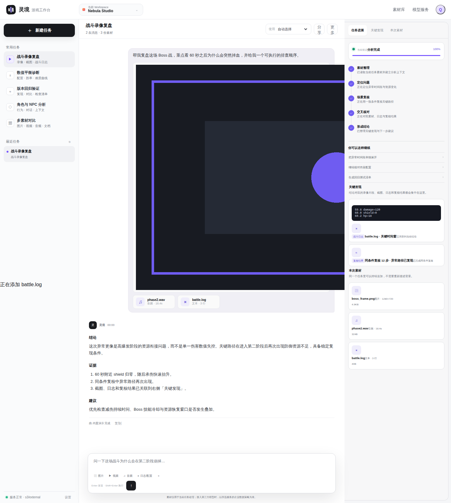

<div align="center">

# 灵境 · Game Studio Cloud

### 对话式游戏研发分析工作台

**把录像、截图、日志、配置与连续追问留在同一个 Workspace。**  
从“问一次 AI”升级为可持续追问、可回到证据、可恢复进度、可团队隔离的研发任务。

<p>
  
  
  
  
  
</p>

<p>
  <a href="#真实产品界面"><b>真实界面</b></a>
  &nbsp;·&nbsp;
  <a href="#功能全景"><b>功能全景</b></a>
  &nbsp;·&nbsp;
  <a href="#30-秒启动"><b>快速启动</b></a>
  &nbsp;·&nbsp;
  <a href="#生产级-saas-基座"><b>SaaS 基座</b></a>
  &nbsp;·&nbsp;
  <a href="#测试与验收"><b>测试验收</b></a>
</p>

</div>


> [!NOTE]
> README 中的 **7 张产品图均由 GitHub Actions 运行当前前端后自动截图并提交**，使用原生 PNG，不再使用英文概念图、人物素材、低码率拼图或重新绘制的 mockup。前端发生变化时，`README Gallery` workflow 会重新生成截图。

---

# 真实产品界面

## 对话是产品主界面，不是附属功能


<p align="center"><sub><b>完整任务态</b> · 左侧管理研发任务，中间持续对话，消息中保留素材，底部继续追问，右侧同步任务进度与下一步建议。</sub></p>

灵境的核心不是“一次性问答”。一个 Conversation 会持续保存 **Messages、Assets、Task Events、Scene 与 Provider 上下文**。因此第二轮、第三轮问题可以直接沿用第一轮的录像、截图与日志，不需要重新上传，也不用重复解释背景。

### 任务开始与分析完成

<table>
<tr>
<td width="50%" valign="top">

<br>
<sub><b>新任务入口</b> · 战斗复盘、数值诊断、版本回归、NPC 分析与多素材对比都从同一工作台进入。</sub>
</td>
<td width="50%" valign="top">

<br>
<sub><b>分析完成态</b> · Assistant 结论、证据、建议与实时进度留在同一个 Conversation。</sub>
</td>
</tr>
</table>

### 证据与模型服务

<table>
<tr>
<td width="50%" valign="top">

<br>
<sub><b>关键发现</b> · 日志片段、素材证据与 Replay / Verifier 结果直接挂到结论旁边。</sub>
</td>
<td width="50%" valign="top">

<br>
<sub><b>Model Gateway</b> · 自动路由与 Provider 状态都由服务端决定，未配置模型明确不可选。</sub>
</td>
</tr>
</table>

### 登录与 Workspace


<p align="center"><sub><b>Production Auth Gate</b> · 登录、创建 Workspace、HttpOnly Session 与租户边界是产品界面的一部分，不只存在于 API 文档。</sub></p>

---

# 功能全景

下面列的是**仓库当前已实现能力**，不是路线图。

## 01 · 对话与任务

| 能力 | 当前实现 |
|---|---|
| **持续多轮对话** | User / Assistant 消息保存在同一 Conversation，可继续追问 |
| **任务上下文延续** | 后续消息自动恢复历史消息与当前任务累计素材，不要求重复挂载 |
| **历史任务恢复** | 左侧最近任务可以重新打开，消息、素材和 Task Events 一并恢复 |
| **任务深链接** | 支持 `?conversation=<id>` 定位并分享指定 Conversation |
| **场景化入口** | 战斗录像复盘、数值平衡诊断、版本回归、角色 / NPC、多素材对比 |
| **快捷追问** | 分析完成后返回下一步建议，可直接回填输入框继续分析 |
| **结构化回答** | 支持标题、强调、编号结论、证据与复制回复 |

## 02 · 多模态素材

| 素材 | 当前处理 |
|---|---|
| **图片** | PNG / JPG / WEBP 上传与预览；Pillow 解码、尺寸与轻量图像特征 |
| **视频** | MP4 / MOV / WEBM；FFprobe 元数据 + FFmpeg 关键帧 |
| **日志 / 文本** | LOG / TXT / JSON / CSV / YAML / XML；文本预览与证据关联 |
| **音频** | 作为任务素材持续保存，并可路由给具备音频能力的 Provider |
| **其他文件** | 作为 binary object + metadata 保存到当前任务 |
| **拖拽与持续追加** | 素材可以在任务进行中继续补充，不需要新建 Conversation |

> 当前**没有**内置 OCR、ASR、PDF / Office 正文深度解析与完整 RAG Pipeline；README 不把“模型理论上支持”写成“产品已经实现”。

## 03 · 实时进度与证据复核

| 能力 | 当前实现 |
|---|---|
| **实时任务进度** | 素材整理、定位问题、场景复核、交叉核对、形成结论等阶段实时展示 |
| **WebSocket** | Conversation 级 Progress / Answer 实时推送 |
| **Durable Event** | Task Event 落库，页面刷新或 WebSocket 重连后可恢复 |
| **关键发现面板** | 结论可绑定图片、视频关键帧、日志与复核结果 |
| **本次素材面板** | 当前 Conversation 累计素材始终可见 |
| **Verifier / Replay** | WorldForge Runtime 的复核结果可以进入产品证据链 |

## 04 · Model Gateway

| Provider | 当前适配 |
|---|---|
| **Auto Router** | 根据任务类型、媒体能力与服务端配置自动选择 |
| **Demo** | 无 Key 时用于本地产品体验、API 与 E2E 的确定性演示链路 |
| **OpenAI** | OpenAI-compatible；图像输入，视频可转换为关键帧 |
| **Anthropic** | Claude 图像输入；视频使用关键帧策略 |
| **Gemini** | 图像 / 视频 / 音频 inline 输入（受当前 Adapter 文件大小边界约束） |
| **DeepSeek** | 文本推理为主 |
| **Qwen / DashScope** | 图像与多模态；视频关键帧策略 |
| **Doubao / Ark** | 图像与多模态；视频关键帧策略 |
| **Custom OpenAI-compatible** | 自定义 Base URL / Model |

API Key 只从服务端环境变量读取，浏览器只看到 Provider 的能力与 `configured` 状态。

## 05 · 游戏研发场景

<table>
<tr>
<td width="33%" valign="top"><b>战斗录像复盘</b><br><sub>定位异常时间段、资源衔接、技能窗口与复现路径。</sub></td>
<td width="33%" valign="top"><b>数值平衡诊断</b><br><sub>检查极端组合、资源陷阱、难度曲线与高风险配置。</sub></td>
<td width="33%" valign="top"><b>版本回归验证</b><br><sub>整理稳定复现步骤、差异点和发布前检查项。</sub></td>
</tr>
<tr>
<td width="33%" valign="top"><b>角色 / NPC 分析</b><br><sub>检查行为跳变、目标切换、连续对话和角色一致性。</sub></td>
<td width="33%" valign="top"><b>多素材对比</b><br><sub>把图片、视频、音频、日志和配置放进同一任务核对。</sub></td>
<td width="33%" valign="top"><b>持续追问</b><br><sub>同一证据上下文中继续缩小问题范围，而不是每轮重新开始。</sub></td>
</tr>
</table>

---

# 生产级 SaaS 基座

灵境不是只给 FastAPI 套一层 Docker。仓库已经包含可继续扩展的 SaaS 控制面与生产基础设施。

<table>
<tr>
<td width="50%" valign="top">
<h3>身份与租户</h3>
<ul>
<li>Argon2 密码哈希</li>
<li>JWT Bearer Token</li>
<li>HttpOnly Session Cookie</li>
<li>User / Workspace / Membership</li>
<li>服务端 Principal 解析</li>
<li>Workspace 强制数据隔离</li>
<li>关键操作 Audit Trail</li>
</ul>
</td>
<td width="50%" valign="top">
<h3>数据与任务</h3>
<ul>
<li>SQLAlchemy 数据层</li>
<li>SQLite 开发模式 / PostgreSQL 生产模式</li>
<li>Alembic Schema Migration</li>
<li>持久化 analysis_jobs</li>
<li>In-process / 独立 Worker</li>
<li>DB-backed Task Event Store</li>
</ul>
</td>
</tr>
<tr>
<td width="50%" valign="top">
<h3>对象存储</h3>
<ul>
<li>Local / S3 双后端</li>
<li>MinIO 兼容部署</li>
<li>Workspace 级对象路径隔离</li>
<li>Presigned 下载 URL</li>
</ul>
</td>
<td width="50%" valign="top">
<h3>安全与运维</h3>
<ul>
<li>Request ID</li>
<li>Security Headers / CSP</li>
<li>CORS Allowlist</li>
<li>Trusted Hosts</li>
<li>基础 Rate Limit</li>
<li>Liveness / Readiness</li>
<li>Database + Object Storage Readiness</li>
</ul>
</td>
</tr>
</table>

### 租户边界

客户端不能通过自由填写 Workspace Header 来切换租户。服务端从认证 Principal 解析当前 Workspace，并在 Store 层对 Conversation、Asset、Event、Audit 等查询强制应用 `workspace_id` 条件。即使拿到其他 Workspace 的 Conversation ID，也不会直接读到对应任务。

---

## WorldForge Runtime

产品对话层下方保留了结构化运行时，用于更严格的场景复核与实验：

- Adaptive Planner
- State Verifier
- Event Store
- Counterfactual Brancher
- Episodic Memory
- Skill Bank
- Replay / Self-play / Evolution
- Benchmark / Scenario Evaluation

Runtime 的目标不是替代对话，而是让对话结论能够落到可复核的状态、事件和实验结果上。

---

# 30 秒启动

### 1 · 创建环境

```bash
python -m venv .venv
source .venv/bin/activate
pip install -r requirements.txt
```

Windows PowerShell：

```powershell
.venv\Scripts\Activate.ps1
```

### 2 · 启动

```bash
uvicorn worldforge.api.app:app --host 0.0.0.0 --port 8765 --reload
```

浏览器打开：

```text
http://localhost:8765
```

开发模式默认提供本地 Demo Workspace，不要求 PostgreSQL、S3 或模型 Key，适合先验证完整交互。

---

# 生产部署

仓库提供 `docker-compose.prod.yml`：

| Service | 职责 |
|---|---|
| **PostgreSQL** | User / Workspace / Conversation / Event / Job / Audit 持久数据 |
| **MinIO** | S3-compatible 素材与大对象存储 |
| **Migrate** | 应用启动前执行 `alembic upgrade head` |
| **API** | FastAPI、Auth、Tenant Guard、Upload、WebSocket |
| **Worker** | 独立消费 durable analysis jobs |

```bash
cp .env.production.example .env.production

docker compose \
  --env-file .env.production \
  -f docker-compose.prod.yml \
  up --build
```

健康检查：

```text
GET /api/health/live
GET /api/health/ready
```

<details>
<summary><b>展开生产配置矩阵</b></summary>

| 变量 | 开发默认 | 生产建议 |
|---|---|---|
| `WORLDFORGE_ENV` | `development` | `production` |
| `WORLDFORGE_AUTH_MODE` | `dev` | `required` |
| `DATABASE_URL` | SQLite | PostgreSQL |
| `WORLDFORGE_STORAGE_BACKEND` | `local` | `s3` |
| `WORLDFORGE_QUEUE_MODE` | `inprocess` | `external` |
| `WORLDFORGE_AUTO_CREATE_SCHEMA` | `1` | `0` + Alembic |
| `WORLDFORGE_SECURE_COOKIES` | `0` | `1` under HTTPS |
| `WORLDFORGE_CORS_ORIGINS` | localhost | 精确前端域名 |
| `WORLDFORGE_TRUSTED_HOSTS` | localhost | 精确业务域名 |
| `WORLDFORGE_JWT_SECRET` | 开发临时密钥 | Secret Manager 中的高熵固定密钥 |

</details>

---

# 测试与验收

### Unit / API

```bash
pytest -q
```

当前主测试集：

```text
16 passed
```

### SaaS UI E2E

```bash
python scripts/product_ui_e2e.py
```

覆盖：

```text
auth_gate
register_workspace
upload_interaction
realtime_answer
evidence_panel
suggestions
provider_modal
page_errors = 0
```

### README Gallery

`.github/workflows/readme-gallery.yml` 会在前端或截图脚本变化后：

1. 安装 Playwright Chromium；
2. 用当前 `frontend/` 运行真实 UI 状态；
3. 生成 `cover / workspace / workspace-empty / workspace-saas / evidence / providers / auth` 七张 PNG；
4. 校验图片可读；
5. 自动提交回 README 资源目录。

这保证 GitHub 首页展示的不是另一套概念设计。

---

## Production Gate

当前仓库已经具备**生产 SaaS 架构骨架**，但“可按生产拓扑运行”不等于“所有企业治理已经完成”。正式公网部署前仍建议补齐：

- SSO / MFA / SCIM；
- 邮件验证、邀请与找回密码；
- 全局分布式限流；
- WAF / DDoS 防护；
- PostgreSQL backup / PITR；
- S3 lifecycle / encryption policy；
- Metrics / Tracing / 集中日志与告警；
- 文件病毒扫描与内容安全；
- Secret Manager / KMS；
- 数据保留、删除与合规策略。

---

## 仓库结构

```text
lingjing-game-studio/
├── frontend/                  对话工作台 / Auth / Realtime UI
├── worldforge/
│   ├── api/                   FastAPI / Auth / Tenant Guard / WebSocket
│   ├── product/               分析编排 / 媒体处理 / SaaS Store
│   ├── providers/             Model Gateway
│   ├── runtime/               Planner / Verifier / Replay / Evolution
│   ├── security.py            Argon2 / JWT Principal
│   ├── storage.py             Local / S3 Object Storage
│   └── worker.py              Durable Analysis Worker
├── migrations/                Alembic migrations
├── tests/                     Runtime / API / Tenant isolation
├── scripts/                   Product E2E / UI E2E / Benchmark
├── docs/                      Architecture / Runbook / Frontend notes
├── docker-compose.prod.yml    PostgreSQL + MinIO + API + Worker
└── .env.production.example    Production configuration template
```

## 文档

| 文档 | 内容 |
|---|---|
| [`docs/ARCHITECTURE.md`](docs/ARCHITECTURE.md) | SaaS 数据模型、API、Worker、事件与存储边界 |
| [`docs/RUNBOOK.md`](docs/RUNBOOK.md) | 部署与运行维护 |
| [`docs/FRONTEND.md`](docs/FRONTEND.md) | 前端交互结构 |
| [`docs/BENCHMARKING.md`](docs/BENCHMARKING.md) | Benchmark 方法 |
| [`SECURITY.md`](SECURITY.md) | 安全模型与漏洞反馈 |

<br>

<div align="center">

**Lingjing Game Studio Cloud**  
让一次问题排查留下可继续使用的上下文、证据和结论。

</div>
