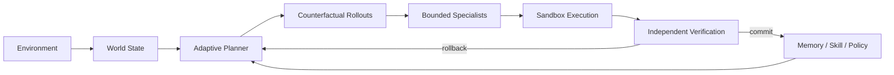

# 灵境

### 游戏研发执行工作台

**给出研发目标和素材，系统持续执行、复核、留证；需要时可以停止、重试、交接、归档，并对永久删除执行显式审批。**

问题复现 · 数值检查 · 版本回归 · 角色行为 · 多素材交叉核对


---

## 一次任务是什么样的

灵境不是给游戏文件加一个聊天框，而是把研发目标变成一条**可持续推进、可中途控制、可交接、可复核、可留下证据**的任务轨迹。

> **目标 → 素材 → 执行 → 复核 → 证据 → 交付 → 人工确认**

1. **交付目标**：直接说要解决什么，不要求先拆 Prompt、Agent 或流程图。
2. **看见执行**：真实进度持续进入任务轨迹；长任务可以停止，失败或停止后可以安全重试。
3. **拿到交付**：目标、执行过程、结论、结构化交付和后续动作留在同一个研发任务里。
4. **检查证据**：截图、录像关键帧、日志摘录和复核结果与结论对应。

客户界面只回答真正需要知道的事：**我要完成什么、系统正在做什么、我能不能介入、发现了什么、结论由什么证据支持、谁来确认结果。**

---

## 当前产品界面

下面 **8 张产品截图全部直接展示**。它们来自真实浏览器 E2E 产品状态；README Gallery 会在相关界面或截图脚本变化后重新采集，并校验每张图都是 **3840×2400 PNG**。

### 1 · 身份入口

注册、登录与工作空间身份边界。


### 2 · 新任务

从研发目标开始，而不是从模型配置开始。


### 3 · 素材输入

图片、视频、音频、日志、配置与文档进入同一个任务上下文。


### 4 · 执行中

查看真实进度、当前任务状态，并在需要时停止执行。


### 5 · 任务结果

结论、后续动作、团队协作和任务管理集中在同一个工作台。


### 6 · 证据核验

让结论能够回到截图、关键帧、日志等来源。


### 7 · 持续多模态上下文

后续追问自动继承当前任务已有素材，不把上一轮上下文丢掉。


### 8 · 产品总览

控制、证据、交付与协作集中在同一个任务空间。


---

## 为什么敢把任务交给它

| 产品承诺 | 当前行为 |
|---|---|
| **可控** | 执行状态持久化；进行中的任务可以真实停止；停止或失败的最近一次执行可以安全重试；刷新页面后恢复正确状态 |
| **可核验** | 结论关联证据，并区分观察、推断与待验证项；关键结果可以进入人工质量确认 |
| **可恢复** | 风险路径与失败路径不会直接覆盖有效任务状态；系统支持恢复、重新规划与安全重试，不伪造无法保证的“任意点暂停/续跑” |
| **可隔离** | 用户、工作空间、任务、素材、运行记录与审计边界在服务端校验，不依赖前端隐藏 |
| **可治理** | 永久删除先进入持久化审批；审批期间锁定任务；拒绝时恢复审批前状态；成员角色、邀请、负责人交接都由服务端权限约束 |
| **可协作** | 支持工作空间切换、邀请/撤销/接受、成员角色、任务负责人和交接； viewer 为真正的服务端只读角色 |
| **可闭环** | 最新交付可以记录正确性、证据价值、人工验证和备注；只有“人工确认正确且无错误反馈”才进入已验证状态 |
| **可度量** | 内置任务完成、首次交付耗时、中断、失败、恢复、继续执行、人工介入、证据打开、结果采纳和人工验证等产品指标 |

任务接收与任务完成都使用确定性的状态提交：**用户输入、排队 Job 与 `message.accepted` 同事务落库；Job 完成、assistant 交付与 `answer.ready` 也同事务提交。** 如果停止先发生，就不会再补写一个迟到的成功结果；如果任务已经进入永久删除审批，也不会再夹进新的执行。

任务本身支持：**搜索、重命名、置顶、归档/恢复、负责人交接、深链接、受审批保护的永久删除**。完成交付后任务先进入“待复核”；只有最新交付被人工确认正确且不存在错误反馈，才进入“已验证”；错误反馈会把任务标记为“需修正”。

交付不是只有一段回答。不同研发场景会沉淀为**复现卡、回归清单、风险清单、调参与验证方案、证据包**等结构化结果，并用证据 ID 与来源关联。

---

## 多模态不是附件栏

一个任务可以持续追加：

**图片 · 视频 · 音频 · 日志 · JSON / CSV · 配置文件 · 文本 / 文档**

灵境会把素材变成真正进入判断链路的上下文，而不是只把文件名挂在消息旁边：

- **图片**进入视觉证据；
- **视频**按时长自适应抽取关键帧，并把关键帧作为视觉证据参与判断；
- **音频**保留声学输入，并由系统按能力自动路由推理资源；
- **日志 / 配置**把实际内容摘录写入任务上下文；
- **素材校验**检查声明类型和真实内容，异常媒体不会伪装成有效图像或音视频；
- **任务继承**让后续追问自动保留当前任务已有的多模态素材；
- **证据索引**让最终结论可以指回来源，而不是只给一段无法复查的答案。

---
## 适合做什么

| 研发目标 | 灵境负责交付 |
|---|---|
| **战斗问题复现** | 对齐录像、日志和状态变化，寻找稳定触发条件并重复核验 |
| **数值风险检查** | 探索极端 Build、资源曲线与高波动组合，给出优先调整项 |
| **版本回归验证** | 复现历史异常、核验修复结果并沉淀发布前检查项 |
| **角色行为检查** | 检查连续交互、目标切换与上下文不一致 |
| **多素材交叉核对** | 在同一任务里联合视觉、声音、日志、配置与历史任务上下文 |

### 产品边界

**任务优先。** 页面围绕目标、执行、证据、交付和确认组织，而不是围绕聊天气泡组织。  
**内部实现隐藏。** 客户不需要选择模型、供应商，也不需要理解内部规划、试演或策略优化术语。  
**推理资源可替换。** 本地或远端推理资源提供感知与内容理解能力；状态、权限、任务生命周期、执行、验证、恢复和完成判定由灵境自己的运行时负责。

---

## 快速开始

```bash
python -m venv .venv
source .venv/bin/activate
pip install -r requirements.txt
uvicorn worldforge.api.app:app --reload
```

浏览器打开本地服务即可进入工作台。开发模式默认使用 SQLite、Local Object Storage、Dev Identity 和进程内 Worker，不要求先配置外部推理服务。

独立 Worker：

```bash
WORLDFORGE_QUEUE_MODE=external python -m worldforge.worker
```

接入兼容的本地多模态推理服务时，通过服务端环境变量配置；客户工作台不会暴露供应商/模型选择器。

生产部署、数据库迁移、对象存储和运行保障见 [`docs/RUNBOOK.md`](docs/RUNBOOK.md)。

---

<details>
<summary><b>WorldForge Runtime · 工程实现</b></summary>

<br>

WorldForge 是灵境自己的执行内核。外部或本地推理资源可以提供感知、文本理解和推理能力，但不能直接绕过 WorldForge 提交动作、修改 canonical state、跳过验证或决定一次任务是否完成。



### World State

`worldforge/runtime/engine.py` 维护可恢复的环境状态，而不是只保存对话文本：Goal / Belief / Game State、append-only hash-chained events、Snapshot / Restore / Checkpoint、Replay / Fork、Sandbox 与 rollback / replan。

反事实分支只操作克隆环境；只有经过选择和验证的动作才进入 canonical state。

### Epistemic Disagreement Control

`worldforge/runtime/planner.py` 会把内部专家分歧和世界状态不确定性组合成 epistemic tension：状态越不确定、专家意见越分裂，低风险信息获取行为越有价值；高威胁下则降低不可逆激进行为的优先级。关键状态被观测确认后，探索奖励下降，系统回到执行优先。

### Counterfactual + Bounded Specialists

动作提交前并行评估候选未来的 expected utility、downside、survival、success probability 与 verifier violations。状态条件专家只提供有界动作偏置，不能直接执行，也不能绕过 Sandbox / Verifier。

### Verification + Evolution

Verifier 独立检查状态不变量、非法动作、灾难性风险和异常奖励循环。成功与失败轨迹进入 Memory / Skill；候选策略更新受 regression gate、trust-region 约束与 Human Feedback Gate 共同限制。客户反馈先进入结构化质量状态，不会直接修改策略；只有当前任务最近交付通过人工质量门，后续执行才允许启用候选演进，而且回归门仍必须同时通过。

### Realtime + Deterministic Job Lifecycle

产品事件通过 durable cursor 读取并 fan-out；WebSocket 使用 subscribe-before-replay、event-id deduplication 与 `after_id` 断点续传，避免重连后重复搬运完整历史。

任务接收、完成、取消、重试和永久删除审批都以持久化状态为事实源。每轮 progress 带自己的 `job_id`，刷新页面时只恢复当前/最近一次执行，不把多轮任务进度混在一起。

更多工程细节见 [`docs/ARCHITECTURE.md`](docs/ARCHITECTURE.md)。

</details>

---

## 质量门禁

```bash
python -m compileall -q worldforge migrations scripts tests
pytest -q
node --check frontend/app.js
python scripts/product_backend_e2e.py
python scripts/product_ui_e2e.py
```

当前正式产品验证覆盖 Python 回归测试、Python 编译、前端 JavaScript 语法、后端产品 E2E、真实浏览器产品 E2E，以及 README 的 GitHub Markdown 渲染与截图可加载性。两个产品 E2E 脚本都会在任一关键检查失败时返回非零退出码，避免“报告里有 false 但 CI 仍然绿色”。

浏览器 E2E 覆盖身份入口、工作空间、任务生命周期、素材上传、多模态上下文、运行状态、停止/重试、实时结果、证据、结构化交付、质量反馈、团队协作、邀请、产品指标、归档保护和永久删除审批，并生成 README Gallery。

---

## 目录

```text
frontend/                 客户工作台
worldforge/
  api/                    API / Auth / Realtime
  product/                任务、素材、证据、治理与持久化
  runtime/                WorldForge 执行与验证内核
  providers/              服务端可替换推理资源
  storage/                本地 / 对象存储
migrations/               产品数据迁移
scripts/                  产品 E2E 与策略训练入口
tests/                    Runtime / API / 产品 / 多模态 / Realtime 回归测试
docs/                     架构、前端、运行与评测说明
```

**目标不是让模型更会描述它做了什么，而是让系统真的执行、复核、恢复，并留下可以检查、可以交接、可以确认的证据。**