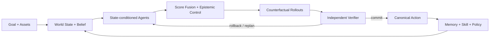

<div align="center">

# 灵境

### 游戏研发 Agent Runtime · 执行工作台

**把研发目标和素材交给系统，让任务持续执行、复核、留证，并在需要时被人随时接管。**

`CONTROL` · `TRUST` · `LIFECYCLE` · `RECOVERY`

不是给游戏文件加一个聊天框。灵境把一次研发问题变成一条**可执行、可停止、可恢复、可核验、可交接、可治理**的任务轨迹。

</div>


---

## 从“问一句”变成“把任务交出去”

> **目标 → 素材 → 执行 → 复核 → 证据 → 交付 → 人工确认**

灵境的界面只围绕研发真正关心的几个问题组织：**现在要完成什么、系统正在做什么、我能不能介入、发现了什么、结论由什么证据支持、谁来确认结果。**

| Control | Evidence | Lifecycle |
|---|---|---|
| **执行可控**：长任务可以停止；失败或停止后可以安全重试；刷新后恢复正确状态 | **结果可核验**：截图、关键帧、日志摘录和复核结果与结论对应 | **任务可治理**：搜索、置顶、归档、交接、审批删除、人工质量确认都有持久化状态 |

---

## 工作台

下面的截图来自真实浏览器产品状态。README Gallery 会在界面或截图脚本变化后重新采集，并在发布图片后再次打开 GitHub 仓库首页验证实际可见性。

| **01 · 身份入口** | **02 · 新任务** |
|---|---|
| 工作空间身份、权限与安全边界。<br><br> | 从研发目标开始，而不是从模型配置开始。<br><br> |

| **03 · 素材输入** | **04 · 执行中** |
|---|---|
| 图片、视频、音频、日志、配置和文档进入同一个任务上下文。<br><br> | 真实进度持续进入任务轨迹，需要时可以停止。<br><br> |

| **05 · 任务结果** | **06 · 证据核验** |
|---|---|
| 结论、后续动作、结构化交付和协作留在同一个工作台。<br><br> | 每个关键结论都能回到截图、关键帧、日志或复核来源。<br><br> |

| **07 · 持续上下文** | **08 · 产品总览** |
|---|---|
| 后续追问继承当前任务已有素材，不把上一轮上下文丢掉。<br><br> | 控制、证据、交付与协作集中在同一个任务空间。<br><br> |

---

## 一个研发任务应该具备什么

### 01 · Control — 人始终拥有控制权

进行中的任务可以真实停止；最近一次停止或失败的执行可以安全重试。停止先发生时，系统不会再补写一个迟到的成功结果；任务进入永久删除审批后，也不会夹入新的执行。

任务本身支持**搜索、重命名、置顶、归档 / 恢复、负责人交接、深链接和受审批保护的永久删除**。这些不是前端假状态，而是服务端持久化生命周期的一部分。

### 02 · Trust — 结论必须能被检查

交付不是只有一段回答。不同研发场景会沉淀为**复现卡、回归清单、风险清单、调参与验证方案、证据包**等结构化结果，并通过证据 ID 与来源关联。

完成交付后任务先进入“待复核”。只有最新交付被人工确认正确且不存在错误反馈，任务才进入“已验证”；错误反馈会把任务标记为“需修正”。

### 03 · Lifecycle — 任务可以跨时间、跨成员继续存在

用户、工作空间、任务、素材、运行记录和审计边界都由服务端校验。工作空间支持邀请、角色、负责人和交接；viewer 是真正的服务端只读角色。

任务接收和任务完成都采用确定性的状态提交：**用户输入、排队 Job 与 `message.accepted` 同事务落库；Job 完成、assistant 交付与 `answer.ready` 同事务提交。**

### 04 · Recovery — 失败是运行时的一部分

风险路径和失败路径不会直接覆盖有效状态。系统保留恢复、重新规划和安全重试能力，不用一句“已完成”掩盖执行中断，也不伪造无法保证的任意点暂停 / 续跑。

---

## 多模态不是附件栏

一个任务可以持续追加：

**图片 · 视频 · 音频 · 日志 · JSON / CSV · 配置文件 · 文本 / 文档**

素材会真正进入判断链路：

- **图片**进入视觉证据；
- **视频**按时长自适应抽取关键帧，关键帧参与判断并成为可回溯证据；
- **音频**保留声学输入，由系统按能力自动路由推理资源；
- **日志 / 配置**把实际内容摘录写入任务上下文；
- **素材校验**同时检查声明类型和真实内容，异常媒体不会伪装成有效输入；
- **任务继承**让后续追问自动保留当前任务已有多模态素材；
- **证据索引**让最终结论能够指回来源，而不是只给一段无法复查的答案。

---

## 适合交给灵境的工作

| 研发目标 | 交付结果 |
|---|---|
| **战斗问题复现** | 对齐录像、日志和状态变化，寻找稳定触发条件并重复核验 |
| **数值风险检查** | 探索极端 Build、资源曲线与高波动组合，给出优先调整项 |
| **版本回归验证** | 复现历史异常、核验修复结果并沉淀发布前检查项 |
| **角色行为检查** | 检查连续交互、目标切换与上下文不一致 |
| **多素材交叉核对** | 在同一任务里联合视觉、声音、日志、配置与历史任务上下文 |

---

## 产品边界

**任务优先。** 页面围绕目标、执行、证据、交付和确认组织，而不是围绕聊天气泡组织。

**内部实现隐藏。** 客户不需要选择模型、供应商，也不需要理解内部规划、试演或策略优化术语。

**推理资源可替换。** 本地或远端推理资源提供感知与内容理解能力；状态、权限、任务生命周期、执行、验证、恢复和完成判定由灵境自己的运行时负责。

---

# Agent Method · WorldForge

WorldForge 是灵境自己的 **stateful Agent Runtime**。它不是“一个模型 + 一串工具调用”，而是把**世界状态、动态专家 Agent、记忆 / Skill、策略先验、反事实试演、独立验证和受约束演化**放进同一条可恢复决策闭环。

> **核心约束：Agent 可以提出偏好、证据与候选动作，但不能绕过 Runtime 直接修改 canonical state。真正的动作提交必须经过 Sandbox 与 Verifier。**



### 方法总览

| Layer | 方法 | Runtime 中的作用 |
|---|---|---|
| **Deliberation** | State-conditioned Specialist Agents | 只在当前状态需要时激活战斗、风险、机制、经济、进度专家 |
| **Decision** | Score Fusion + Epistemic Disagreement Control | 融合专家投票、Skill、Memory、Policy 与不确定性，决定候选动作顺序 |
| **Simulation** | Bounded Counterfactual Rollouts | 在克隆环境里并行试演候选未来，不污染 canonical state |
| **Verification** | Independent State / Risk Verifier | 检查状态不变量、非法动作、灾难性风险与异常奖励循环 |
| **Learning** | Group-relative Policy Update + Failure-driven Evolution | 只从已验证的候选组与失败归因中更新策略 / Skill，并受 KL、回归与人工门禁约束 |

---

## 01 · Dynamic Specialist Agents

专家不是固定串行流水线。`RecursiveAgentScheduler` 根据当前状态动态决定哪些 Agent 值得被激活：高威胁时加入 Risk Specialist，高不确定状态加入 Mechanics Specialist，经济 / exploit 场景才加入 Economy Specialist。

每个专家只能返回一个**有界动作偏置** $b_j(a)$ 与置信度 $c_j$。Runtime 聚合后再裁剪：

$$
B_{\mathrm{agent}}(a)
=
\operatorname{clip}
\left(
\sum_{j \in \mathcal{A}(s)} c_j\,b_j(a),
-4.5,
4.5
\right)
$$

其中 $\mathcal{A}(s)$ 是状态 $s$ 下真正被调度的专家集合。**专家没有执行权限**，它们只是 planner 的受限输入。

`worldforge/runtime/recursive.py`

---

## 02 · Unified Action Score

对合法动作 $a$，Planner 不只看一个模型分数，而是把固定分析 Agent、动态专家、Skill、历史 Memory、本地 Policy prior 和 epistemic adjustment 合成统一排序：

$$
S(a)
=
\sum_i v_i(a)
+
B_{\mathrm{skill}}(a)
+
2.2\tanh\left(\frac{M(s,a)}{10}\right)
+
1.65\,Z_{\theta}(a\mid s)
+
B_{\mathrm{agent}}(a)
+
E(a)
-
R_{\mathrm{repeat}}(a)
$$

其中：

- $v_i(a)$：Combat / Risk / Economy / Progress 分析 Agent 对动作的投票；
- $B_{\mathrm{skill}}(a)$：Skill Bank 的状态条件偏置；
- $M(s,a)$：Memory 中同类状态—动作的历史先验；
- $Z_{\theta}(a\mid s)$：Policy 对合法动作 logits 做标准化后的先验分数；
- $B_{\mathrm{agent}}(a)$：动态 Specialist Tree 的有界建议；
- $E(a)$：由不确定性与专家分歧产生的 epistemic adjustment；
- $R_{\mathrm{repeat}}(a)$：对重复 `farm / scout / defend` 的停滞惩罚。

Policy prior 在合法动作集合上使用：

$$
Z_{\theta}(a\mid s)
=
\frac{z_a-\mu(z_{\mathrm{legal}})}
{\sigma(z_{\mathrm{legal}})}
$$

这意味着 Policy 是**决策先验**，不是最终执行者。Runtime 仍然可以因为风险、证据、Memory、Skill 或 Verifier 结果覆盖它。

`worldforge/runtime/planner.py` · `worldforge/runtime/policy.py`

---

## 03 · Epistemic Disagreement Control

WorldForge 把“专家意见分裂”视为一个可计算信号，而不是把多个 Agent 的意见简单平均。

对动作 $a$，先计算专家打分的离散程度，再与当前 belief uncertainty $u$ 相乘：

$$
T(a)
=
\min
\left(
4,\;
\operatorname{Std}(v_1(a),\ldots,v_n(a))
\right)
\cdot u
$$

$T(a)$ 是 epistemic tension。**世界越不确定、专家越分裂，系统越应该先获得信息，而不是做不可逆承诺。**

信息获取动作的奖励：

$$
E(\mathrm{scout})
=
1.15 + 1.35\,T
$$

高风险承诺动作（如 heavy attack / cast）的摩擦：

$$
E(\mathrm{commit})
=
-T\left(0.28 + 0.42\,\tau\right)
$$

其中 $\tau$ 是当前 threat。关键机制被观测后，belief uncertainty 从 latent 状态下降，探索奖励也随之降低，系统自然回到执行优先。

`worldforge/runtime/planner.py`

---

## 04 · Counterfactual Rollouts

Planner 排出的动作不会立刻进入真实状态。`CounterfactualBrancher` 会把前几个候选动作放进**克隆环境**，按有限 width / horizon / rollouts 并行试演。

每条 rollout 先由独立 Verifier 形成 branch utility：

$$
U_k
=
r_k
+
24(1-e_k)
+
17h_k
+
0.04g_k
-
26\max(0,\tau_k-\rho)
-
8|\mathcal{V}_k|
+
70\mathbf{1}_{\mathrm{victory}}
-
90\mathbf{1}_{\mathrm{defeat}}
$$

其中：

- $r_k$：环境累计 reward；
- $e_k$：敌方生命比例；
- $h_k$：玩家生命比例；
- $g_k$：资源状态中的 gold；
- $\tau_k$：threat；
- $\rho$：目标允许的 risk tolerance；
- $\mathcal{V}_k$：该 rollout 真实出现的 verifier violations。

一个动作最终不是按平均收益单点排序，而是使用**风险调整后的分支分数**：

$$
Q(a)
=
\mathbb{E}[U]
-
0.45\,\operatorname{Std}(U)
+
0.20\,\min(U)
+
16\,p_{\mathrm{success}}
$$

因此高均值但极端 downside 很差、方差很大或成功率很低的动作会被主动降权。分支的 `survival`、`success_probability`、`downside_score` 和 violations 同时保留为证据。

`worldforge/runtime/counterfactual.py` · `worldforge/runtime/verifier.py`

---

## 05 · Independent Verification

Verifier 与 Planner 分离。它不负责“想办法”，只负责判断候选状态是否仍然可信、合法、可接受。

运行时风险分数：

$$
R_{\mathrm{state}}
=
\operatorname{clip}
\left(
0.65\,\tau + 0.55(1-h),
0,
1
\right)
$$

其中 $h$ 为玩家生命比例。除此之外，Verifier 还检查：

**negative gold · energy invariant · hp invariant · invalid action · reward-loop anomaly · catastrophic survival risk · terminal failure**

严重违规会触发 `rollback`，高生存风险触发 `replan`；只有被验证的路径才有资格进入 canonical state。

`worldforge/runtime/verifier.py`

---

## 06 · Local Policy Prior

WorldForge Policy 是一个小型本地 MLP 决策先验。输入不是聊天文本，而是规范化后的 World State / Belief / Goal 特征：

$$
\hat{x}
=
\frac{x-\mu}{\sigma}
$$

$$
h
=
\tanh(\hat{x}W_1+b_1),
\qquad
z
=
hW_2+b_2
$$

在合法动作集合 $\mathcal{L}(s)$ 上：

$$
\pi_{\theta}(a\mid s)
=
\frac{\exp(z_a)}
{\sum_{a' \in \mathcal{L}(s)}\exp(z_{a'})}
$$

Policy 提供快速经验先验；Sandbox、Verifier、Memory、Skill 与 Agent deliberation 仍然拥有更高层的运行时约束。

`worldforge/runtime/policy.py`

---

## 07 · Group-relative Policy Update

训练时，一个状态的多个可行动作构成同一个 group。它们先经过 Runtime / Verifier 得到 reward，再在**组内**中心化和标准化：

$$
A_i
=
\operatorname{clip}
\left(
\frac{r_i-\bar{r}}
{\sigma_r+\varepsilon},
-3,
3
\right)
$$

冻结旧策略后计算 probability ratio：

$$
\rho_i(\theta)
=
\frac
{\pi_{\theta}(a_i\mid s)}
{\pi_{\theta_{\mathrm{old}}}(a_i\mid s)}
$$

更新使用 clipped group-relative term；实现中超出 clip 区间的项不继续推动梯度，默认 $\epsilon=0.18$：

$$
L_{\mathrm{clip}}
=
\frac{1}{|G|}
\sum_i
\min
\left(
\rho_iA_i,\;
\operatorname{clip}(\rho_i,1-\epsilon,1+\epsilon)A_i
\right)
$$

策略更新还必须留在 KL trust region 内：

$$
D_{\mathrm{KL}}
\left(
\pi_{\mathrm{old}}
\parallel
\pi_{\theta}
\right)
=
\mathbb{E}_{G}
\left[
\sum_a
\pi_{\mathrm{old}}(a\mid s)
\log
\frac{\pi_{\mathrm{old}}(a\mid s)}
{\pi_{\theta}(a\mid s)}
\right]
\le 0.035
$$

一旦 empirical KL 越界，candidate policy 直接回退到更新前策略。Policy 因此只能**渐进地改变决策先验**，不能一次训练把 Runtime 的行为推离可信区域。

`worldforge/runtime/policy.py`

---

## 08 · Failure-driven Evolution

Skill 演化不是“跑赢一次就升级”。失败先被归因为 execution / survival / economy / progress 信号，再生成候选 patch；候选必须同时经过 regression evaluation 与 Human Feedback Gate。

当前 acceptance gate 可以写成：

$$
\mathrm{Accept}
=
H
\land
(J_{\mathrm{candidate}}\ge J_{\mathrm{baseline}}-0.01)
\land
(J_{\mathrm{candidate}}\ge J_{\mathrm{baseline}}+0.005)
$$

其中 $H$ 表示人工允许更新。只有被门禁接受的 patch 才进入 Skill Bank；否则旧 Skill 保持不变。

`worldforge/runtime/evolver.py`

---

## Runtime Invariants

方法层最终受几条不可绕过的 Runtime invariant 约束：

| Invariant | 含义 |
|---|---|
| **Canonical state ownership** | 只有 Runtime 可以提交真实状态；反事实分支永远操作 clone |
| **Bounded specialists** | Specialist 只能返回有界 bias，不能直接执行 |
| **Independent verification** | Planner / Policy 不能自证成功 |
| **Rollback before corruption** | 失败分支先回滚或重规划，不覆盖已验证状态 |
| **Policy is a prior** | Policy 参与排序，但不拥有权限、完成判定或状态写入 |
| **Human-gated evolution** | 行为更新要过回归、trust region 与人工反馈门禁 |

<details>
<summary><b>工程实现与状态生命周期</b></summary>

<br>

### World State

`worldforge/runtime/engine.py` 维护可恢复环境状态，而不是只保存对话文本：Goal / Belief / Game State、append-only hash-chained events、Snapshot / Restore / Checkpoint、Replay / Fork、Sandbox 与 rollback / replan。

反事实分支只操作克隆环境；只有经过选择和验证的动作才进入 canonical state。

### Realtime + Deterministic Job Lifecycle

产品事件通过 durable cursor 读取并 fan-out；WebSocket 使用 subscribe-before-replay、event-id deduplication 与 `after_id` 断点续传，避免重连后重复搬运完整历史。

任务接收、完成、取消、重试和永久删除审批都以持久化状态为事实源。每轮 progress 带自己的 `job_id`，刷新页面时只恢复当前 / 最近一次执行，不把多轮任务进度混在一起。

更多工程细节见 [`docs/ARCHITECTURE.md`](docs/ARCHITECTURE.md)。

</details>

---

## Quick start

```bash
python -m venv .venv
source .venv/bin/activate
pip install -r requirements.txt
uvicorn worldforge.api.app:app --reload
```

浏览器打开本地服务即可进入工作台。开发模式默认使用 SQLite、Local Object Storage、Dev Identity 和进程内 Worker，不要求先配置外部推理服务。

独立 Worker：

```bash
WORLDFORGE_QUEUE_MODE=external python -m worldforge.worker
```

生产部署、数据库迁移、对象存储和运行保障见 [`docs/RUNBOOK.md`](docs/RUNBOOK.md)。

---

## Verification

```bash
python -m compileall -q worldforge migrations scripts tests
pytest -q
node --check frontend/app.js
python scripts/product_backend_e2e.py
python scripts/product_ui_e2e.py
```

正式门禁覆盖 Python 回归与编译、前端 JavaScript 语法、后端产品 E2E、真实浏览器产品 E2E、README GitHub 渲染、Release 图片完整性，以及**发布图片后重新打开公开 GitHub 仓库首页验证截图真实可见**。

浏览器产品 E2E 覆盖身份入口、工作空间、任务生命周期、素材上传、多模态上下文、运行状态、停止 / 重试、实时结果、证据、结构化交付、质量反馈、团队协作、邀请、产品指标、归档保护和永久删除审批。任一关键检查失败都会返回非零退出码。

---

## Repository

```text
frontend/                 客户工作台
worldforge/
  api/                    API / Auth / Realtime
  product/                任务、素材、证据、治理与持久化
  runtime/                执行与验证内核
  providers/              服务端可替换推理资源
  storage/                本地 / 对象存储
migrations/               产品数据迁移
scripts/                  产品 E2E 与策略训练入口
tests/                    Runtime / API / 产品 / 多模态 / Realtime 回归测试
docs/                     架构、前端、运行与评测说明
```

---

<div align="center">

**目标不是让系统更会描述它做了什么，而是让它真的执行、复核、恢复，并留下可以检查、可以交接、可以确认的结果。**

</div>
