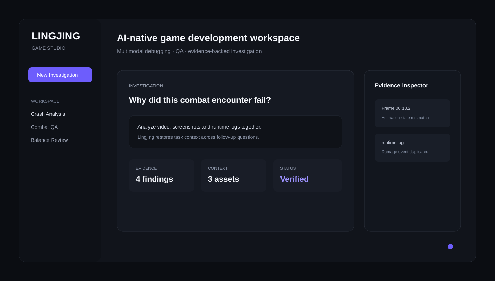
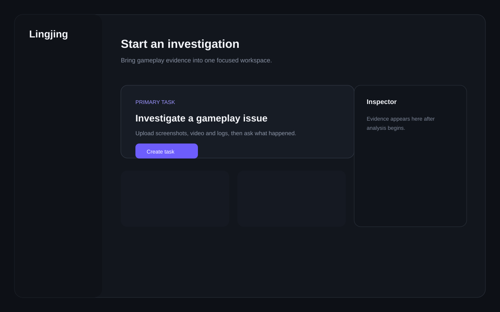
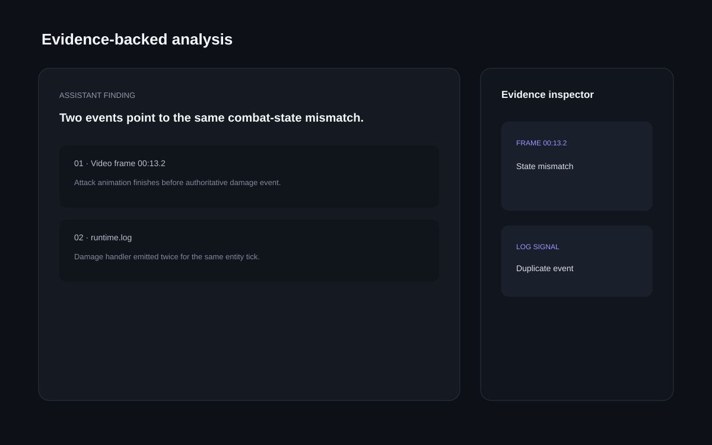
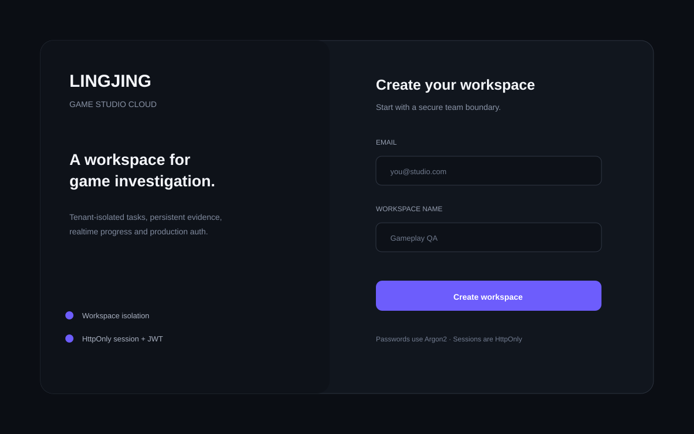
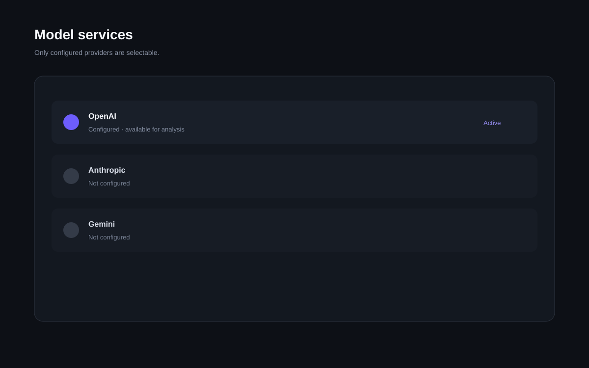

<div align="center">



# 灵境 · Game Studio Cloud

### 面向游戏研发团队的多模态分析、证据复核与持续任务工作空间

把录像、截图、日志、配置和连续追问留在同一个 Workspace。  
不是一次性聊天，而是一条可恢复、可审计、可隔离、可继续执行的研发任务。

<p>
  
  
  
  
  
</p>

<p>
  <a href="#30-秒启动"><b>30 秒启动</b></a>
  &nbsp;·&nbsp;
  <a href="#产品体验"><b>产品体验</b></a>
  &nbsp;·&nbsp;
  <a href="#生产部署"><b>生产部署</b></a>
  &nbsp;·&nbsp;
  <a href="#安全与租户隔离"><b>安全模型</b></a>
  &nbsp;·&nbsp;
  <a href="#测试与验收"><b>测试验收</b></a>
</p>

</div>

<br>

## 产品体验

灵境把 AI 分析组织成一个真正的研发工作台：左侧管理任务，中间持续对话，右侧固定呈现进度、证据和素材。上下文保存在服务端，页面刷新或继续追问都不会退化成“重新上传一次”。

<table>
<tr>
<td width="58%" valign="top">

<br>
<sub><b>任务入口</b> · 把常见研发问题变成有主次的工作入口，不再使用模板化 2×2 AI 卡片。</sub>
</td>
<td width="42%" valign="top">

<br>
<sub><b>证据视图</b> · 日志片段、复核结果和结论保持在同一任务上下文里。</sub>
</td>
</tr>
</table>

<table>
<tr>
<td width="50%" valign="top">

<br>
<sub><b>Production Auth Gate</b> · 登录和 Workspace 创建是产品界面的一部分，不只存在于 API 文档。</sub>
</td>
<td width="50%" valign="top">

<br>
<sub><b>模型服务</b> · 未配置 Provider 会明确显示不可用，密钥只保留在服务端。</sub>
</td>
</tr>
</table>

> **UI v3**：这一版按 Taste Skill 的 redesign 思路重新审计了视觉系统。保留原有信息架构和交互 ID，降低紫色渐变、统一圆角与密度、强化主次层级，并补齐 reduced-motion 与响应式检查。产品行为没有为了“换皮”被重写。

---

## 这版已经落地什么

| 领域 | 当前实现 | 生产价值 |
|---|---|---|
| **Identity** | Argon2 密码、JWT、HttpOnly Session | 浏览器和 API Client 都有明确身份边界 |
| **Workspace** | User / Membership / Workspace | 多租户控制面进入真实数据模型 |
| **Tenant Guard** | Conversation、Asset、Event、Audit 按 `workspace_id` 过滤 | ID 泄露不会直接变成跨租户读 |
| **Database** | SQLAlchemy；SQLite / PostgreSQL | 本地轻量，生产可迁移 |
| **Schema** | Alembic | 容器启动不依赖隐式建表 |
| **Object Storage** | Local / S3 / MinIO | API 不再绑死本地磁盘 |
| **Jobs** | 持久化 `analysis_jobs` + Worker | API 和长任务可以独立扩容 |
| **Realtime** | DB Event Store + WebSocket | 进度事件可以跨进程恢复 |
| **Audit** | Workspace Audit Trail | 关键操作可追踪 |
| **Ops** | Request ID、Security Headers、CORS、Trusted Host、Rate Limit | 建立公网部署基础线 |
| **Health** | Liveness + Readiness | 编排器可以判断 DB / Storage 是否真正可用 |

---

## 30 秒启动

### 1 · 创建环境

```bash
python -m venv .venv
source .venv/bin/activate
pip install -r requirements.txt
```

Windows PowerShell：

```powershell
.venv\Scripts\Activate.ps1
```

### 2 · 启动

```bash
uvicorn worldforge.api.app:app --host 0.0.0.0 --port 8765 --reload
```

打开：

```text
http://localhost:8765
```

开发模式默认提供一个本地 Demo Workspace，不要求数据库、Redis、S3 或模型 Key。

---

## 架构

灵境把生产系统拆成四个职责区域，而不是把所有状态都塞在 Web 进程里。

| 区域 | 职责 | 默认实现 |
|---|---|---|
| **Web / API** | Auth、Workspace、Conversation、Upload、WebSocket | FastAPI |
| **Data Plane** | User / Tenant / Task / Audit / Job / Event | SQLAlchemy + PostgreSQL |
| **Execution** | 分析任务、媒体处理、模型调用、Verifier | Durable Worker |
| **Object Plane** | 上传素材与大对象 | S3 / MinIO |

### Request Path

```text
Browser
  Web/API        Identity · Tenant Guard · Conversation · WebSocket
  Data           PostgreSQL · Audit · Event Store · Durable Jobs
  Worker         Media · Provider · Verifier · Result persistence
  Object Store   S3 / MinIO
```

这里只描述责任边界，不用一整屏流程箭头解释系统。

---

## 安全与租户隔离

### Authentication

Production 模式支持：

```text
Authorization: Bearer <JWT>
```

浏览器登录后使用 HttpOnly Session Cookie，不把 Token 存在 Local Storage。

密码使用 **Argon2** 哈希。生产环境必须配置稳定的高熵：

```bash
WORLDFORGE_JWT_SECRET=<long-random-secret>
```

### Workspace Boundary

客户端不会通过 `X-Workspace-ID` 自由声明租户。

服务端从认证 Principal 解析当前 Workspace，并在 Store 层强制：

```text
workspace_id == current_principal.workspace_id
```

即使用户知道其他 Workspace 的 Conversation ID，查询仍返回 404。

### Audit Trail

管理员可以读取 Workspace Audit Trail：

```http
GET /api/audit
```

当前记录包括注册、登录、Conversation 创建、素材上传、模型切换等关键操作。

---

## 多模态任务

一个任务可以持续挂载：

- PNG / JPG / WEBP；
- MP4 / MOV / WEBM；
- LOG / TXT；
- 其他文件作为 metadata + binary context 保存。

第二轮追问不需要重新挂录像和日志。Worker 会恢复同一 Workspace / Conversation 的历史消息和素材。

### 当前媒体边界

| 类型 | 当前处理 |
|---|---|
| Image | Pillow 解码、尺寸、颜色等轻量特征 |
| Video | FFprobe 元数据 + FFmpeg 关键帧 |
| Log / Text | UTF-8 文本解析 |
| Audio | 文件上下文；尚未内置 ASR Pipeline |
| PDF / Office | 文件上下文；尚未内置正文解析 / RAG |

README 不把“模型理论上可以做”写成“产品已经实现”。

---

## Model Gateway

当前 Adapter：

```text
OpenAI
Anthropic
Gemini
DeepSeek
Qwen / DashScope
Doubao / Ark
Custom OpenAI-compatible endpoint
```

浏览器只会把服务端判定为 configured 的 Provider 显示为可选择。

<details>
<summary><b>展开模型配置示例</b></summary>

```bash
OPENAI_API_KEY=...
OPENAI_MODEL=...

ANTHROPIC_API_KEY=...
ANTHROPIC_MODEL=...

GEMINI_API_KEY=...
GEMINI_MODEL=...

DEEPSEEK_API_KEY=...
DEEPSEEK_MODEL=deepseek-v4-pro

DASHSCOPE_API_KEY=...
QWEN_MODEL=qwen3-vl-plus

ARK_API_KEY=...
DOUBAO_MODEL=...
```

</details>

没有配置任何 Key 时，开发模式使用 deterministic demo provider，便于 UI / API / E2E 测试。

---

# 生产部署

仓库提供了生产 Compose 拓扑：

```text
PostgreSQL   persistent SaaS data
MinIO        S3-compatible object storage
Migrate      Alembic upgrade head
API          FastAPI + Auth + WebSocket
Worker       durable analysis jobs
```

### 1 · 准备环境

```bash
cp .env.production.example .env.production
```

至少修改：

```bash
POSTGRES_PASSWORD=...
MINIO_ROOT_USER=...
MINIO_ROOT_PASSWORD=...
WORLDFORGE_JWT_SECRET=...
```

### 2 · 部署

```bash
docker compose \
  --env-file .env.production \
  -f docker-compose.prod.yml \
  up --build
```

Production Compose 会先启动数据库与对象存储，再执行 Alembic migration；成功后启动 API 与独立 Worker。

### 3 · 健康检查

```http
GET /api/health/live
GET /api/health/ready
```

Readiness 不只是返回写死的 `ok`，它会检查数据库与 Object Storage。

<details>
<summary><b>展开生产配置矩阵</b></summary>

| 变量 | 开发默认 | 生产建议 |
|---|---|---|
| `WORLDFORGE_ENV` | `development` | `production` |
| `WORLDFORGE_AUTH_MODE` | `dev` | `required` |
| `DATABASE_URL` | SQLite | PostgreSQL |
| `WORLDFORGE_STORAGE_BACKEND` | `local` | `s3` |
| `WORLDFORGE_QUEUE_MODE` | `inprocess` | `external` |
| `WORLDFORGE_AUTO_CREATE_SCHEMA` | `1` | `0` + Alembic |
| `WORLDFORGE_SECURE_COOKIES` | `0` | `1` under HTTPS |
| `WORLDFORGE_CORS_ORIGINS` | localhost | 精确前端域名 |
| `WORLDFORGE_TRUSTED_HOSTS` | localhost | 精确业务域名 |
| `WORLDFORGE_JWT_SECRET` | 开发临时生成 | Secret Manager 中的高熵固定密钥 |

</details>

---

## 仓库结构

```text
Lingjing-Game-Studio/
├── frontend/                       Workspace / Auth / Realtime UI
├── worldforge/
│   ├── api/                        FastAPI、Auth、Tenant Guard、WebSocket
│   ├── product/                    分析编排、媒体处理、SaaS Store
│   ├── providers/                  Model Gateway
│   ├── runtime/                    Planner / Verifier / Replay / Evolution
│   ├── security.py                 Argon2 + JWT Principal
│   ├── storage.py                  Local / S3 Object Storage
│   ├── observability.py            Request ID / Headers / Rate Limit
│   └── worker.py                   Durable Analysis Worker
├── migrations/                     Alembic migrations
├── tests/                          Runtime / API / Tenant isolation tests
├── scripts/                        Product E2E / UI E2E / benchmark
├── docs/                           Architecture / Runbook / frontend notes
├── docker-compose.prod.yml         PostgreSQL + MinIO + API + Worker
├── Dockerfile                      non-root production image
└── .env.production.example        Production configuration template
```

---

# 测试与验收

README 中的产品截图来自当前代码的 Playwright 测试状态，不是概念稿。

### Unit / API

```bash
pytest -q
```

当前结果：

```text
16 passed
```

### SaaS UI E2E

```bash
python scripts/product_ui_e2e.py
```

当前检查：

```text
auth_gate             PASS
register_workspace    PASS
upload_interaction    PASS
realtime_answer       PASS
evidence_panel        PASS
suggestions           PASS
provider_modal        PASS
page_errors           0
```

### 后端产品 E2E

```bash
python scripts/product_backend_e2e.py
```

覆盖 Health、Conversation、Asset、WebSocket event、Answer、follow-up context 等主链路。

### 已验证的生产路径

- Alembic 可在全新数据库执行 `upgrade head`；
- `production + auth required` 可真实启动；
- 未认证访问受到拦截；
- 注册后可以创建 User + Workspace；
- Workspace Conversation 查询强制租户隔离；
- Readiness 检查 Database + Object Storage；
- UI 自动化未发现 JavaScript page error。

---

## Production Gate

这套仓库已经是**生产 SaaS 架构骨架**，但“能以生产拓扑运行”和“已经完成企业上线治理”不是一回事。

公网正式部署前仍建议补齐：

- 企业 SSO / MFA / SCIM；
- 邮件验证、邀请和找回密码；
- 全局分布式限流；
- WAF / DDoS 防护；
- PostgreSQL backup / PITR；
- S3 lifecycle / encryption policy；
- Metrics、Tracing、集中日志与告警；
- 文件病毒扫描与内容安全；
- Secret Manager / KMS；
- 数据保留、删除与合规策略。

这部分刻意不在 README 里伪装成“已经内置”。

---

## 文档

| 文档 | 内容 |
|---|---|
| [`docs/ARCHITECTURE.md`](docs/ARCHITECTURE.md) | SaaS 数据模型、API、Worker、事件与存储边界 |
| [`docs/RUNBOOK.md`](docs/RUNBOOK.md) | 部署与运行维护 |
| [`docs/FRONTEND.md`](docs/FRONTEND.md) | 前端交互结构 |
| [`docs/BENCHMARKING.md`](docs/BENCHMARKING.md) | Benchmark 方法 |
| [`SECURITY.md`](SECURITY.md) | 安全模型与漏洞反馈 |

<br>

<div align="center">

**Lingjing Game Studio Cloud**  
让一次问题排查留下可继续使用的上下文、证据和结论。

</div>
