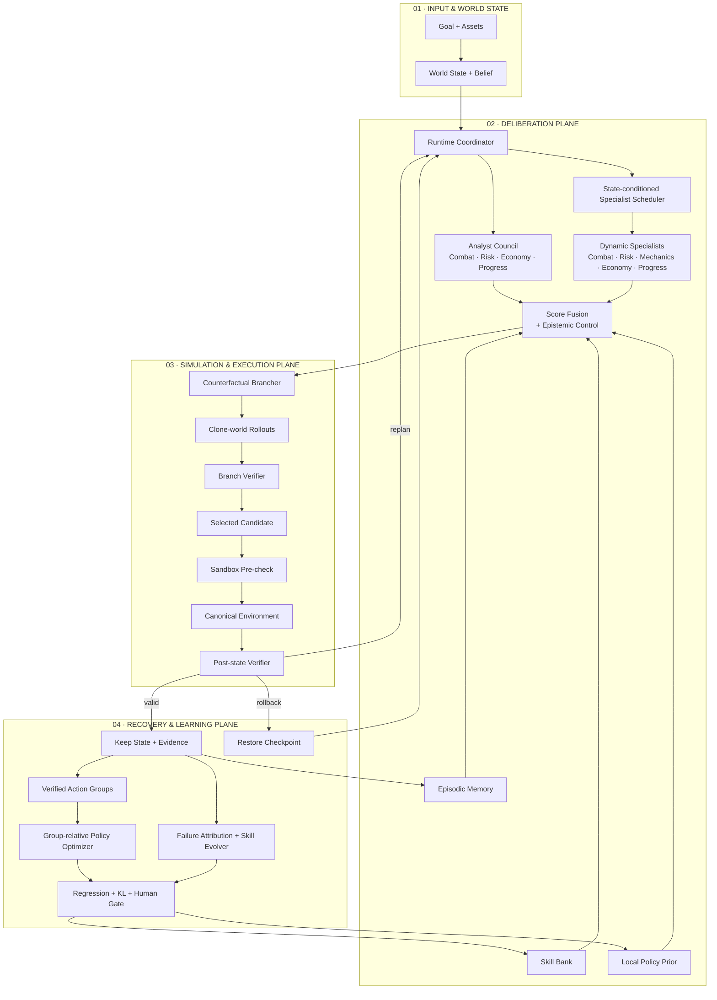
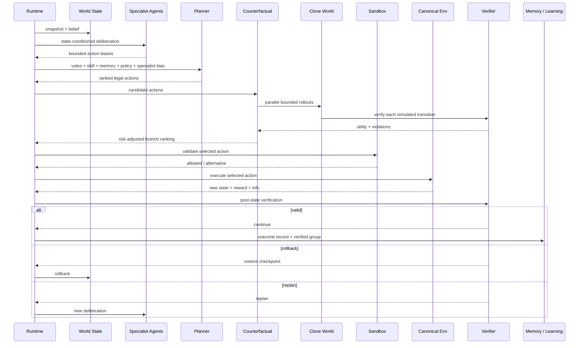

<div align="center">

# 灵境

### 游戏研发 Agent Runtime · 执行工作台

**把研发目标和素材交给系统，让任务持续执行、试演、复核、留证，并在需要时被人随时接管。**

`STATEFUL` · `MULTI-AGENT` · `COUNTERFACTUAL` · `VERIFIED` · `RECOVERABLE`

灵境不是“给游戏文件加一个聊天框”。它把一次研发问题变成一条**可执行、可停止、可恢复、可核验、可交接、可治理**的任务轨迹。

</div>


---

## Product Thesis · 从“问一句”变成“把任务交出去”

> **目标 → 素材 → 状态 → Agent 决策 → 试演 → 执行 → 验证 → 证据 → 交付 → 人工确认**

| CONTROL | TRUST | LIFECYCLE | RECOVERY |
|---|---|---|---|
| **执行可控**：长任务可停止，失败或停止后可安全重试 | **结论可核验**：证据与最终判断一一对应 | **任务可治理**：搜索、归档、交接、审批删除、质量确认持久化 | **失败可恢复**：checkpoint、rollback、replan 是 Runtime 能力 |

---

# Agent Architecture · WorldForge

WorldForge 是灵境自己的 **stateful Agent Runtime**。它不是单个模型外面套一层工具，而是把**世界状态、并行分析 Agent、动态 Specialist、Skill / Memory、策略先验、反事实试演、Sandbox、独立 Verifier 与受门禁学习**放在一个可恢复闭环里。

> **最重要的权限边界：Agent 负责建议与评估；Runtime 负责状态所有权、执行、恢复与完成判定。任何 Specialist、Policy、Planner 都不能直接写入 canonical state。**

### 01 · Architecture at a glance



### 02 · 四个层次，各自只做一件事

| Plane | 组件 | 核心职责 | 能直接写 canonical state？ |
|---|---|---|---|
| **World State** | Runtime / State Store | 保存 Goal、Belief、Game State、checkpoint 与事件链 | **只有 Runtime 拥有状态写权限** |
| **Deliberation** | Council / Specialists / Skill / Memory / Policy | 给动作提供评分、先验、经验与风险意见 | 否 |
| **Simulation & Execution** | Counterfactual / Sandbox / Environment / Verifier | 在 clone 中试演；执行前检查；真实执行后再验证 | 仅 Runtime 驱动的 canonical environment |
| **Recovery & Learning** | Rollback / Replan / Optimizer / Evolver | 恢复失败路径，并在门禁下更新 Skill / Policy | 不直接写世界状态 |

### 03 · Agent 角色不是“多人聊天”

| Agent / Module | 什么时候出现 | 输出 | 权限边界 |
|---|---|---|---|
| **Runtime Coordinator** | 每个 decision step | 调度、checkpoint、状态推进与恢复 | 决策闭环唯一协调者 |
| **Analyst Council** | 每个合法动作 | Combat / Risk / Economy / Progress 评分 | 只能投票 |
| **Combat Specialist** | 默认参与 | 终结窗口、能量与压制建议 | 只能返回 bounded bias |
| **Risk Specialist** | 高 threat / 低 HP | 生存边界、heal / defend / retreat 偏置 | 不能直接阻止或执行动作 |
| **Mechanics Specialist** | 高 uncertainty 且关键机制未观测 | scout / 信息获取偏置 | 不能修改 belief，只能提供建议 |
| **Economy Specialist** | economy / exploit 场景 | 资源轨迹与异常循环建议 | 不能直接购买、farm 或写状态 |
| **Progress Specialist** | 默认参与 | 剩余 horizon 与推进压力 | 只能给 progress bias |
| **Planner** | Specialist / Skill / Memory / Policy 汇合后 | 合法动作排序 | 不能执行 |
| **Counterfactual Brancher** | 有多个候选时 | clone-world 风险调整分支分数 | 只操作 clone |
| **Sandbox** | canonical 执行前 | allow / block / alternative | 只做 pre-execution guard |
| **Verifier** | rollout 与真实动作后 | violations、risk、rollback / replan 建议 | 不自我规划，不自证成功 |

### 04 · 单次决策真实时序



这张图按当前 `worldforge/runtime/engine.py` 的真实调用顺序表达：**先 checkpoint；counterfactual 在 clone 环境中预评估；Sandbox 做 canonical 执行前检查；动作进入真实环境后由 Verifier 做 post-state 验证；失败再 rollback / replan。**

---

## 工作台 · Product Surface

下面的截图来自真实浏览器产品状态。README Gallery 会在界面或截图脚本变化后重新采集，并在发布图片后再次打开 GitHub 仓库首页验证实际可见性。

| **01 · 身份入口** | **02 · 新任务** |
|---|---|
| 工作空间身份、权限与安全边界。<br><br> | 从研发目标开始，而不是从模型配置开始。<br><br> |

| **03 · 素材输入** | **04 · 执行中** |
|---|---|
| 图片、视频、音频、日志、配置和文档进入同一个任务上下文。<br><br> | 真实进度持续进入任务轨迹，需要时可以停止。<br><br> |

| **05 · 任务结果** | **06 · 证据核验** |
|---|---|
| 结论、后续动作、结构化交付和协作留在同一个工作台。<br><br> | 每个关键结论都能回到截图、关键帧、日志或复核来源。<br><br> |

| **07 · 持续上下文** | **08 · 产品总览** |
|---|---|
| 后续追问继承当前任务已有素材，不把上一轮上下文丢掉。<br><br> | 控制、证据、交付与协作集中在同一个任务空间。<br><br> |

---

# Agent Method · Core Equations

下面的公式不是概念化包装，而是对应当前实现中的实际评分、试演、验证与更新规则。为了避免 GitHub 页面把公式当普通文本，块公式统一使用 GitHub 原生 `math` fenced block。

### 01 · Dynamic Specialist Aggregation

每个动态 Specialist 返回动作偏置 `b_j(a)` 与置信度 `c_j`。Runtime 只接受有界建议：

```math
B_{\mathrm{agent}}(a)
=
\operatorname{clip}
\left(
\sum_{j \in \mathcal{A}(s)} c_j\,b_j(a),
-4.5,
4.5
\right)
```

`\mathcal{A}(s)` 是当前状态真正激活的 Specialist 集合。专家意见可以累积，但最终会被裁剪，不能无限放大。

`worldforge/runtime/recursive.py`

---

### 02 · Unified Action Score

Planner 对每个合法动作 `a` 融合固定 Analyst、Skill、Memory、Policy、动态 Specialist 与 epistemic adjustment：

```math
S(a)
=
\sum_i v_i(a)
+
B_{\mathrm{skill}}(a)
+
2.2\tanh\left(\frac{M(s,a)}{10}\right)
+
1.65\,Z_{\theta}(a\mid s)
+
B_{\mathrm{agent}}(a)
+
E(a)
-
R_{\mathrm{repeat}}(a)
```

其中：

- `v_i(a)`：Combat / Risk / Economy / Progress Analyst 的投票；
- `B_skill(a)`：Skill Bank 的状态条件偏置；
- `M(s,a)`：Memory 中相似状态—动作历史先验；
- `Z_θ(a|s)`：Policy 对合法动作 logit 的标准化先验；
- `B_agent(a)`：动态 Specialist Tree 的有界建议；
- `E(a)`：不确定性 × 专家分歧产生的 epistemic adjustment；
- `R_repeat(a)`：重复 `farm / scout / defend` 的停滞摩擦。

Policy prior 本身先标准化：

```math
Z_{\theta}(a\mid s)
=
\frac
{z_a-\mu(z_{\mathrm{legal}})}
{\sigma(z_{\mathrm{legal}})}
```

`worldforge/runtime/planner.py` · `worldforge/runtime/policy.py`

---

### 03 · Epistemic Disagreement Control

WorldForge 不把多 Agent 分歧简单平均，而是把分歧作为“是否应该先获取信息”的信号。

```math
T(a)
=
\min
\left(
4,\;
\operatorname{Std}(v_1(a),\ldots,v_n(a))
\right)
\cdot u
```

`u` 是 belief uncertainty，`T(a)` 是 epistemic tension。

对信息获取动作：

```math
E(\mathrm{scout})
=
1.15 + 1.35\,T
```

对高风险承诺动作：

```math
E(\mathrm{commit})
=
-T\left(0.28 + 0.42\,\tau\right)
```

`\tau` 是 threat。世界越不确定、专家越分裂，系统越倾向先获得证据；关键机制被观测后，uncertainty 下降，探索奖励自然衰减。

`worldforge/runtime/planner.py`

---

### 04 · Counterfactual Rollout Utility

候选动作先在 clone world 中并行试演。每条 rollout 的 verifier utility：

```math
U_k
=
r_k
+
24(1-e_k)
+
17h_k
+
0.04g_k
-
26\max(0,\tau_k-\rho)
-
8|\mathcal{V}_k|
+
70\mathbf{1}_{\mathrm{victory}}
-
90\mathbf{1}_{\mathrm{defeat}}
```

- `r_k`：累计 reward；
- `e_k`：敌方生命比例；
- `h_k`：玩家生命比例；
- `g_k`：gold；
- `\tau_k`：threat；
- `\rho`：目标 risk tolerance；
- `\mathcal{V}_k`：该 rollout 实际出现的 verifier violations。

一个动作最终按风险调整后的分支分数排序：

```math
Q(a)
=
\mathbb{E}[U]
-
0.45\,\operatorname{Std}(U)
+
0.20\,\min(U)
+
16\,p_{\mathrm{success}}
```

所以“平均收益高但 downside 极差”的动作会被主动降权。

`worldforge/runtime/counterfactual.py` · `worldforge/runtime/verifier.py`

---

### 05 · Independent Verification

真实动作执行后，Verifier 独立计算状态风险：

```math
R_{\mathrm{state}}
=
\operatorname{clip}
\left(
0.65\,\tau + 0.55(1-h),
0,
1
\right)
```

Verifier 同时检查：

**negative gold · energy invariant · hp invariant · invalid action · reward-loop anomaly · catastrophic survival risk · terminal failure**

严重路径会产生 rollback / replan 建议。Planner 和 Policy 都不能自己宣布“成功”。

`worldforge/runtime/verifier.py`

---

### 06 · Local Policy Prior

Policy 是小型本地 MLP，只负责提供决策先验。

```math
\hat{x}
=
\frac{x-\mu}{\sigma}
```

```math
h
=
\tanh(\hat{x}W_1+b_1),
\qquad
z
=
hW_2+b_2
```

合法动作集合 `\mathcal{L}(s)` 上：

```math
\pi_{\theta}(a\mid s)
=
\frac{\exp(z_a)}
{\sum_{a' \in \mathcal{L}(s)}\exp(z_{a'})}
```

它不拥有工具权限、状态写入、rollback、verification 或任务完成判定。

`worldforge/runtime/policy.py`

---

### 07 · Group-relative Policy Update

同一状态下多个候选动作组成一个 verified group。优势先在组内中心化、标准化并裁剪：

```math
A_i
=
\operatorname{clip}
\left(
\frac{r_i-\bar{r}}
{\sigma_r+\varepsilon},
-3,
3
\right)
```

旧策略冻结后计算 probability ratio：

```math
\rho_i(\theta)
=
\frac
{\pi_{\theta}(a_i\mid s)}
{\pi_{\theta_{\mathrm{old}}}(a_i\mid s)}
```

更新目标：

```math
L_{\mathrm{clip}}
=
\frac{1}{|G|}
\sum_i
\min
\left(
\rho_iA_i,\;
\operatorname{clip}(\rho_i,1-\epsilon,1+\epsilon)A_i
\right)
```

默认 `\epsilon = 0.18`，并要求 empirical KL 留在 trust region：

```math
D_{\mathrm{KL}}
\left(
\pi_{\mathrm{old}}
\parallel
\pi_{\theta}
\right)
=
\mathbb{E}_{G}
\left[
\sum_a
\pi_{\mathrm{old}}(a\mid s)
\log
\frac{\pi_{\mathrm{old}}(a\mid s)}
{\pi_{\theta}(a\mid s)}
\right]
\le 0.035
```

KL 越界时 candidate policy 回退到旧策略。

`worldforge/runtime/policy.py`

---

### 08 · Failure-driven Evolution Gate

Skill patch 不是“跑赢一次就升级”。失败先归因，再过 regression 与 Human Feedback Gate：

```math
\mathrm{Accept}_{\mathrm{skill}}
=
H
\land
(J_{\mathrm{candidate}}\ge J_{\mathrm{baseline}}-0.01)
\land
(J_{\mathrm{candidate}}\ge J_{\mathrm{baseline}}+0.005)
```

Policy candidate 还必须满足真实引擎里的独立接受条件：

```math
\mathrm{Accept}_{\mathrm{policy}}
=
H
\land
(\mathrm{updates}>0)
\land
(J_{\mathrm{candidate}}\ge J_{\mathrm{baseline}}+0.001)
\land
(D_{\mathrm{KL}}\le 0.035)
```

只有通过门禁的 Skill / Policy 才会写回共享学习状态。

`worldforge/runtime/evolver.py` · `worldforge/runtime/engine.py`

---

## Runtime Invariants

| Invariant | 含义 |
|---|---|
| **Canonical state ownership** | 只有 Runtime 能推进真实状态；反事实分支永远操作 clone |
| **Bounded specialists** | Specialist 只能返回 bounded bias，不能执行 |
| **Planner ≠ executor** | 排序、建议与执行权限严格分离 |
| **Independent verification** | Planner / Policy 不能自证成功 |
| **Checkpoint before risk** | 每个 decision step 先保存 checkpoint，再进入候选试演与真实执行 |
| **Rollback before corruption** | 失败路径恢复旧状态或重规划，不把错误状态当完成结果 |
| **Policy is a prior** | Policy 影响排序，但不拥有权限、状态写入或完成判定 |
| **Human-gated learning** | Skill / Policy 更新必须经过 regression、KL / trust-region 与人工门禁 |

---

## 产品层：Control · Trust · Lifecycle · Recovery

### Control — 人始终拥有控制权

进行中的任务可以真实停止；最近一次停止或失败的执行可以安全重试。停止先发生时，系统不会再补写迟到的成功结果。

任务支持**搜索、重命名、置顶、归档 / 恢复、负责人交接、深链接和受审批保护的永久删除**。

### Trust — 结论必须能被检查

交付不是只有一段回答。不同研发场景会沉淀为**复现卡、回归清单、风险清单、调参与验证方案、证据包**等结构化结果，并通过证据 ID 与来源关联。

完成交付后先进入“待复核”。只有最新交付被人工确认正确且不存在错误反馈，任务才进入“已验证”。

### Lifecycle — 任务跨时间、跨成员继续存在

用户、工作空间、任务、素材、运行记录和审计边界由服务端校验。工作空间支持邀请、角色、负责人和交接；viewer 是真正的服务端只读角色。

任务接收和任务完成采用确定性状态提交：用户输入、排队 Job 与 `message.accepted` 同事务落库；Job 完成、assistant 交付与 `answer.ready` 同事务提交。

### Recovery — 失败是 Runtime 的正常路径

风险路径不会直接覆盖有效状态。系统保留停止、重试、checkpoint、rollback 与 replan，不用一句“已完成”掩盖执行中断。

---

## 多模态不是附件栏

一个任务可以持续追加：

**图片 · 视频 · 音频 · 日志 · JSON / CSV · 配置文件 · 文本 / 文档**

素材会真正进入判断链路：

- **图片**进入视觉证据；
- **视频**按时长自适应抽取关键帧，关键帧参与判断并成为可回溯证据；
- **音频**保留声学输入，由系统按能力自动路由推理资源；
- **日志 / 配置**把实际内容摘录写入任务上下文；
- **素材校验**同时检查声明类型和真实内容；
- **任务继承**让后续追问保留当前任务已有多模态素材；
- **证据索引**让最终结论能够指回来源。

---

## 适合交给灵境的工作

| 研发目标 | 交付结果 |
|---|---|
| **战斗问题复现** | 对齐录像、日志和状态变化，寻找稳定触发条件并重复核验 |
| **数值风险检查** | 探索极端 Build、资源曲线与高波动组合，给出优先调整项 |
| **版本回归验证** | 复现历史异常、核验修复结果并沉淀发布前检查项 |
| **角色行为检查** | 检查连续交互、目标切换与上下文不一致 |
| **多素材交叉核对** | 在同一任务里联合视觉、声音、日志、配置与历史任务上下文 |

---

<details>
<summary><b>Engineering Notes · 状态、Realtime 与持久化</b></summary>

<br>

### World State

`worldforge/runtime/engine.py` 维护可恢复环境状态：Goal / Belief / Game State、append-only hash-chained events、Snapshot / Restore / Checkpoint、Replay / Fork、Sandbox 与 rollback / replan。

反事实分支只操作 clone；共享 Policy、Skill、Memory 在单次 run 内隔离，run 完成后才在短 critical section 中合并学习状态。

### Realtime + Deterministic Job Lifecycle

产品事件通过 durable cursor 读取并 fan-out；WebSocket 使用 subscribe-before-replay、event-id deduplication 与 `after_id` 断点续传。

任务接收、完成、取消、重试和永久删除审批都以持久化状态为事实源。每轮 progress 带自己的 `job_id`，刷新页面时只恢复当前 / 最近一次执行。

更多工程细节见 [`docs/ARCHITECTURE.md`](docs/ARCHITECTURE.md)。

</details>

---

## Quick start

```bash
python -m venv .venv
source .venv/bin/activate
pip install -r requirements.txt
uvicorn worldforge.api.app:app --reload
```

浏览器打开本地服务即可进入工作台。开发模式默认使用 SQLite、Local Object Storage、Dev Identity 和进程内 Worker。

独立 Worker：

```bash
WORLDFORGE_QUEUE_MODE=external python -m worldforge.worker
```

生产部署、数据库迁移、对象存储和运行保障见 [`docs/RUNBOOK.md`](docs/RUNBOOK.md)。

---

## Verification

```bash
python -m compileall -q worldforge migrations scripts tests
pytest -q
node --check frontend/app.js
python scripts/product_backend_e2e.py
python scripts/product_ui_e2e.py
```

正式门禁覆盖 Python 回归与编译、前端 JavaScript 语法、后端产品 E2E、真实浏览器产品 E2E、README GitHub 渲染、Release 图片完整性，以及发布图片后重新打开公开 GitHub 仓库首页验证截图真实可见。

---

## Repository

```text
frontend/                 客户工作台
worldforge/
  api/                    API / Auth / Realtime
  product/                任务、素材、证据、治理与持久化
  runtime/                Agent Runtime / 执行 / 验证 / 学习
  providers/              服务端可替换推理资源
  storage/                本地 / 对象存储
migrations/               产品数据迁移
scripts/                  产品 E2E 与策略训练入口
tests/                    Runtime / API / 产品 / 多模态 / Realtime 回归测试
docs/                     架构、前端、运行与评测说明
```

---

<div align="center">

**目标不是让系统更会描述它做了什么，而是让它真的执行、试演、复核、恢复，并留下可以检查、可以交接、可以确认的结果。**

</div>
