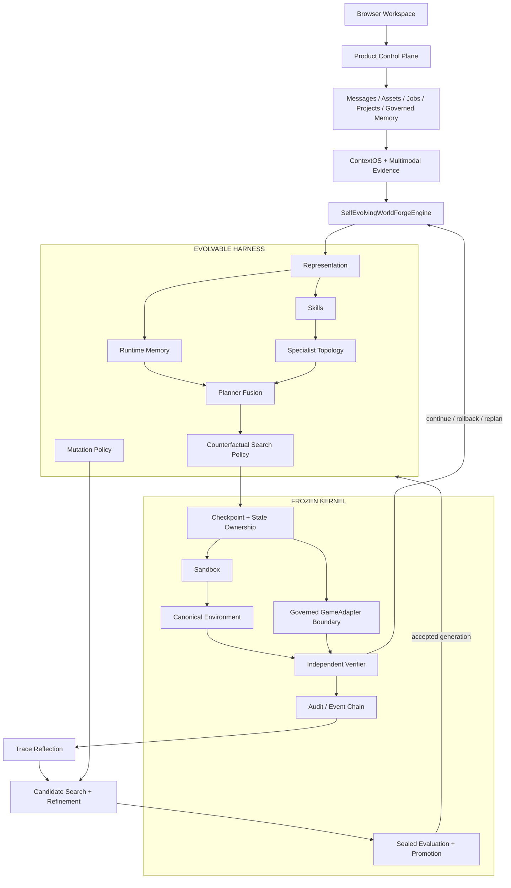

<div align="center">

# 灵境 · Lingjing

### AI game debugging agent for bug reproduction, fix verification and regression

**上传录像、日志、截图、配置与 Build 上下文，让灵境持续复现游戏问题、定位触发条件、绑定关键证据，并在修复后沿用同一条件重新验证。**

`BUG REPRODUCTION` · `EVIDENCE` · `FIX VERIFICATION` · `REGRESSION` · `STATEFUL` · `VERIFIABLE`

<p>
  <a href="#-快速开始"><b>快速开始</b></a> ·
  <a href="#-默认产品闭环"><b>默认产品闭环</b></a> ·
  <a href="#-产品能力"><b>产品能力</b></a> ·
  <a href="#-系统架构"><b>系统架构</b></a> ·
  <a href="#-工作台"><b>工作台</b></a>
</p>


</div>


---

## 🌌 灵境是什么

灵境首先是一个面向游戏 QA 与研发团队的 **Bug 复现、修复验证与回归交付 Agent**。用户把问题描述和多模态素材放进同一个持久任务后，系统持续保留执行状态、证据、项目上下文与验证结果，避免一次问题分析退化成一轮聊天或一份不可复核的结论。

默认用户不需要理解 ContextOS、Genome、Frozen Kernel 或 Counterfactual Search。产品首先承诺三件事：

1. **能复现**：把“偶发”推进到稳定触发条件，或明确说明证据不足与不可复现边界；
2. **有证据**：关键结论能回到录像片段、截图、日志、配置、finding 与 Verifier 结果；
3. **能验证**：修复后可沿用同一任务和复现条件重新执行，并留下前后对比与回归清单。

底层仍是一个 verifiable、stateful 的 game R&D agent runtime：

> **Goal → Assets → ContextOS / Project Memory → State → Agent Decision → Counterfactual Search → Canonical Execution → Verification → Evidence → Delivery → Harness Evolution**

模型负责推理；Product Control Plane 负责身份、任务、ContextOS、Project Memory 与治理；Harness 负责把 Skill、Memory、Specialist、Planner 与搜索策略组织成可运行的研发流程；Frozen Kernel 负责真实状态、执行、验证与晋升边界。

---

## 🎯 默认产品闭环

```text
发现 Bug
→ 上传录像 / 日志 / 配置 / Build 上下文
→ 搜索稳定复现条件
→ 输出复现卡 + 关键 Evidence
→ 提交修复版本 / branch / commit
→ 按原条件重新验证
→ 输出前后对比 + 回归清单
```

工作台的默认信息层只强调 **执行、证据、结果、素材**。Project Memory governance、Harness Evolution、细粒度审计与算法机制仍然存在，但属于高级能力，不要求普通用户先理解。

> 当前仓库已经提供 GameAdapter protocol、reference client、Frozen Kernel ticket gateway，并新增可通过 Unity Package Manager 导入的 **Unity Editor activation package**。该 package 当前只提供 `127.0.0.1` loopback、可选 bearer token 与 non-mutating dry-run conformance；它不是完整的项目自动化执行插件，也不会把 engine observation 升级为验证真相。Unreal plugin、项目级截图/运行日志/action handlers 与真实 Bug → Fix 项目证据仍需后续补齐，并继续经过 Frozen Kernel 独立验证边界。

---

## ✨ 产品能力

| 能力 | 说明 |
|---|---|
| **问题复现与持续执行** | 任务状态与事件持续保存，支持停止、安全重试、rollback 与 replan；复现上下文不会因为一次失败丢失 |
| **多模态问题上下文** | 图片、视频、音频、日志、配置和文档可以进入同一个 workspace，并被后续修复验证继续使用 |
| **可验证结果** | 关键结论可以回到截图、关键帧、日志、finding 与 Verifier 结果；memory/retrieval 不会自动升级为验证真相 |
| **修复后重跑与交付** | 结构化复现卡、风险项、验证方案、回归清单与 evidence pack 可以留在同一任务轨迹 |
| **长期 ContextOS** | 将 TaskState、历史检索、Project Memory 与 EvidenceControl 编译成 bounded context，避免长期任务退化成简单 last-N 对话 |
| **受治理的项目记忆** | Project ↔ Conversation 显式绑定；proposal、revision、scope、撤回、争议与审批全部可审计，未批准建议不会自动成为项目事实 |
| **反事实搜索** | 在 clone world 中比较候选路径，再选择进入 canonical execution 的动作 |
| **可进化 Harness** | Representation、Skill、runtime Memory、Specialist topology、Planner fusion、搜索预算与 mutation policy 都可以进入 Genome |
| **受控外部引擎边界** | Unity/Unreal/custom bridge 通过短时 ticket 与 replay protection 接入，engine observation 仍需独立 Frozen Kernel verification |
| **完整任务生命周期** | 身份、协作、搜索、归档、审批删除、反馈、任务事件和 memory governance 统一进入产品层 |

---

## 🧭 系统架构

灵境保持三个明确的权威边界：

1. **Product Control Plane**：workspace、任务、消息、素材、ContextOS、Project Memory、审批与审计；
2. **Evolvable Harness**：决定如何组织 Skill、runtime Memory、Specialist、Planner 与搜索策略；
3. **Frozen Kernel**：拥有 canonical state、安全、Verifier、真实动作提交和 Harness promotion gate。



### 权威边界

| Product / ContextOS | Evolvable Harness | Frozen Kernel |
|---|---|---|
| Workspace authorization | Feature representation / normalization | Canonical state ownership |
| Task / message / asset lifecycle | Belief 与 uncertainty 参数 | Checkpoint / rollback |
| Governed Project Memory | Skill gate / bias / reliability | Sandbox 与 invariant verification |
| Bounded long-horizon context | Runtime memory kernel / recency | Independent Verifier |
| Multimodal retrieval / evidence planning | Specialist topology / action features | Real action submission |
| Proposal / approval / audit | Planner fusion / epistemic control | Sealed evaluation / promotion |
| Provider-aware context budget | Counterfactual budget / risk utility | Atomic promotion / lineage |

Harness 可以改变**怎么工作**；ContextOS 可以改变**模型看到哪些经过治理的上下文**；但二者都不能改写**谁拥有真实状态、什么算安全、谁负责验证、什么条件允许晋升**。

更完整的实现说明见 [`docs/ARCHITECTURE.md`](docs/ARCHITECTURE.md)。

---

## 🖥️ 工作台

下面的截图来自实际产品界面，覆盖从身份入口、素材输入到执行、证据与结果的完整路径。

| 身份与新任务 | 素材与执行 |
|---|---|
| **01 · 身份入口**<br><br> | **02 · 新任务**<br><br> |
| **03 · 多模态素材**<br><br> | **04 · 执行中**<br><br> |
| **05 · 任务结果**<br><br> | **06 · 证据核验**<br><br> |
| **07 · 持续上下文**<br><br> | **08 · 产品总览**<br><br> |

前端结构与页面说明见 [`docs/FRONTEND.md`](docs/FRONTEND.md)。

---

## 🧬 Harness Evolution

Harness Evolution 使用运行轨迹中的 evidence 产生候选 Genome，在独立 shadow arena 中搜索与比较，并通过 held-out gate 决定是否晋升新的 generation。


任务开始时固定一个明确 Harness generation；即使其他 worker 在任务期间完成新的 promotion，当前任务也不会中途切换 phenotype。

README 只保留机制概览；算法、评估协议与研究背景分别见：

- [`docs/ARCHITECTURE.md`](docs/ARCHITECTURE.md)
- [`docs/BENCHMARKING.md`](docs/BENCHMARKING.md)
- [`docs/RESEARCH_NOTES.md`](docs/RESEARCH_NOTES.md)

---

## 🎮 适合的工作

**默认主路径**：

- 战斗、Boss、角色行为等偶发问题复现；
- 录像 / 截图 / 日志 / 配置的跨模态证据核对；
- 修复版本的同条件重跑与前后证据比较；
- 结构化复现卡、回归清单和 evidence pack；
- 跨 build / branch / commit 的持续问题上下文。

**扩展工作流**：

- 极端 Build 与数值风险检查；
- 经济、成长、掉落与奖励循环异常分析；
- 长任务执行、停止、重试、rollback 与 replan；
- 跨 Conversation 的 Project Memory、状态更新与版本隔离；
- 基于真实失败轨迹搜索更合适的 Skill、runtime Memory、Specialist 与反事实策略。

---

## 🚀 快速开始

### 1. 启动产品

```bash
git clone https://github.com/jiaweine/lingjing-game-studio.git
cd lingjing-game-studio
pip install -r requirements.txt
uvicorn worldforge.api.app:app --reload
```

打开：`http://127.0.0.1:8000`

> 运行环境要求 Python `>= 3.11`。

### 2. 开发与测试

```bash
pip install -r requirements-dev.txt
pytest -q
```

### 3. 运行独立验证

```bash
python scripts/harness_evolution_benchmark.py
python scripts/memory_benchmark.py
python scripts/memory_identity_benchmark.py
python scripts/context_adversarial_benchmark.py
python scripts/product_backend_e2e.py
```

Synthetic / deterministic benchmark 只证明对应 correctness/protocol floor。真实 held-out、live retrieval、PostgreSQL、provider latency/cost 或 Unity/Unreal 项目证据按 [`docs/EXTERNAL_EVIDENCE_RUNBOOK.md`](docs/EXTERNAL_EVIDENCE_RUNBOOK.md) 单独执行。

---

## 🔌 Runtime API

| Endpoint | 用途 |
|---|---|
| `POST /runs` | 启动 WorldForge 任务 |
| `GET /runs/{id}` | 查询任务状态 |
| `GET /runs/{id}/events` | 读取持久事件链 |
| `GET /runs/{id}/stream` | 通过 SSE 订阅实时事件 |
| `POST /runs/{id}/cancel` | 停止运行中的任务 |

Product workspace、Project Memory 与治理 API 由同一 FastAPI control plane 提供，并始终进行 workspace/actor authorization；它们不是 Frozen Runtime API 的旁路写入口。

---

## 🗂️ Repository Map

```text
frontend/                       产品工作台与 Memory governance UI
worldforge/api/                 Runtime / Product API
worldforge/product/             工作空间、协作、任务、素材与产品生命周期
worldforge/context/             ContextOS、Project Memory、identity、evidence 与 token budget
worldforge/integrations/        Governed external integration boundaries / GameAdapter
integrations/unity/             Unity Editor activation package for GameAdapter v1
worldforge/runtime/             Frozen Kernel + Evolvable Harness
worldforge/providers/           Provider routing / native token safety
worldforge/envs/                可验证游戏环境 / BalanceLab
services/multimodal_retriever/  Optional semantic multimodal coordinator/workers
migrations/                     Production schema evolution
benchmarks/                     Frozen benchmark contracts / private-corpus scaffolds
scripts/                        E2E、benchmark、corpus 与 conformance entrypoints
tests/                          Runtime / Product / Context / Memory / integration 回归
docs/                           架构、前端、评估、协议、运维、产品策略与研究说明
```

---

## 📚 文档

| 文档 | 内容 |
|---|---|
| [`PRODUCT_STRATEGY.md`](docs/PRODUCT_STRATEGY.md) | ICP、Bug → Fix → Regression 主路径、Value Proof、产品指标与 P0/P1 roadmap |
| [`ARCHITECTURE.md`](docs/ARCHITECTURE.md) | Product Control Plane、ContextOS、Memory、Harness、Frozen Kernel 与 GameAdapter 权威边界 |
| [`BENCHMARKING.md`](docs/BENCHMARKING.md) | Harness / Memory / Identity / Context / Multimodal benchmark 与证据分层 |
| [`LONG_HORIZON_MODEL_BENCHMARK.md`](docs/LONG_HORIZON_MODEL_BENCHMARK.md) | baseline-last8 ↔ ContextOS 模型级 held-out 协议 |
| [`MULTIMODAL_QUALITY_BENCHMARK.md`](docs/MULTIMODAL_QUALITY_BENCHMARK.md) | game-rd-mm-v1 corpus 与 live retrieval quality protocol |
| [`GAME_ADAPTER_PROTOCOL.md`](docs/GAME_ADAPTER_PROTOCOL.md) | Unity / Unreal / custom bridge 的 Frozen-Kernel-governed contract |
| [`EXTERNAL_EVIDENCE_RUNBOOK.md`](docs/EXTERNAL_EVIDENCE_RUNBOOK.md) | 真实 held-out / GPU / PostgreSQL / provider / engine 证据执行与升级规则 |
| [`FRONTEND.md`](docs/FRONTEND.md) | 工作台结构、交互与前端实现 |
| [`RUNBOOK.md`](docs/RUNBOOK.md) | 本地运行、部署与运维说明 |
| [`RESEARCH_NOTES.md`](docs/RESEARCH_NOTES.md) | 研究背景、参考方法与实现映射 |

---

## 📦 当前版本

当前仓库版本为 **v1.0.0**。README 聚焦第一版产品当前已经实现的能力；synthetic correctness 分数、真实外部实验、研究出处与工程细节统一放在 `docs/`，避免首页把 CI smoke 写成产品质量或 SOTA 声明。

项目使用 **Apache License 2.0**，见 [`LICENSE`](LICENSE)。

---

<div align="center">

**REPRODUCE THE ISSUE · VERIFY THE FIX · KEEP THE EVIDENCE**

</div>