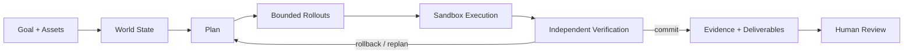

# 灵境

### 游戏研发执行工作台

**把研发目标和素材交给系统，让任务持续执行、复核、留证，并在需要时被人随时接管。**

不是给游戏文件加一个聊天框。灵境把一次研发问题变成一条**可执行、可停止、可恢复、可核验、可交接、可治理**的任务轨迹。


---

## 从“问一句”变成“把任务交出去”

> **目标 → 素材 → 执行 → 复核 → 证据 → 交付 → 人工确认**

灵境的界面只围绕研发真正关心的几个问题组织：**现在要完成什么、系统正在做什么、我能不能介入、发现了什么、结论由什么证据支持、谁来确认结果。**

| Control | Evidence | Lifecycle |
|---|---|---|
| **执行可控**：长任务可以停止；失败或停止后可以安全重试；刷新后恢复正确状态 | **结果可核验**：截图、关键帧、日志摘录和复核结果与结论对应 | **任务可治理**：搜索、置顶、归档、交接、审批删除、人工质量确认都有持久化状态 |

---

## 工作台

下面的截图来自真实浏览器产品状态。README Gallery 会在界面或截图脚本变化后重新采集，并在发布图片后再次打开 GitHub 仓库首页验证实际可见性。

| **01 · 身份入口** | **02 · 新任务** |
|---|---|
| 工作空间身份、权限与安全边界。<br><br> | 从研发目标开始，而不是从模型配置开始。<br><br> |

| **03 · 素材输入** | **04 · 执行中** |
|---|---|
| 图片、视频、音频、日志、配置和文档进入同一个任务上下文。<br><br> | 真实进度持续进入任务轨迹，需要时可以停止。<br><br> |

| **05 · 任务结果** | **06 · 证据核验** |
|---|---|
| 结论、后续动作、结构化交付和协作留在同一个工作台。<br><br> | 每个关键结论都能回到截图、关键帧、日志或复核来源。<br><br> |

| **07 · 持续上下文** | **08 · 产品总览** |
|---|---|
| 后续追问继承当前任务已有素材，不把上一轮上下文丢掉。<br><br> | 控制、证据、交付与协作集中在同一个任务空间。<br><br> |

---

## 一个研发任务应该具备什么

### 01 · Control — 人始终拥有控制权

进行中的任务可以真实停止；最近一次停止或失败的执行可以安全重试。停止先发生时，系统不会再补写一个迟到的成功结果；任务进入永久删除审批后，也不会夹入新的执行。

任务本身支持**搜索、重命名、置顶、归档 / 恢复、负责人交接、深链接和受审批保护的永久删除**。这些不是前端假状态，而是服务端持久化生命周期的一部分。

### 02 · Trust — 结论必须能被检查

交付不是只有一段回答。不同研发场景会沉淀为**复现卡、回归清单、风险清单、调参与验证方案、证据包**等结构化结果，并通过证据 ID 与来源关联。

完成交付后任务先进入“待复核”。只有最新交付被人工确认正确且不存在错误反馈，任务才进入“已验证”；错误反馈会把任务标记为“需修正”。

### 03 · Lifecycle — 任务可以跨时间、跨成员继续存在

用户、工作空间、任务、素材、运行记录和审计边界都由服务端校验。工作空间支持邀请、角色、负责人和交接；viewer 是真正的服务端只读角色。

任务接收和任务完成都采用确定性的状态提交：**用户输入、排队 Job 与 `message.accepted` 同事务落库；Job 完成、assistant 交付与 `answer.ready` 同事务提交。**

### 04 · Recovery — 失败是运行时的一部分

风险路径和失败路径不会直接覆盖有效状态。系统保留恢复、重新规划和安全重试能力，不用一句“已完成”掩盖执行中断，也不伪造无法保证的任意点暂停 / 续跑。

---

## 多模态不是附件栏

一个任务可以持续追加：

**图片 · 视频 · 音频 · 日志 · JSON / CSV · 配置文件 · 文本 / 文档**

素材会真正进入判断链路：

- **图片**进入视觉证据；
- **视频**按时长自适应抽取关键帧，关键帧参与判断并成为可回溯证据；
- **音频**保留声学输入，由系统按能力自动路由推理资源；
- **日志 / 配置**把实际内容摘录写入任务上下文；
- **素材校验**同时检查声明类型和真实内容，异常媒体不会伪装成有效输入；
- **任务继承**让后续追问自动保留当前任务已有多模态素材；
- **证据索引**让最终结论能够指回来源，而不是只给一段无法复查的答案。

---

## 适合交给灵境的工作

| 研发目标 | 交付结果 |
|---|---|
| **战斗问题复现** | 对齐录像、日志和状态变化，寻找稳定触发条件并重复核验 |
| **数值风险检查** | 探索极端 Build、资源曲线与高波动组合，给出优先调整项 |
| **版本回归验证** | 复现历史异常、核验修复结果并沉淀发布前检查项 |
| **角色行为检查** | 检查连续交互、目标切换与上下文不一致 |
| **多素材交叉核对** | 在同一任务里联合视觉、声音、日志、配置与历史任务上下文 |

---

## 产品边界

**任务优先。** 页面围绕目标、执行、证据、交付和确认组织，而不是围绕聊天气泡组织。

**内部实现隐藏。** 客户不需要选择模型、供应商，也不需要理解内部规划、试演或策略优化术语。

**推理资源可替换。** 本地或远端推理资源提供感知与内容理解能力；状态、权限、任务生命周期、执行、验证、恢复和完成判定由灵境自己的运行时负责。

---

## Runtime

WorldForge 是灵境的执行内核。外部或本地推理资源可以提供感知、文本理解和推理能力，但不能直接绕过 Runtime 提交动作、修改 canonical state、跳过验证或决定一次任务是否完成。



<details>
<summary><b>展开工程实现</b></summary>

<br>

### World State

`worldforge/runtime/engine.py` 维护可恢复环境状态，而不是只保存对话文本：Goal / Belief / Game State、append-only hash-chained events、Snapshot / Restore / Checkpoint、Replay / Fork、Sandbox 与 rollback / replan。

反事实分支只操作克隆环境；只有经过选择和验证的动作才进入 canonical state。

### Epistemic Disagreement Control

`worldforge/runtime/planner.py` 把内部专家分歧与世界状态不确定性组合成 epistemic tension。状态越不确定、专家意见越分裂，低风险信息获取行为越有价值；关键状态被观测确认后，探索奖励下降，系统回到执行优先。

### Counterfactual + Bounded Specialists

动作提交前并行评估候选未来的 expected utility、downside、survival、success probability 与 verifier violations。状态条件专家只提供有界动作偏置，不能直接执行，也不能绕过 Sandbox / Verifier。

### Verification + Evolution

Verifier 独立检查状态不变量、非法动作、灾难性风险和异常奖励循环。成功与失败轨迹进入 Memory / Skill；候选策略更新受 regression gate、trust-region 约束与 Human Feedback Gate 共同限制。

### Realtime + Deterministic Job Lifecycle

产品事件通过 durable cursor 读取并 fan-out；WebSocket 使用 subscribe-before-replay、event-id deduplication 与 `after_id` 断点续传，避免重连后重复搬运完整历史。

任务接收、完成、取消、重试和永久删除审批都以持久化状态为事实源。每轮 progress 带自己的 `job_id`，刷新页面时只恢复当前 / 最近一次执行，不把多轮任务进度混在一起。

更多工程细节见 [`docs/ARCHITECTURE.md`](docs/ARCHITECTURE.md)。

</details>

---

## Quick start

```bash
python -m venv .venv
source .venv/bin/activate
pip install -r requirements.txt
uvicorn worldforge.api.app:app --reload
```

浏览器打开本地服务即可进入工作台。开发模式默认使用 SQLite、Local Object Storage、Dev Identity 和进程内 Worker，不要求先配置外部推理服务。

独立 Worker：

```bash
WORLDFORGE_QUEUE_MODE=external python -m worldforge.worker
```

生产部署、数据库迁移、对象存储和运行保障见 [`docs/RUNBOOK.md`](docs/RUNBOOK.md)。

---

## Verification

```bash
python -m compileall -q worldforge migrations scripts tests
pytest -q
node --check frontend/app.js
python scripts/product_backend_e2e.py
python scripts/product_ui_e2e.py
```

正式门禁覆盖 Python 回归与编译、前端 JavaScript 语法、后端产品 E2E、真实浏览器产品 E2E、README GitHub 渲染、Release 图片完整性，以及**发布图片后重新打开公开 GitHub 仓库首页验证截图真实可见**。

浏览器产品 E2E 覆盖身份入口、工作空间、任务生命周期、素材上传、多模态上下文、运行状态、停止 / 重试、实时结果、证据、结构化交付、质量反馈、团队协作、邀请、产品指标、归档保护和永久删除审批。任一关键检查失败都会返回非零退出码。

---

## Repository

```text
frontend/                 客户工作台
worldforge/
  api/                    API / Auth / Realtime
  product/                任务、素材、证据、治理与持久化
  runtime/                执行与验证内核
  providers/              服务端可替换推理资源
  storage/                本地 / 对象存储
migrations/               产品数据迁移
scripts/                  产品 E2E 与策略训练入口
tests/                    Runtime / API / 产品 / 多模态 / Realtime 回归测试
docs/                     架构、前端、运行与评测说明
```

---

**目标不是让系统更会描述它做了什么，而是让它真的执行、复核、恢复，并留下可以检查、可以交接、可以确认的结果。**