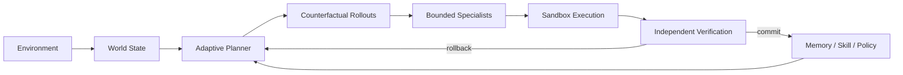

<div align="center">

# 灵境 · 游戏研发执行工作台

### 把研发目标交给系统，持续执行到得到可核验的结果

**问题复现 · 数值检查 · 版本回归 · 角色行为 · 多模态证据 · 长周期任务**

<p>
  
  
  
  
  
</p>

</div>


---

## 不是给游戏文件加一个聊天框

灵境的入口可以是自然语言，但产品本体是一条持续运行的研发任务：

> **目标 → 素材 → 执行 → 复核 → 证据 → 结论 → 下一步**

用户不需要知道内部用了什么规划器、多少分支或哪些推理资源。客户界面只回答五个问题：**我要完成什么、系统正在做什么、哪里需要介入、发现了什么、结论由什么证据支持。**

<table>
<tr>
<td width="50%" valign="top">

<br><sub><b>目标入口</b> · 直接描述要完成的研发目标，不要求先拆 Prompt 或流程图。</sub>
</td>
<td width="50%" valign="top">

<br><sub><b>持续执行</b> · 实时显示正在处理什么，而不是用“思考中”替代真实进度。</sub>
</td>
</tr>
<tr>
<td width="50%" valign="top">

<br><sub><b>结果工作区</b> · 目标、执行记录、结论和后续动作保留在同一任务轨迹中。</sub>
</td>
<td width="50%" valign="top">

<br><sub><b>证据面板</b> · 日志、截图、录像关键帧和重复复核结果与结论一一对应。</sub>
</td>
</tr>
</table>

---

## 多模态输入是第一等能力


同一个任务可以持续追加：

**图片 · 视频 · 音频 · 日志 · JSON / CSV · 配置文件 · 文本 / 文档**

处理链路不是“附件上传成功”就结束，而是把不同模态转换为真正可用于判断的证据：

- 图片直接进入视觉证据；
- 视频自适应抽取关键帧，长视频增加采样密度；
- 音频保留声学输入，交给具备对应能力的本地或远端推理资源；
- 日志和配置把真实内容摘录写入任务上下文，而不是只把文件名交给模型；
- 每份素材生成证据索引，最终结论要求区分**观察、推断和待验证项**。


---

## 适合做什么

| 研发目标 | 灵境负责交付 |
|---|---|
| **战斗问题复现** | 对齐录像、日志和状态变化，寻找稳定触发条件并重复核验 |
| **数值风险检查** | 探索极端 Build、资源曲线与高波动组合，给出优先调整项 |
| **版本回归验证** | 复现历史异常、验证修复结果并沉淀发布前检查项 |
| **角色行为检查** | 检查连续交互、目标切换和上下文不一致 |
| **多素材交叉核对** | 在同一个任务里把视觉、声音、日志、配置和历史对话联合起来 |

### 产品层的三个原则

**任务优先。** 页面围绕目标、执行、证据与结果组织，而不是围绕“聊天气泡”组织。  
**算法隐藏。** 客户不需要理解内部规划、试演、策略优化等工程术语。  
**推理可替换。** 外部或本地模型只提供感知/推理能力；任务策略、权限、执行、回滚与完成判定属于 WorldForge。

---

## 快速开始

```bash
python -m venv .venv
source .venv/bin/activate
pip install -r requirements.txt
uvicorn worldforge.api.app:app --reload
```

浏览器打开本地服务即可进入工作台。

需要独立 Worker 时：

```bash
WORLDFORGE_QUEUE_MODE=external python -m worldforge.worker
```

需要接入本地开源全模态推理服务时，可配置任意兼容接口：

```bash
export LOCAL_OMNI_BASE_URL=http://127.0.0.1:8901/v1
export LOCAL_OMNI_MODEL=your-local-multimodal-model
```

这条本地推理通道只参与感知与内容理解，不接管 WorldForge 的 Agent 决策。

---

# Engineering · WorldForge Runtime

产品界面刻意不展示下面这些概念；它们只属于工程实现。



## 1. World-State Runtime

`worldforge/runtime/engine.py` 维护可恢复的真实环境状态，而不是只保存一段对话历史：

- Goal / Belief / Game State；
- append-only、hash-chained event store；
- Snapshot / Restore / Checkpoint；
- Replay / Fork；
- Sandbox；
- Durable runtime events；
- 失败后的 rollback / replan。

反事实分支只操作克隆环境；只有通过选择与验证的动作才进入 canonical state。

## 2. 自主决策：把“分歧”当作信息

`worldforge/runtime/planner.py` 的动作排序不仅融合本地策略、Skill、Memory 与状态条件专家，还加入 **Epistemic Disagreement Control**：

- 内部专家对某个动作意见越分裂，说明该动作附近的不确定性越值得处理；
- 当世界状态本身也不确定时，低风险信息获取动作得到额外价值；
- 高威胁下，不确定性与专家分歧会共同降低不可逆激进行为的优先级；
- 一旦关键状态被观测确认，信息动作价值自动下降，系统回到执行优先。

这个机制完全属于 WorldForge，不依赖任何第三方模型给出最终动作。

## 3. 反事实试演

`worldforge/runtime/counterfactual.py` 会在提交动作之前并行评估候选未来：

- expected utility；
- downside；
- survival；
- success probability；
- verifier violations。

每个 rollout 的违规集合独立维护，一个失败未来不会污染其他候选的风险评分。

## 4. 状态条件专家

`worldforge/runtime/recursive.py` 根据当前状态按需派生专家，而不是固定 DAG。专家只输出**有界动作偏置**，不能直接执行动作、绕过 Sandbox 或绕过验证。

最终动作始终由 WorldForge Planner 提交。

## 5. 验证、恢复与策略演进

任务执行后由 Verifier 独立检查状态不变量、非法动作、灾难性风险和异常奖励循环。失败可以触发 rollback / replan。

成功与失败轨迹进入 Memory / Skill；策略更新使用 group-relative reward，并受 KL trust region 与 Regression Gate 约束。新策略只有在回归表现没有退化时才允许持久化。

这意味着“自进化”不是让 Agent 随意改自己，而是：

> **收集可验证轨迹 → 形成候选更新 → 回归评估 → 通过才提交。**

## 6. 并发与实时事件

每个 Runtime session 都拥有隔离的 Planner、Policy、Memory、Skill 与 Sandbox 运行态；共享演进提交串行化，避免多个任务互相污染。

产品实时层采用一个 durable cursor 读取事件，再向多个会话订阅者 fan-out。连接恢复采用 **subscribe-before-replay + event-id deduplication**，减少 replay/live 边界的漏事件风险。

---

## 质量门禁

```bash
python -m compileall -q worldforge scripts tests
pytest -q
node --check frontend/app.js
python scripts/product_backend_e2e.py
python scripts/product_ui_e2e.py
```

UI E2E 会真实运行注册、Workspace、素材上传、多模态上下文、执行中状态、结果、证据和后续建议，并生成 README Gallery。

Gallery 固定以 `1920×1200` viewport、device scale `2` 采集，因此产品截图为 **3840×2400 PNG**。

---

## 目录

```text
frontend/                 客户工作台
worldforge/
  api/                    API / Auth / Realtime
  product/                多模态任务与证据层
  runtime/                WorldForge 自主执行内核
  providers/              可替换推理资源
  storage/                本地 / 对象存储
scripts/                  E2E 与训练入口
tests/                    Runtime / API / 多模态 / Realtime 回归测试
```

---

<div align="center">

**目标不是让模型更会描述“它做了什么”，而是让系统真的执行、复核、恢复，并留下可以检查的证据。**

</div>
