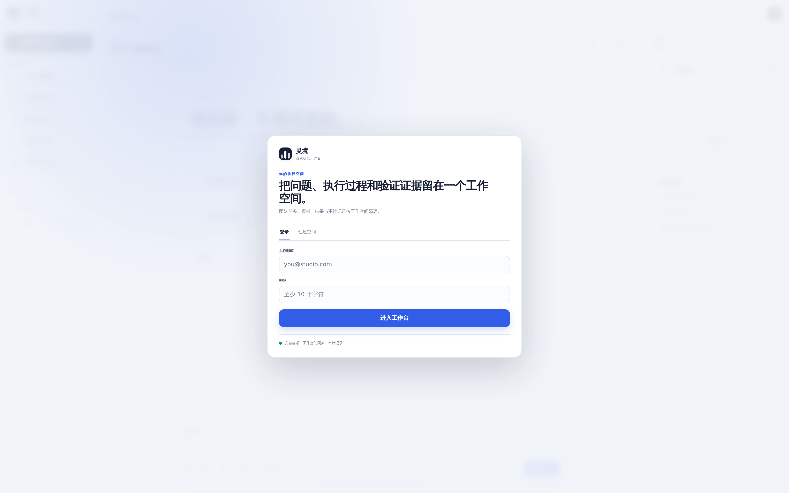

<div align="center">

# 灵境 · WorldForge Harness

### 面向游戏世界的可执行 Agent Harness Runtime

**World State · Counterfactual Planning · Recursive Multi-Agent · Tool Execution · Verifier · Self-Play · Skill Bank · MCP · GRPO**

它不是“给游戏文件加一个聊天框”。WorldForge Harness 的主链路是：接收长期目标，建立可验证世界状态，规划候选策略，在隔离任务工作区调用工具和命令，派生并行 Agent，执行反事实分支，经 Verifier 决定提交、回滚或继续探索，并把完整 Episode 留给后续策略演进。

<p>
  
  
  
  
  
  
</p>

<p>
  <a href="#真实执行界面"><b>真实执行界面</b></a>
  &nbsp;·&nbsp;
  <a href="#harness-能力全景"><b>Harness 能力</b></a>
  &nbsp;·&nbsp;
  <a href="#高并发与生产运行"><b>高并发</b></a>
  &nbsp;·&nbsp;
  <a href="#benchmark--grpo"><b>Benchmark / GRPO</b></a>
  &nbsp;·&nbsp;
  <a href="#快速开始"><b>快速开始</b></a>
</p>

</div>


> [!IMPORTANT]
> README 中的产品图由仓库当前前端通过 Playwright 自动生成。截图使用 **1920×1200 viewport + deviceScaleFactor 2**；完整状态图为 **3840×2400 PNG**。源文件保持 PNG，**不降采样、不转 WebP / JPEG、不做有损像素压缩**。`README Gallery` workflow 会对尺寸和格式做门禁。

---

# 真实执行界面

## 任务执行，而不是只对话


<p align="center"><sub><b>Executable Task Workspace</b> · 中间区域展示长期任务、Agent 执行结果与最终 Episode；右侧展示执行轨迹、Agent 树、证据与素材。对话分析保留为辅助模式，但不再是 Harness 的主入口。</sub></p>

### 从目标到运行中任务

<table>
<tr>
<td width="50%" valign="top">

<br>
<sub><b>任务入口</b> · 选择审批模式、Agent 并发预算与游戏场景，然后提交可持续执行的 Harness Task。</sub>
</td>
<td width="50%" valign="top">

<br>
<sub><b>运行状态</b> · Planner、World Observer、执行 Agent、Counterfactual 与 Verifier 的事件持续进入 Durable Trace。</sub>
</td>
</tr>
</table>

### 多模态输入与人工审批

<table>
<tr>
<td width="50%" valign="top">

<br>
<sub><b>Task Context</b> · 图片、视频、音频、日志、配置与代码素材可以持续挂在同一任务上下文中。</sub>
</td>
<td width="50%" valign="top">

<br>
<sub><b>Human Approval</b> · 中高风险工具可进入 waiting_approval，批准后从同一个 ToolCall 精确恢复，避免重复执行写操作。</sub>
</td>
</tr>
</table>

### 执行 Trace 与 Recursive Agent

<table>
<tr>
<td width="50%" valign="top">

<br>
<sub><b>Execution Trace</b> · World State、Checkpoint、ToolCall、Counterfactual Branch、Decision Commit、Verification 都有可审计事件。</sub>
</td>
<td width="50%" valign="top">

<br>
<sub><b>Recursive Multi-Agent</b> · Observer、Execution、Regression、Population、Coding、MCP 与 Verifier Agent 可以按 Planner 结果并行执行。</sub>
</td>
</tr>
</table>

### 证据与模型服务

<table>
<tr>
<td width="50%" valign="top">

<br>
<sub><b>Evidence / Verifier</b> · 工具结果、Replay、Runtime 验证、测试结果和关键素材进入统一证据面板。</sub>
</td>
<td width="50%" valign="top">

<br>
<sub><b>Model Gateway</b> · Harness 与模型解耦；模型负责提出结构化 action，权限、预算、工具执行和验证由 Harness Runtime 控制。</sub>
</td>
</tr>
</table>

### SaaS 身份与 Workspace



<p align="center"><sub><b>Production Control Plane</b> · User、Workspace、Membership、HttpOnly Session、JWT、Audit 与 Tenant Guard 是真实数据模型的一部分。</sub></p>

---

# Harness 能力全景

## 01 · World-State Runtime

任务不是一串临时 Prompt。Harness 维护可恢复的任务状态、Goal、Belief、Game State、Agent Assignment、Checkpoint、ToolResult 与 Verification Report，并把关键事件写入 Durable Event Store。

| 能力 | 当前实现 |
|---|---|
| **Task State Machine** | `queued / planning / running / waiting_approval / verifying / completed / failed / cancelled` |
| **Goal / World State** | Planner 与 Runtime 持续维护任务目标、世界状态与可验证结果 |
| **Checkpoint** | 执行前后保存 Workspace 快照，用于失败恢复和回滚 |
| **Durable Trace** | Task Event 持久化，页面刷新、WebSocket 重连和 Worker 重启后可继续恢复 |
| **Episode Package** | 每个任务生成 `episode.json`、`trace.jsonl`、`summary.md`，作为回放和策略演进输入 |

核心实现：`worldforge/harness/schemas.py`、`executor.py`、`worldforge/runtime/engine.py`。

## 02 · Autonomous Planner

Planner 不只决定“下一句回答什么”，而是根据目标、任务场景、风险与工具集合构造执行计划。

当前可派生角色包括：

- **WorldObserver**：读取环境与素材，形成 World State；
- **ExecutionAgent**：执行游戏 Runtime / Scenario / Tool；
- **RegressionAgent**：执行回归检查与失败复现；
- **PopulationAgent**：运行 Population / Self-Play 相关任务；
- **CodingAgent**：读取、搜索、修改项目文件并运行测试；
- **MCPAgent**：通过管理员白名单 MCP Server 调用外部能力；
- **VerifierAgent**：最后独立验证结果，决定是否允许完成任务。

Agent ID 由 Task + Role 确定性生成，保证 Worker retry / approval resume 不会重新生成另一棵不可对应的 Agent 树。

## 03 · Counterfactual Branching

WorldForge Runtime 可以基于 Checkpoint 派生多个候选分支，分别执行不同策略，再由 Verifier 对候选结果评分并提交最优分支。

| 阶段 | Runtime 行为 |
|---|---|
| **Snapshot** | 保存当前可恢复世界状态 |
| **Branch** | 按 Budget 限制生成多个候选策略 |
| **Parallel Rollout** | 分支可并行试演，避免只沿单一路径贪心执行 |
| **Verification** | 比较约束、得分、风险和可验证状态 |
| **Commit / Rollback** | 提交优胜分支；失败分支不污染主任务工作区 |

`ExecutionBudget` 对 `max_branch_width`、`max_rollouts_per_branch`、任务时限和 Agent 数量做硬约束。

## 04 · Coding Agent 与真实工具执行

Harness v4 增加了真正的任务工作区与 Coding Tools，因此可以执行“检查仓库、修改代码、运行测试、验证 diff”这类工作，而不是只生成文本建议。

当前工作区工具：

```text
workspace.list_files
workspace.search_text
workspace.read_file
workspace.snapshot
workspace.replace_text
workspace.write_file
workspace.delete_file
workspace.diff
workspace.run_command
workspace.restore
```

`TaskWorkspace` 为每个任务复制独立 source worktree，并提供：

- Path confinement，禁止逃出任务根目录；
- 命令 allowlist / denylist；
- Tool timeout；
- Task wall-clock budget；
- Output byte cap；
- Environment sanitization；
- Snapshot / Restore；
- Diff / Test evidence；
- 高风险工具进入 Approval Gate。

默认允许的命令族包含 Python、pytest、Node、npm、git、ripgrep、grep 等；默认拒绝 `curl / wget / ssh / scp / nc / docker / podman / mount / sudo` 等高风险命令。

> [!CAUTION]
> `TaskWorkspace` 是应用层隔离，不是 Linux namespace、gVisor、Firecracker 或独立 VM。对于不可信代码的公网任意执行，生产部署仍应把 Worker 放到容器沙箱 / microVM / 专用执行集群中。README 不把应用层路径隔离包装成内核级安全边界。

## 05 · Model Action Loop

模型输出受限的结构化 Decision，而不是获得无限制 Shell 权限：

```json
{
  "type": "tool",
  "summary": "检查失败测试并定位实现",
  "tool": "workspace.search_text",
  "arguments": {"query": "failed assertion"}
}
```

Harness 负责校验：

1. Tool 是否在 Agent 的 Allowed Tools 中；
2. Tool Risk 是否需要审批；
3. Task / Agent / Tool Budget 是否超限；
4. Tool 执行是否成功；
5. Tool Result 是否进入 Trace；
6. 最终结果是否通过 Verifier。

Provider 不支持或未配置时可以使用确定性 fallback，用于 Harness / UI / CI 验证；真实模型通过 Model Gateway 接入。

## 06 · Human Approval 与精确恢复

支持三种 Approval Mode：

| Mode | 行为 |
|---|---|
| **review** | 写入、命令等操作更积极进入人工审批 |
| **safe_auto** | 低风险内部操作自动执行；高风险和外部副作用暂停 |
| **full_auto** | 尽可能自动，但仍受 Harness Sandbox、Tool Policy 与硬 Budget 限制 |

审批暂停后，数据库保存原 ToolCall。批准后重放的是**同一个 deterministic call**；已完成 ToolResult 会复用，从而降低 retry 时重复修改文件的风险。

## 07 · Verifier Gate

任务不是“模型说完成了就 completed”。Verifier 会检查：

- Runtime 是否真正执行；
- Event / Trace hash chain 是否完整；
- Counterfactual 是否执行并提交；
- Tool Result 是否有错误；
- Benchmark / Regression 是否达到任务约束；
- CodingAgent 是否存在 inspect / change / test evidence；
- 是否存在未解决 Approval；
- 是否需要回滚或再次规划。

Runtime 同时发出规范化 `verification.result`，便于产品层和评测层统一消费。

## 08 · MCP

WorldForge 同时支持 MCP Server 与 MCP Client Bridge。

**Server** 可以向外暴露：

- Scenario list / inspect；
- Runtime run；
- Benchmark；
- Self-Play；
- Skill 查询。

**Client Bridge** 只允许调用运维人员通过 `WORLDFORGE_MCP_SERVERS_JSON` 配置的命名 Server。Task 本身不能注入任意 URL、任意命令或任意环境变量，避免把 MCP 变成绕过 Sandbox 的后门。

项目使用官方 MCP Python SDK v2 依赖：`mcp>=2,<3`。

## 09 · Self-Play / Memory / Skill Bank / Strategy Evolution

WorldForge Runtime 保留游戏原生的长期策略演进能力：

- Population Self-Play；
- Episodic Memory；
- Skill Bank；
- 成功 Episode 蒸馏；
- 失败归因；
- Regression Gate；
- Planner 参数更新；
- Group Relative Policy Optimization。

这些能力和 Coding Harness 并存：Coding Agent 解决“仓库与工具执行”，WorldForge Runtime 解决“游戏世界状态与长期决策”。

## 10 · GRPO

`worldforge/harness/grpo.py` 实现 NumPy Group Relative Optimizer，包括：

- Group-relative advantage；
- Masked softmax；
- Policy-gradient update；
- Frozen-reference penalty；
- 两层参数反向传播；
- Gradient clipping。

训练入口：

```bash
python scripts/train_worldforge_grpo.py --seeds 2 --epochs 1
```

当前 smoke run 用于验证训练闭环可运行，不把单次小样本结果包装成 benchmark 提升。

---

# 高并发与生产运行

单机 `asyncio` 并发不是生产高并发方案。v4 将 API、Durable Queue、Worker Fleet、Event Fanout 和 Workspace Admission 分开处理。

## Durable Job Queue

`analysis_jobs` 当前包含：

- `kind`；
- `priority`；
- `idempotency_key`；
- `lease_expires_at`；
- `heartbeat_at`；
- `cancel_requested`；
- `result`；
- retry / pause / approval 状态。

PostgreSQL Worker claim 使用：

```sql
FOR UPDATE SKIP LOCKED
```

避免多个 Worker 抢同一任务时互相串行阻塞。

## Tenant Admission Control

只做全局 Worker 并发容易让一个超大 Workspace 把队列吃满。当前 PostgreSQL admission 会：

1. 对候选 Workspace 做事务级 advisory lock；
2. 统计该 Workspace 已运行且未取消 Job；
3. 根据 `WORLDFORGE_WORKSPACE_CONCURRENCY` 控制租户并发；
4. over-scan 候选队列，降低头部大租户饱和导致的 head-of-line blocking。

相关配置：

```bash
WORLDFORGE_WORKER_CONCURRENCY=8
WORLDFORGE_WORKSPACE_CONCURRENCY=3
WORLDFORGE_JOB_LEASE_SECONDS=90
WORLDFORGE_JOB_BATCH_SIZE=8
```

## Worker Fleet

`worker_heartbeats` 表记录：

- worker id；
- hostname / pid；
- started / heartbeat time；
- advertised concurrency；
- active jobs；
- runtime version。

API 的 Harness Scheduler 视图返回 healthy workers、advertised capacity、queue stats 和 admission 策略，而不是只展示一个进程内 Queue 长度。

## Lease / Heartbeat / Recovery

Worker 执行任务期间续租。如果进程崩溃导致 lease 过期，任务可以回到可 claim 状态；Approval / Retry 也由 Durable Store 恢复，而不是依赖原 Python 进程仍然存活。

## Realtime Fanout

旧实现如果每个 WebSocket 客户端各自轮询数据库，在并发连接增大时会造成无意义查询放大。v4 使用进程级 `TaskEventFanoutHub`：

- 一个 global durable event cursor；
- 按 Conversation 订阅；
- bounded subscriber queue；
- overflow 时触发 `resync.required`；
- 客户端从 Durable Event Store 增量补齐；
- WebSocket 仍提供 heartbeat 与断线恢复。

这使实时 UI 和 Durable Store 解耦，同时不把内存广播当作唯一事实来源。

## 多 Worker 部署

生产 Compose 包含：

```text
PostgreSQL
MinIO
MinIO bootstrap
Alembic migrate
FastAPI API
Harness Worker
```

单机可横向增加 Worker：

```bash
docker compose --env-file .env.production -f docker-compose.prod.yml up --build --scale worker=4
```

> [!NOTE]
> 当前 Compose 使用共享 named volume 作为单机任务 worktree。真正跨主机 Worker Fleet 需要 RWX / distributed filesystem，或者把 Task Workspace 改造成 object-backed / remote execution worktree。这个边界在设计上明确保留，没有把“单机多容器”误称为“无限水平扩展”。

---

# Benchmark / GRPO

## 内部 BalanceLab Ablation

仓库包含确定性场景、Planner / Verifier / Harness 组合评测。它用于验证 Runtime 机制，不等同于外部公开 Benchmark。

最近一次内部固定预算运行：

| Variant | Success | Avg Score | Recovery | Invalid Action |
|---|---:|---:|---:|---:|
| M1 direct | 0.6562 | 63.068 | 0.0000 | 0 |
| M1 + Planner | 0.7188 | 65.284 | 0.0000 | 0 |
| M1 + Verifier | 0.7500 | 68.389 | 0.5556 | 0 |
| WorldForge Harness | 0.8750 | 90.889 | 0.5000 | 0 |

**这些数字只代表仓库内置 BalanceLab 场景，不应替代 Orak、BALROG 或 lmgame-Bench 的公开结果。**

## 外部 Benchmark Runner

仓库提供 `worldforge/benchmarks/external.py` 与：

```bash
python scripts/benchmark_external.py
```

默认只 dry-run。真正执行必须显式 `--execute`，并由运维人员提前安装 Benchmark：

```bash
WORLDFORGE_ORAK_ROOT=...
WORLDFORGE_BALROG_ROOT=...
WORLDFORGE_LMGAME_ROOT=...
```

Runner 会记录 benchmark repository revision，并把外部执行视为 HIGH risk Tool，需要 Approval。

> [!WARNING]
> 简历中如果写“Orak / BALROG / lmgame-Bench 成功率提升 5.6 个百分点、无效动作下降 12.8%、恢复率提升 7.4 个百分点”，这些数字必须来自**相同模型、相同动作接口、相同推理预算、可复现 seed 的真实对比跑分**。当前仓库已经具备 Runner 和 Harness 机制，但 README 不声称这些外部增益已经在本次仓库环境复现。

---

# 与通用 Coding Harness 的定位

v4 的目标已经从“聊天式游戏分析 SaaS”升级为 **execution-first Agent Harness**：模型可以在受控 Worktree 中检查文件、修改代码、运行命令、派生 Agent、暂停审批、恢复任务、验证结果，并把 Episode 持久化。

WorldForge 与通用 Coding Agent 的核心差异在于它额外关注游戏世界：

| 通用执行 Harness 责任 | WorldForge v4 |
|---|---|
| Task / Workspace | Durable Harness Task + per-task TaskWorkspace |
| Tool use | Workspace / Runtime / Benchmark / MCP tools |
| Code execution | allowlisted command runner + time/output budget |
| Parallel agent | TaskGroup + Worker Scheduler + deterministic assignments |
| Human approval | risk-aware pause / exact-call resume |
| Verification | Verifier Gate + regression / runtime evidence |
| Durable task | SQL Job lease / heartbeat / retry / event store |
| Game world state | Goal / Belief / Game State / Replay |
| Counterfactual | Snapshot / parallel branch / commit / rollback |
| Strategy evolution | Self-Play / Memory / Skill Bank / GRPO |

这里不写“已经客观超过某个 Harness”。**是否超过 Codex、DeepSeek Harness 或其他系统必须用同模型、同工具、同预算、同任务集做独立 benchmark。** 当前可以准确说的是：仓库已经从聊天 UI 进入可执行 Harness 的职责范围，并加入了游戏场景特有的 World State、Counterfactual、Replay、Self-Play 与 Strategy Evolution。

---

# SaaS Control Plane

执行 Runtime 上层仍然保留生产 SaaS 能力：

<table>
<tr>
<td width="50%" valign="top">
<h3>Identity / Tenant</h3>
<ul>
<li>Argon2 password hashing</li>
<li>JWT Bearer Token</li>
<li>HttpOnly Session</li>
<li>User / Workspace / Membership</li>
<li>Store-level workspace_id guard</li>
<li>Audit Trail</li>
</ul>
</td>
<td width="50%" valign="top">
<h3>Data / Object</h3>
<ul>
<li>SQLAlchemy</li>
<li>SQLite development</li>
<li>PostgreSQL production</li>
<li>Alembic migrations</li>
<li>Local / S3 / MinIO</li>
<li>Presigned object access</li>
</ul>
</td>
</tr>
<tr>
<td width="50%" valign="top">
<h3>Security / Ops</h3>
<ul>
<li>Request ID</li>
<li>Security Headers / CSP</li>
<li>CORS allowlist</li>
<li>Trusted Hosts</li>
<li>Rate Limit</li>
<li>Liveness / Readiness</li>
</ul>
</td>
<td width="50%" valign="top">
<h3>Realtime / Worker</h3>
<ul>
<li>Durable Job Queue</li>
<li>Worker Fleet heartbeat</li>
<li>Lease recovery</li>
<li>Tenant admission</li>
<li>TaskEventFanoutHub</li>
<li>WebSocket resync</li>
</ul>
</td>
</tr>
</table>

---

# 快速开始

## 本地启动

```bash
python -m venv .venv
source .venv/bin/activate
pip install -r requirements.txt
uvicorn worldforge.api.app:app --host 0.0.0.0 --port 8765 --reload
```

Windows PowerShell：

```powershell
.venv\Scripts\Activate.ps1
uvicorn worldforge.api.app:app --host 0.0.0.0 --port 8765 --reload
```

浏览器访问：

```text
http://localhost:8765
```

开发模式默认提供 Demo Workspace 和 deterministic provider，可以先完整体验 Task / Tool / Event / Verifier 交互。

## 创建执行任务

前端主入口是 **执行任务**。API 也可以直接创建 Harness Task：

```http
POST /api/conversations/{conversation_id}/execute
Content-Type: application/json
```

任务规范包含：

```json
{
  "objective": "复现这个战斗异常，检查相关代码并运行回归测试",
  "scene": "battle_review",
  "provider": "auto",
  "approval_mode": "safe_auto",
  "budget": {
    "max_steps": 24,
    "max_parallel_agents": 4,
    "max_tool_seconds": 60,
    "max_task_seconds": 900,
    "max_branch_width": 3
  }
}
```

Harness 状态与调度信息：

```text
GET /api/harness
GET /api/harness/tools
GET /api/harness/scheduler
```

## MCP 配置

```bash
WORLDFORGE_MCP_SERVERS_JSON='{
  "studio-tools": {
    "url": "http://mcp.internal.example/mcp"
  }
}'
```

只允许管理员配置的命名 Server；Task 不能临时传入任意 endpoint。

## Production

```bash
cp .env.production.example .env.production

docker compose \
  --env-file .env.production \
  -f docker-compose.prod.yml \
  up --build
```

健康检查：

```text
GET /api/health/live
GET /api/health/ready
```

---

# 仓库结构

```text
Lingjing-Game-Studio/
├── frontend/                         execution-first Harness UI
├── worldforge/
│   ├── harness/
│   │   ├── executor.py               durable task execution
│   │   ├── model_loop.py             structured model action loop
│   │   ├── planner.py                agent / tool planning
│   │   ├── scheduler.py              in-process agent scheduler
│   │   ├── tools.py                  runtime / workspace / MCP tools
│   │   ├── sandbox.py                per-task TaskWorkspace
│   │   ├── approvals.py              risk / approval policy
│   │   ├── mcp_bridge.py             MCP client whitelist
│   │   ├── mcp_server.py             WorldForge MCP server
│   │   ├── grpo.py                   group-relative optimizer
│   │   └── schemas.py                task / plan / result contracts
│   ├── runtime/                      World State / Planner / Replay / Verifier
│   ├── product/                      SaaS store / media / analysis
│   ├── providers/                    model gateway
│   ├── benchmarks/                   internal + external runner
│   ├── realtime.py                   durable event fanout hub
│   ├── storage.py                    Local / S3 object storage
│   ├── security.py                   Auth / JWT / Principal
│   └── worker.py                     durable Harness worker
├── migrations/                       SaaS / Harness / Worker Fleet schema
├── scripts/                          E2E / benchmark / GRPO training
├── tests/                            runtime / API / tenant / harness tests
├── docker-compose.prod.yml           PostgreSQL + MinIO + API + Worker
└── .github/workflows/                CI + lossless high-res README gallery
```

---

# 测试与验收

## Python / Runtime / SaaS / Harness

```bash
pytest -q
```

当前全量结果：

```text
27 passed
```

同时执行：

```bash
python -m compileall -q worldforge scripts
node --check frontend/app.js
```

## Harness UI E2E

```bash
python scripts/product_ui_e2e.py
```

当前自动检查覆盖：

```text
auth_gate
register_workspace
execute_is_primary
multimodal_upload
task_running_state
approval_pause
parallel_agents
counterfactual_trace
approval_resume
verifier_gate
episode_answer
tool_trace
agent_results
evidence_panel
provider_modal
lossless_high_res_gallery
```

JavaScript page errors：`0`。

## Backend Product E2E

```bash
python scripts/product_backend_e2e.py
```

覆盖 Health、Conversation、Asset、Durable Event、WebSocket History、Answer 与 Follow-up Context，当前主链路检查 `7 / 7 PASS`。

## Migration

Fresh DB 已验证依次执行：

```text
0001 SaaS schema
0002 executable Harness queue / lease
0003 Worker Fleet heartbeat
```

---

# Production Gate

当前仓库已经具备执行型 Harness 和生产 SaaS 基座，但以下项目仍属于正式大规模上线前的基础设施工作：

- untrusted code 的 microVM / gVisor / Kata / Firecracker 级隔离；
- 多主机共享 Task Workspace 或 Remote Execution filesystem；
- Redis / NATS / Kafka 等独立事件总线（当单 DB Event Store 达到吞吐瓶颈时）；
- Kubernetes HPA / PDB / topology spread；
- OpenTelemetry + Prometheus + distributed tracing；
- SSO / MFA / SCIM；
- Secret Manager / KMS；
- Object malware scanning；
- PostgreSQL HA、PITR、跨区备份；
- WAF / API Gateway / egress policy；
- 公共 Orak / BALROG / lmgame-Bench 的固定模型、动作接口、预算与 seed 的正式对比报告。

这些边界不会在 README 中被包装成已经完成。

---

<div align="center">

**WorldForge Harness**

不是让模型“多说一点”，而是让模型在边界明确、状态可恢复、动作可验证的 Runtime 中真正完成游戏世界任务。

</div>
