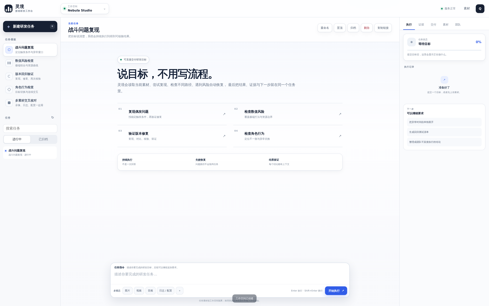
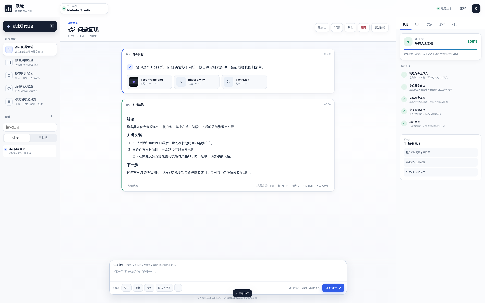
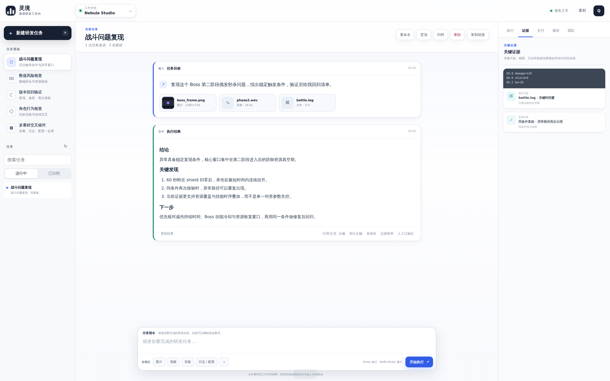
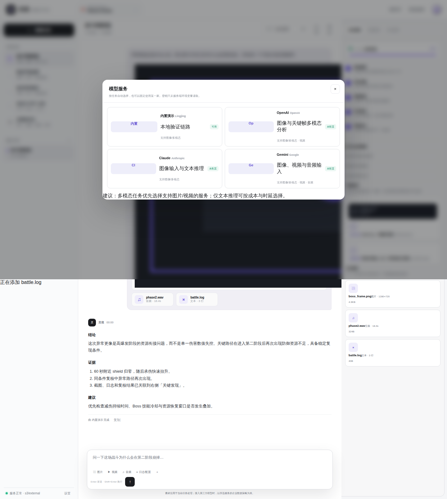

<div align="center">

# 灵境 · 游戏研发执行工作台

### 把研发目标交给一个会真正执行、复核、恢复并留下证据的工作空间

**游戏问题复现 · 数值风险检查 · 版本回归 · NPC 行为验证 · 多模态研发上下文**

<p>
  
  
  
  
  
</p>

</div>


---

## 产品不是“给游戏文件加一个聊天框”

用户只需要关心五件事：

> **我要完成什么 → 系统正在做什么 → 是否需要我介入 → 发现了什么 → 最终结果与证据是什么**

自然语言输入只是任务入口，不是产品本体。灵境把同一个研发目标、素材、执行过程、复核结果和后续追问留在一个 Workspace 中，让一次任务可以持续推进，而不是每一轮都从零开始。

### 真实工作台

<table>
<tr>
<td width="50%" valign="top">

<br>
<sub><b>目标入口</b> · 直接描述研发目标，不要求用户先把内部执行流程拆成 Prompt。</sub>
</td>
<td width="50%" valign="top">

<br>
<sub><b>完整任务</b> · 目标、素材、执行记录、最终结论、证据和下一步保留在同一条任务轨迹中。</sub>
</td>
</tr>
</table>

### 证据与推理服务

<table>
<tr>
<td width="50%" valign="top">

<br>
<sub><b>证据面板</b> · 录像关键帧、日志片段、素材和重复验证结果可以和结论对应。</sub>
</td>
<td width="50%" valign="top">

<br>
<sub><b>可替换推理服务</b> · Claude、DeepSeek、OpenAI、Gemini 等只提供模型能力；任务策略与执行控制属于 WorldForge。</sub>
</td>
</tr>
</table>

登录与 Workspace 隔离界面见 [`docs/assets/readme/auth.png`](docs/assets/readme/auth.png)。

> README Gallery 由 `scripts/product_ui_e2e.py` 从当前前端自动运行并截图。视口为 `1920×1200`、device scale 为 `2`，因此产品图为 `3840×2400 PNG`。脚本同时检查页面错误、任务执行状态、证据面板和推理服务弹窗。

---

## 适合做什么

| 场景 | 交付目标 |
|---|---|
| **战斗问题复现** | 从录像、日志和配置中寻找稳定触发条件，并在一致条件下再次核验 |
| **数值风险检查** | 检查极端 Build、资源曲线和高方差组合，找出优先调整项 |
| **版本回归验证** | 复现历史问题、核对修复结果，并沉淀可继续使用的回归上下文 |
| **NPC 行为检查** | 检查目标切换、连续交互和行为一致性 |
| **多素材交叉核对** | 把图片、视频、音频、日志、JSON/CSV、配置和文本放进同一任务 |

产品层坚持两个原则：

1. **客户看到任务，不看到算法。** 页面不展示内部规划、分支、策略优化等工程术语。
2. **模型可替换，策略不可外包。** 外部模型可以辅助理解和生成，但不能接管 WorldForge 的决策、权限、恢复与完成判定。

---

## 快速开始

### 1. 安装

```bash
python -m venv .venv
source .venv/bin/activate
pip install -r requirements.txt
```

### 2. 启动 API

```bash
uvicorn worldforge.api.app:app --reload
```

打开浏览器访问本地服务即可进入工作台。

### 3. 独立 Worker（可选）

当 `WORLDFORGE_QUEUE_MODE=external` 时：

```bash
python -m worldforge.worker
```

### 4. 训练本地决策策略

```bash
python scripts/train_policy.py
```

训练结果默认写入 Runtime 数据目录中的 `worldforge_policy.json`。Runtime 也可以基于已验证的任务分支继续做受回归门禁保护的在线策略演进。

---

# Engineering · WorldForge Runtime

产品界面刻意隐藏下面这些概念；它们只属于工程层。

## Runtime 主链路

```text
环境感知
  ↓
World State / Goal / Belief
  ↓
自主 Planner
  ↓
反事实试演
  ↓
状态条件专家并行建议
  ↓
Sandbox 执行
  ↓
Verifier
  ↓
提交 / 回滚 / 继续规划
  ↓
Memory + Skill + Policy Evolution
```

WorldForge 的核心目标不是让模型“说自己完成了”，而是让一个长期任务具备 **可恢复状态、候选未来、真实执行、独立验证、失败归因与策略更新**。

## 1. World-State Runtime

`worldforge/runtime/engine.py` 维护真实游戏状态和运行轨迹。

当前实现包括：

- Goal、Belief 与 Game State；
- Append-only、hash-chained Event Store；
- Snapshot / Restore；
- Checkpoint；
- Replay / Fork；
- Sandbox；
- Durable Runtime Events；
- 失败后的 rollback / replan。

反事实环境使用 `clone()`，不会直接修改 canonical state。真实动作只有在 Runtime 选择并提交后才进入主环境。

## 2. 自主决策不是固定 DAG

`worldforge/runtime/planner.py` 根据当前状态动态排序合法动作，综合：

- WorldForge 本地策略先验；
- 当前可用 Skill；
- Episodic Memory；
- 风险、战斗、经济和进度信号；
- 状态条件专家给出的 bounded action bias。

第三方 LLM 不拥有最终动作选择权。

## 3. 状态条件多专家执行

`worldforge/runtime/recursive.py` 会根据当前状态按需创建专家：

- 战斗窗口；
- 生存风险；
- 隐藏机制不确定性；
- 经济与异常收益；
- 长周期进度。

这些专家并行运行，并输出**受限动作偏置**。它们不能直接执行动作，也不能绕过 Sandbox 或验证；最终提交仍由 WorldForge Planner 决定。

这解决了旧实现中“Agent 树只用于展示、实际上不影响决策”的问题。

## 4. 反事实分支

`worldforge/runtime/counterfactual.py` 对候选策略做并行 rollout，并比较：

- expected utility；
- downside；
- survival；
- success probability；
- verifier violations。

每个 rollout 的 violation 集合相互隔离，最后只在证据层汇总。这样一个失败试演不会污染同一候选的其他 rollout 评分。

## 5. Verifier 与恢复

`worldforge/runtime/verifier.py` 在动作后检查：

- 游戏状态不变量；
- 非法动作；
- 灾难性生存风险；
- terminal failure；
- suspicious reward loop。

Runtime 根据验证结果选择继续、重新规划或恢复到最近 checkpoint。

## 6. Self-Play / Memory / Skill Evolution

当前工程实现包括：

- Population Self-Play；
- Aggressive / Conservative / Economist / Explorer 玩家画像；
- Episodic Memory；
- Skill Bank；
- 失败归因；
- Skill candidate patch；
- deterministic regression gate。

Skill 使用 `generation / parent_generation` 表示策略谱系，不使用产品阶段式命名。

## 7. Group-Relative Policy Evolution

`worldforge/runtime/policy.py` 是项目自研的本地策略先验。

策略更新使用经过验证的反事实候选作为一个 decision group：

```text
同一 World State
  ├─ action A → verified reward
  ├─ action B → verified reward
  ├─ action C → verified reward
  └─ action D → verified reward
          ↓
group-relative advantage
          ↓
clipped policy-ratio update
          ↓
KL trust region
          ↓
deterministic regression gate
          ↓
accept / reject
```

这是一套轻量的 **GRPO-style group-relative clipped policy optimization**：优势在同一候选组内标准化，更新受 probability-ratio clipping 与 KL trust region 约束。候选策略只有在固定回放回归集上不退化并实际提升时才会持久化。

因此“自进化”不是无门禁地改权重，而是：

> **生成候选 → 验证 → 回放回归 → 通过才提交。**

## 8. 模型边界

灵境可以接入多个 Model Provider，但 Runtime 合约固定：

**Provider 可以：**

- 理解用户自然语言；
- 处理多模态上下文；
- 生成解释性文本；
- 提供受约束的推理建议。

**Provider 不可以：**

- 绕过 WorldForge Planner；
- 直接拥有动作权限；
- 绕过 Sandbox；
- 决定是否“验证通过”；
- 覆盖 Runtime checkpoint；
- 未经过 regression gate 修改持久策略。

这也是项目和“把一个模型 API 包进循环”最大的工程差异。

## 9. Realtime Event Fan-out

客户任务事件使用 `worldforge/product/fanout.py`。

旧实现中，每个 WebSocket 连接都会约每 `0.4s` 单独查询一次数据库。现在改为：

```text
Durable Task Event table
        ↓
one process-level cursor
        ↓
batched event read
        ↓
conversation fan-out
        ↓
bounded subscriber queues
```

连接流程是：

```text
Subscribe
  ↓
Durable Replay
  ↓
event-id dedupe
  ↓
Live Fan-out
```

先 Subscribe 再 Replay，可以避免事件恰好发生在“回放完成”和“开始监听”之间时被漏掉。

## 10. Workspace 与运行会话安全

当前 API 包含：

- User / Workspace / Membership；
- Argon2 password hashing；
- HttpOnly session cookie；
- signed JWT；
- membership freshness check；
- tenant-scoped conversation / asset / job / audit；
- raw Runtime session ownership；
- WebSocket workspace authorization；
- security headers；
- request ID / audit。

运行会话在 Event Store metadata 中写入 `workspace_id / user_id`，因此 `/api/runs/*` 与 `/ws/runs/*` 不再是无租户归属的裸 Runtime 入口。

---

## 本地评测边界

`worldforge/benchmarks/game_eval.py` 只做**同一 BalanceLab 环境中的本地消融评测**：

```text
Policy
Policy + Planner
Policy + Verification
WorldForge Runtime
```

它用于验证 WorldForge 自己各组件是否产生增益，不是 Claude Code、Pi、DeepSeek 或其他外部产品的成绩对比。

如果要声称“优于某个外部 Harness”，必须先建立同任务、同工具、同预算、同模型、同沙箱和同评测集的 apples-to-apples benchmark；本仓库不会用内部消融结果替代这种证据。

---

## 项目结构

```text
frontend/
  index.html            客户工作台
  app.css               视觉系统与响应式布局
  app.js                任务、素材、Realtime、证据交互

worldforge/
  api/
    app.py              SaaS / Runtime API + WebSocket
    manager.py          Runtime session manager
  product/
    analyzer.py         产品任务编排与业务结果
    fanout.py           Durable event fan-out
    media.py            多模态素材探测与视频关键帧
    store.py            Workspace / Task / Asset / Job store
  runtime/
    engine.py           WorldForge 主运行时
    policy.py           自研策略 + group-relative optimizer
    planner.py          状态条件自主规划
    recursive.py        状态条件多专家建议
    counterfactual.py   候选未来试演
    verifier.py         结果验证
    sandbox.py          执行前约束
    skill_bank.py       可演进 Skill
    selfplay.py         Population Self-Play
    evolver.py          失败归因与回归门禁
    event_store.py      Hash-chained event store
  envs/
    balance_lab.py      可复现游戏测试环境
  providers/            可替换推理服务
  integrations/         外部集成边界

scripts/
  train_policy.py       本地策略训练
  product_backend_e2e.py
  product_ui_e2e.py

tests/
```

---

## 回归检查

```bash
python -m compileall -q worldforge scripts tests
pytest -q
node --check frontend/app.js
python scripts/product_backend_e2e.py
python scripts/product_ui_e2e.py
```

`product_ui_e2e.py` 会生成 README Gallery，但 `outputs/` 只用于本地测试报告，不进入仓库。

压力测试使用临时脚本运行，不提交到项目代码。

---

## 设计约束

- 客户 UI 不展示内部算法专有名词；
- WorldForge 持有策略与执行控制权；
- 外部模型是 Provider，不是 Agent 大脑；
- speculative branch 不得污染 canonical world；
- 自进化必须有 regression gate；
- realtime 不允许按客户端数量线性放大数据库轮询；
- 所有长期运行会话必须有 Workspace ownership；
- README 只描述当前代码已经存在并可验证的能力。
