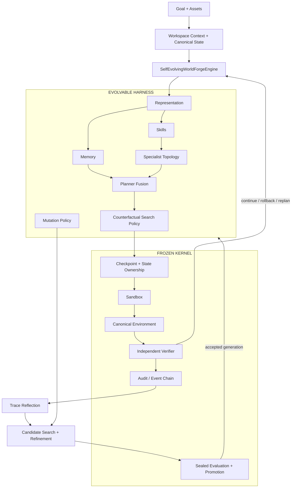
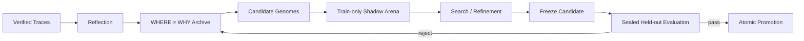

<div align="center">

# 灵境 · Lingjing

### Verifiable, stateful game R&D agent runtime

**让 Agent 在同一个研发工作空间里接收目标与多模态素材，执行任务、验证结果、保留证据，并在受控边界内改进自己的 Harness。**

`STATEFUL RUNTIME` · `MULTIMODAL` · `VERIFIABLE` · `RECOVERABLE` · `SELF-EVOLVING HARNESS`

<p>
  <a href="#-快速开始"><b>快速开始</b></a> ·
  <a href="#-产品能力"><b>产品能力</b></a> ·
  <a href="#-系统架构"><b>系统架构</b></a> ·
  <a href="#-工作台"><b>工作台</b></a> ·
  <a href="#-文档"><b>文档</b></a>
</p>


</div>


---

## 🌌 灵境是什么

灵境是一个面向游戏研发任务的 Agent Runtime 与协作工作台。它把**研发目标、素材、世界状态、执行事件、验证结果、证据与恢复路径**放进同一条持久任务轨迹，让一次任务可以被持续观察、停止、恢复、复核和迭代。

核心执行链路：

> **Goal → Assets → State → Agent Decision → Counterfactual Search → Canonical Execution → Verification → Evidence → Delivery → Harness Evolution**

模型负责推理，Runtime 负责状态与执行边界；Harness 负责把 Skill、Memory、Specialist、Planner 与搜索策略组织成可运行的研发流程。

---

## ✨ 产品能力

| 能力 | 说明 |
|---|---|
| **有状态执行** | 任务状态与事件持续保存，支持停止、恢复、rollback 与 replan |
| **多模态研发上下文** | 图片、视频、音频、日志、配置和文档可以进入同一个 workspace，并被后续任务继续使用 |
| **可验证结果** | 关键结论可以回到截图、关键帧、日志、finding 与 Verifier 结果 |
| **反事实搜索** | 在 clone world 中比较候选路径，再选择进入 canonical execution 的动作 |
| **可进化 Harness** | Representation、Skill、Memory、Specialist topology、Planner fusion、搜索预算与 mutation policy 都可以进入 Genome |
| **受控安全边界** | Canonical state ownership、Sandbox、Verifier、评估协议与 promotion gate 保持在 Frozen Kernel 中 |
| **完整任务生命周期** | 身份、协作、搜索、归档、审批删除、反馈与任务事件统一进入产品层 |

---

## 🧭 系统架构

灵境把系统分为两层：**Frozen Kernel** 负责真实状态、安全与验证；**Evolvable Harness** 负责如何组织和改进任务执行策略。



### Frozen Kernel × Evolvable Harness

| Frozen Kernel | Evolvable Harness |
|---|---|
| Canonical state ownership | Feature representation / normalization |
| Checkpoint / rollback | Belief 与 uncertainty 参数 |
| Sandbox 与 invariant verification | Skill gate / bias / reliability |
| Independent Verifier | Memory kernel / feature weights / recency |
| Train / held-out credit protocol | Specialist topology / activation / action features |
| Atomic promotion 与 lineage | Planner fusion / epistemic control |
| 任务级 generation pinning | Counterfactual budget / risk utility |
| 评估与安全边界 | Mutation operator policy |

这条边界的目的很简单：Harness 可以改变**怎么工作**，但不能改写**谁拥有真实状态、什么算安全、谁负责验证、什么条件允许晋升**。

更完整的实现说明见 [`docs/ARCHITECTURE.md`](docs/ARCHITECTURE.md)。

---

## 🖥️ 工作台

下面的截图来自实际产品界面，覆盖从身份入口、素材输入到执行、证据与结果的完整路径。

| 身份与新任务 | 素材与执行 |
|---|---|
| **01 · 身份入口**<br><br> | **02 · 新任务**<br><br> |
| **03 · 多模态素材**<br><br> | **04 · 执行中**<br><br> |
| **05 · 任务结果**<br><br> | **06 · 证据核验**<br><br> |
| **07 · 持续上下文**<br><br> | **08 · 产品总览**<br><br> |

前端结构与页面说明见 [`docs/FRONTEND.md`](docs/FRONTEND.md)。

---

## 🧬 Harness Evolution

Harness Evolution 使用运行轨迹中的 evidence 产生候选 Genome，在独立 shadow arena 中搜索与比较，并通过 held-out gate 决定是否晋升新的 generation。



实现中，任务会在开始时固定使用一个明确的 Harness generation；即使其他 worker 在任务执行期间完成了新的 promotion，当前任务也不会在中途切换 phenotype。

README 只保留机制概览。算法、评估协议与 benchmark 细节分别放在：

- [`docs/ARCHITECTURE.md`](docs/ARCHITECTURE.md)
- [`docs/BENCHMARKING.md`](docs/BENCHMARKING.md)
- [`docs/RESEARCH_NOTES.md`](docs/RESEARCH_NOTES.md)

---

## 🎮 适合的工作

- 战斗与 Boss 机制复现、极端 Build 风险检查；
- 经济、成长、掉落与奖励循环异常分析；
- 截图 / 视频 / 日志 / 配置的跨模态证据汇总；
- 长任务执行、停止、重试、rollback 与 replan；
- 结构化复现卡、风险清单、回归清单和 evidence pack；
- 基于真实失败轨迹搜索更合适的 Skill、Memory、Specialist 与反事实策略。

---

## 🚀 快速开始

### 1. 启动产品

```bash
git clone https://github.com/jiaweine/lingjing-game-studio.git
cd lingjing-game-studio
pip install -r requirements.txt
uvicorn worldforge.api.app:app --reload
```

打开：`http://127.0.0.1:8000`

> 运行环境要求 Python `>= 3.11`。

### 2. 开发与测试

```bash
pip install -r requirements-dev.txt
pytest -q
```

### 3. 运行独立验证

```bash
python scripts/harness_evolution_benchmark.py
python scripts/product_backend_e2e.py
```

Harness benchmark、指标解释与评估协议见 [`docs/BENCHMARKING.md`](docs/BENCHMARKING.md)。

---

## 🔌 Runtime API

| Endpoint | 用途 |
|---|---|
| `POST /runs` | 启动 WorldForge 任务 |
| `GET /runs/{id}` | 查询任务状态 |
| `GET /runs/{id}/events` | 读取持久事件链 |
| `GET /runs/{id}/stream` | 通过 SSE 订阅实时事件 |
| `POST /runs/{id}/cancel` | 停止运行中的任务 |

---

## 🗂️ Repository Map

```text
frontend/                       产品工作台
worldforge/api/                 Runtime / Product API
worldforge/product/             工作空间、协作、任务与证据生命周期
worldforge/runtime/             Frozen Kernel + Evolvable Harness
worldforge/envs/                可验证游戏环境 / BalanceLab
scripts/                        E2E 与独立 Harness benchmark
tests/                          Runtime / Product / Promotion 回归
docs/                           架构、前端、运行、评估与研究说明
```

---

## 📚 文档

| 文档 | 内容 |
|---|---|
| [`ARCHITECTURE.md`](docs/ARCHITECTURE.md) | Runtime、Frozen Kernel、Harness 与状态边界 |
| [`BENCHMARKING.md`](docs/BENCHMARKING.md) | Harness evolution benchmark 与评估协议 |
| [`FRONTEND.md`](docs/FRONTEND.md) | 工作台结构、交互与前端实现 |
| [`RUNBOOK.md`](docs/RUNBOOK.md) | 本地运行、部署与运维说明 |
| [`RESEARCH_NOTES.md`](docs/RESEARCH_NOTES.md) | 研究背景、参考方法与实现映射 |

---

## 📦 当前版本

当前仓库版本为 **v1.0.0**。README 聚焦第一版产品当前已经实现的能力；更细的算法公式、实验数据、研究出处与工程细节统一放在 `docs/`，避免首页混入实现历史或内部调参叙事。

项目使用 **Apache License 2.0**，见 [`LICENSE`](LICENSE)。

---

<div align="center">

**CONTROL THE EXECUTION · VERIFY THE RESULT · EVOLVE THE HARNESS**

</div>
