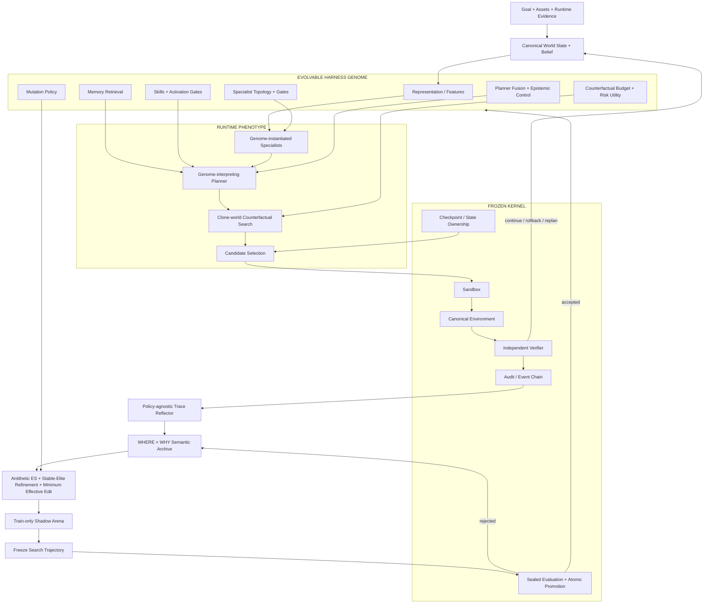
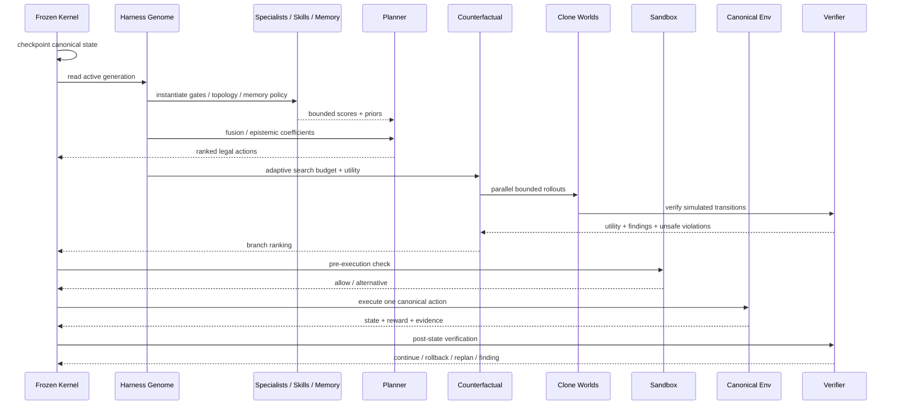

<div align="center">

# 灵境

### Self-Evolving Game R&D Agent Harness Runtime

**不是把模型接进一个聊天框，而是把游戏研发任务交给一个会执行、会验证、会恢复，也会改进自己工作方式的 Harness。**

`STATEFUL` · `SELF-EVOLVING HARNESS` · `COUNTERFACTUAL` · `SEALED EVAL` · `RECOVERABLE`

目标、素材、世界状态、Agent 拓扑、Skill、Memory、反事实预算与恢复路径进入同一条可审计任务轨迹；安全内核保持冻结，Harness 行为在独立评估门禁下持续进化。

</div>


---

## Product Thesis · 从“调用 Agent”变成“拥有一个可进化的研发执行系统”

> **目标 → 素材 → 状态 → Harness phenotype → Agent 决策 → clone 试演 → canonical 执行 → Verifier → 证据 → 交付 → Harness evolution**

| CONTROL | TRUST | LIFECYCLE | EVOLUTION |
|---|---|---|---|
| **执行可控**：任务可停止、重试、回滚，canonical state 只有 Runtime 能推进 | **结论可核验**：执行、发现、证据、Verifier 与结果保持同一事件链 | **任务可治理**：身份、协作、搜索、归档、审批删除、反馈门禁持久化 | **Harness 可进化**：调度、专家结构、Skill、Memory、搜索与融合策略都进入 Genome，并由 sealed held-out gate 决定是否晋升 |

灵境把“模型能力”与“Agent Harness 能力”分开：模型可以替换；**任务状态所有权、工具循环、上下文、恢复、验证、Harness 进化与代际谱系**属于 Runtime。

---

# Agent Architecture · Frozen Kernel × Evolvable Harness

WorldForge 现在不是“固定 Planner + 若干手写 Specialist”。产品入口是 `SelfEvolvingWorldForgeEngine`：外层 Harness 可以进化自己的可执行程序面，内层 Frozen Kernel 负责不可被候选篡改的状态、安全、验证和晋升协议。

> **核心边界：Harness 可以改变“怎么工作”，但不能改变“谁拥有真实状态、什么算安全、谁给候选打分、什么条件允许上线”。**

### 01 · Architecture at a glance



### 02 · 哪些可以进化，哪些永远不能由进化器修改

| Surface | 状态 | 说明 |
|---|---|---|
| Feature representation / normalization | **Evolvable** | 决定 Harness 如何表示连续世界状态与动态 `tag:*` 特征 |
| Belief / uncertainty parameters | **Evolvable** | 决定隐藏机制下的 belief 形状 |
| Memory kernel / feature weights / recency | **Evolvable** | 决定经验如何被检索并回流当前决策 |
| Skill gate / bias / reliability | **Evolvable** | Skill 不再由 Python `if hp < ...` 触发 |
| Specialist topology / activation / action features | **Evolvable** | 可以 split、prune、重组；Python 不认识“什么时候必须生成某专家” |
| Planner fusion / epistemic action coefficients | **Evolvable** | 不再把 `1.65`、`2.2`、`scout +1.15` 写进 Runtime 逻辑 |
| Counterfactual width / horizon / rollouts / risk utility | **Evolvable** | 调用方只给资源上限，Genome 决定实际预算 |
| Mutation operator policy | **Evolvable** | 连“用哪种变异更有效”也能随代际改变 |
| Canonical state ownership | **Frozen** | 候选 Harness 永远不能直接写真实世界状态 |
| Sandbox / invariant verification / rollback | **Frozen** | 不能通过“把安全规则改松”获得高分 |
| Train / held-out split 与 credit protocol | **Frozen** | held-out 不参与候选生成与 refinement |
| Atomic promotion / lineage | **Frozen** | 只有被独立评估的同一 Genome 对象才能晋升 |

### 03 · 单次执行：Genome 决定工作方式，Kernel 决定执行权限



### 04 · 自进化：搜索者不能给自己发毕业证

```mermaid
flowchart LR
    TRACE["Verified Traces"] --> REF["Policy-agnostic Reflection"]
    REF --> CELL["WHERE × WHY"]
    CELL --> PAIR["Antithetic Candidate Pairs"]
    PAIR --> PLATEAU["Behavior Plateau Detection"]
    PLATEAU --> ELITE["Stable Train Elites"]
    ELITE --> REFINE["Topology / Gate / Skill / Memory / Parameter Refinement"]
    REFINE --> MEE["Minimum Effective Edit"]
    MEE --> LOCK["Freeze Search"]
    LOCK --> HELD["Sealed Held-out Judge"]
    HELD --> PARETO["Pareto + Semantic QD Archive"]
    PARETO -->|pass| NEXT["Atomic Generation Promotion"]
    PARETO -->|reject| KEEP["Keep Current Generation"]
```



这条链的关键不是“会改配置”，而是 **proposal 与 credit 分离**：搜索阶段只看 train；搜索轨迹冻结以后才打开 held-out；候选不能修改 Verifier、评估器或 promotion gate。

---

## 工作台 · Real Product Surface

下面 8 张图全部来自**真实浏览器产品状态**，不是生成图。README Gallery 会从运行中的产品重新采集 PNG，发布到稳定 Release 资产，然后再次用 Chromium 打开 GitHub 仓库页验证像素实际加载。

| **01 · 身份入口** | **02 · 新任务** |
|---|---|
| 工作空间身份、权限与安全边界。<br><br> | 从研发目标开始，而不是从模型配置开始。<br><br> |

| **03 · 素材输入** | **04 · 执行中** |
|---|---|
| 图片、视频、音频、日志、配置和文档进入同一个任务上下文。<br><br> | 真实进度持续进入任务轨迹，需要时可以停止。<br><br> |

| **05 · 任务结果** | **06 · 证据核验** |
|---|---|
| 结论、后续动作、结构化交付和协作留在同一个工作台。<br><br> | 每个关键结论都能回到截图、关键帧、日志或复核来源。<br><br> |

| **07 · 持续上下文** | **08 · 产品总览** |
|---|---|
| 后续追问继承当前任务已有素材，不把上一轮上下文丢掉。<br><br> | 控制、证据、交付与协作集中在同一个任务空间。<br><br> |

---

# Method · Game Harness Evolution

这里的公式对应当前实现的**符号化机制**，不再把 bootstrap prior 的具体数字冒充算法本身。初始数值只存在 `default_harness_genome.json`，之后可以由 Harness Evolution 改变；Python Runtime 负责解释 Genome。

### 01 · Evolvable representation

世界状态首先由当前 Genome $G$ 的表示参数映射成特征：

```math
\phi_G(s)_k
=
\mathrm{clip}
\left(
\frac{x_k(s)}{d_{G,k}},
-c_{G,k},
c_{G,k}
\right)
```

动态场景标签不需要 Python 认识具体名字，统一进入 `tag:<name>` 特征空间。

### 02 · Smooth activation gate

```math
g_j(s;G)
=
\sigma
\left(
\frac{w_j^\top\phi_G(s)-\tau_j}{T_j}
\right)
```

门控阈值、温度和特征权重都属于 Genome；因此 Specialist / Skill 的“什么时候出现”不是手写 `if`。

### 03 · Specialist phenotype

```math
b_j(a\mid s,G)
=
g_j(s;G)c_j
\left(
\beta_{j,a}+u_{j,a}^\top\phi_G(s)
\right)
```

一个 Specialist 的角色名只是可审计元数据；真正行为由 gate、confidence、action bias 和 action-feature weights 共同决定。

### 04 · Bounded specialist aggregation

```math
B_{\mathrm{spec},G}(a)
=
\mathrm{clip}
\left(
\sum_{j\in\mathcal A_G(s)}b_j(a\mid s,G),
-C_G,
C_G
\right)
```

### 05 · Unified planner

```math
S_G(a\mid s)
=
V_G(a\mid s)
+\lambda_{\mathrm{skill},G}B_{\mathrm{skill},G}(a\mid s)
+\lambda_{\mathrm{mem},G}M_G(s,a)
+\lambda_{\mathrm{policy},G}Z_\theta(a\mid s)
+\lambda_{\mathrm{spec},G}B_{\mathrm{spec},G}(a\mid s)
+E_G(a,s)-R_G(a,s)
```

这里所有 Harness 融合系数都从当前 Genome 读取；`Policy` 只是 Harness 内一个 prior，而不是 Harness 本身。

### 06 · Epistemic tension

```math
T_G(a,s)
=
\min
\left(
C_G^{\mathrm{dis}},
\mathrm{Std}(v_1(a),\ldots,v_n(a))
\right)
u(s)
```

### 07 · Generic epistemic control

```math
E_G(a,s)
=
\beta^E_{G,a}
+T_G(a,s)\kappa_{G,a}
+T_G(a,s)\,\rho(s)\,\xi_{G,a}
```

Python 不再写 `if action == scout`。每个动作的 base / tension / threat-tension 系数都属于 Genome，可被同一演化机制修改。

### 08 · Continual memory kernel

```math
M_G(s,a)
=
\frac{
\sum_{i:a_i=a}
\left(r_i+\zeta_G y_i\right)
\exp\left(-d_G(s,s_i)/T_G^M\right)
\exp\left(-\lambda_G^M\Delta t_i\right)
}{
\sum_{i:a_i=a}
\exp\left(-d_G(s,s_i)/T_G^M\right)
\exp\left(-\lambda_G^M\Delta t_i\right)
}
```

$d_G$ 使用 Genome 定义的 feature weights；因此“记什么、哪些状态算相似、多久衰减”都在 Harness surface 内。

### 09 · Adaptive counterfactual budget

```math
\begin{aligned}
W_G(s)&=\mathrm{clip}(b_W+u\,k_W+\rho\,r_W,1,W_{\max})\\
H_G(s)&=\mathrm{clip}(b_H+u\,k_H,1,H_{\max})\\
N_G(s)&=\mathrm{clip}(b_N+u\,k_N,1,N_{\max})
\end{aligned}
```

调用方只提供硬资源上限 $W_{\max},H_{\max},N_{\max}$；实际搜索预算由 Genome 按当前 uncertainty / threat 分配。

### 10 · Risk-adjusted branch utility

```math
Q_G(a)
=
w_{\mu,G}\mathbb E[U]
-w_{\sigma,G}\mathrm{Std}(U)
+w_{d,G}\min(U)
+w_{p,G}p_{\mathrm{success}}
```

### 11 · Self-referential mutation policy

```math
p_G(o)
=
(1-\epsilon_G)
\frac{\exp(\ell_{G,o}/T_G^o)}
{\sum_{o'}\exp(\ell_{G,o'}/T_G^o)}
+
\frac{\epsilon_G}{|\mathcal O|}
```

变异算子集合当前覆盖 parameter / gate / Skill / Memory / topology split-prune / recombination / meta-mutation；operator logits 自身也属于 Genome。

### 12 · True antithetic edit pair

```math
G^{+},G^{-}
=
\mathrm{Mutate}(G,o,\pm\sigma_G;\,\omega)
```

$\omega$ 是同一个采样 edit plan。正负候选共享编辑位置，只反转数值方向，减少随机搜索噪声。

### 13 · Behavior-plateau adaptation

```math
\sigma_{t+1}
=
\min
\left(
\sigma_{\max},
\gamma\sigma_t
\right)
\quad
\text{if}\quad
\frac{|\{G':\Pi(G')\ne\Pi(G)\}|}{|\mathcal P_t|}<\eta
```

如果很多 Genome 数值变了但最终行为 phenotype $\Pi(G)$ 完全没变，搜索会主动扩大步长跨过离散 argmax 平台，而不是继续浪费候选。

### 14 · Stable train selection

```math
J_{\mathrm{stable}}(G)
=
\bar J_{\mathrm{train}}(G)
-\lambda_{\mathrm{stab}}
\mathrm{Std}
\left(
J_{\mathrm{train}}^{(1)}(G),\ldots,J_{\mathrm{train}}^{(K)}(G)
\right)
```

不是只追平均分；跨场景 / seed 不稳定的候选会降低 elite 排名。

### 15 · Minimum Effective Edit

```math
\alpha^\star
=
\inf
\left\{
\alpha\in(0,1]:
J_{\mathrm{train}}(G_\alpha)
\ge
J_{\mathrm{train}}(G)+\delta
\;\land\;
\Pi(G_\alpha)\ne\Pi(G)
\right\}
```

其中 $G_\alpha$ 是 baseline 与候选之间的 trust-region 插值。二分搜索只使用 train，目的是找到**刚好改变行为且有效的最小 Harness 编辑**，降低跨 seed 过冲。

### 16 · Semantic QD + Pareto preservation

```math
\begin{aligned}
c(G)&=(\mathrm{WHERE},\mathrm{WHY})\\
G_1\succ G_2
&\iff
m_k(G_1)\ge m_k(G_2)\;\forall k
\;\land\;
\exists k:m_k(G_1)>m_k(G_2)
\end{aligned}
```

Archive 不只保存一个全局 champion，而是按病理类型保留互补 elite；quality / safety / efficiency / novelty 共同参与选择。

### 17 · Paired-bootstrap held-out credit

```math
\mathrm{LCB}_q(G')
=
Q_q
\left(
\frac{1}{N}
\sum_i
\left[
J_i^{(b)}(G')-J_i^{(b)}(G)
\right]
\right)
```

候选生成、elite selection、refinement、trust-region 和 boundary search 完成后，搜索轨迹先冻结，再第一次打开 held-out。

### 18 · Atomic promotion gate

```math
\mathrm{Promote}(G')
=
\mathbb 1
\left[
\Delta_{\mathrm{train}}\ge\delta
\land
\Delta_{\mathrm{heldout}}\ge0
\land
\mathrm{LCB}_q\ge0
\land
\Delta_{\mathrm{safety}}\ge-\eta_s
\land
\Delta_{\mathrm{quality}}\ge0
\land
\mathrm{cost}(G')\le\kappa\,\mathrm{cost}(G)
\right]
```

被晋升的对象就是被 held-out 评估过的同一个 Genome；评估以后不再偷偷改 mutation policy 或任何参数。

---

# Evidence · Harness 真的进化过，而不是“代码里有 evolve()”

CI 中有独立命令：

```bash
python scripts/harness_evolution_benchmark.py
```

它从干净进程、bootstrap Genome 开始，对 4 个 BalanceLab 研发场景使用独立 train / held-out seeds。held-out **不参与候选生成**；只有最后 promotion credit 才能看到。

当前 `sealed-heldout-game-harness-2026-08` 的可复现实验结果：

| Metric | Result |
|---|---:|
| Candidate genomes | **36** |
| Passed promotion gate | **4** |
| Baseline generation | **1** |
| Promoted generation | **3** |
| Train objective gain | **+0.004712** |
| Sealed held-out objective gain | **+0.000559** |
| Paired-bootstrap lower bound | **0.000000** |
| Promoted held-out quality | **0.612886** |
| Promoted held-out safety | **0.966518** |
| Promoted held-out efficiency | **0.730917** |
| Promoted held-out operations | **23.25** |
| Winning lineage | **Memory mutation → elite refinement → trust-region minimum edit** |

这组数据的意义是**机制证明，不是通用 SOTA 宣称**。held-out 增益很小，因此 README 不把它包装成“大幅性能提升”；真正重要的是：候选在看不到 held-out 的情况下改变 Harness，随后仍能通过独立 quality / safety / efficiency / bootstrap credit，并产生新的持久化 generation。

场景覆盖 Boss 爆发窗口、经济陷阱、玻璃大炮极端 Build、奖励循环漏洞回归。`tests/test_harness_promotion.py` 还会在 pytest 内再跑一条 promotion regression，独立 benchmark 则防止测试进程全局状态造成假绿。

---

# 为什么这不是“把常数搬进 JSON”

如果只是把 `0.45` 从 Python 移到配置文件，仍然不是 Harness Evolution。当前实现额外具备：

- **结构搜索**：Specialist 可以 split / prune / recombine，不只调权重；
- **Skill / Memory evolution**：可改变 action bias、gate、reliability、相似度特征、温度与衰减；
- **Meta-mutation**：mutation operator 的选择策略本身会获得 credit；
- **Behavior-aware search**：发现参数变了但动作轨迹没变时自动跨越行为平台；
- **Minimum Effective Edit**：不是“越大越好”，而是寻找刚刚足以改变 phenotype 的最小有效更新；
- **Semantic Quality-Diversity**：不同 WHERE × WHY 病理保留不同 elite；
- **Sealed credit**：搜索者不能用 held-out 指导自己，再宣布自己成功；
- **Frozen judge**：Verifier、canonical ownership、evaluation、promotion 不能进入 Genome。

这也是灵境和普通“Prompt 自优化”“训练一个 policy”“失败后 bias +0.5”的根本区别。

---

<details>
<summary><strong>Research provenance · 2026 最新研究、顶会底座与工程基线</strong></summary>

我们没有逐仓库复制代码，而是把公开方法中适合游戏研发 Harness 的机制复现、组合并重新约束。研究来源和实际实现边界如下。

| Source | Status | 我们吸收的机制 | 灵境的垂直改造 |
|---|---|---|---|
| [Adaptive Auto-Harness](https://arxiv.org/abs/2606.01770) · [code](https://github.com/A-EVO-Lab/AdaptiveHarness) | **2026 public research + open source** | 把 prompt / tool / skill / memory / orchestration / infrastructure 视为 harness surface；stateful evolution + archive | Genome 覆盖 representation / memory / skill / topology / planner / search / mutation；Frozen Kernel 独立 |
| [Self-Evolving Agent Harnesses via GSME](https://arxiv.org/abs/2607.13683) | **2026 public research** | proposal-credit separation、WHERE×WHY semantic QD、sealed test | 变成游戏研发病理 archive + deterministic shadow arena + sealed held-out promotion |
| [SHAPER](https://arxiv.org/abs/2608.06755) | **2026-08 public research** | Skill 与 context-code harness 联合进化 | 当前实现与其方向一致，但**不宣称复现 SHAPER**；我们自己的 Skill/Memory/Topology Genome 路径独立实现 |
| [ADAS / Automated Design of Agentic Systems](https://openreview.net/forum?id=VbI7wVEy0r) · [code](https://github.com/ShengranHu/ADAS) | **ICLR 2025** | Agent architecture / code-level search | Specialist topology、gate、recombination进入可搜索程序面 |
| [Promptbreeder](https://proceedings.mlr.press/v235/fernando24a.html) | **ICML 2024** | self-referential mutation | mutation operator logits / sigma / temperature / exploration 自身进入 Genome |
| [Pi](https://github.com/badlogic/pi-mono) | **open-source engineering baseline** | 小核心、session/tool loop、extensions/skills | 对标 Harness 工程纪律；灵境进一步加入 world-state / verifier / self-evolution |
| [DeerFlow](https://github.com/bytedance/deer-flow) | **ByteDance open-source engineering baseline** | subagents、memory、sandbox、skills、long-horizon harness | 对标长任务工程能力；灵境重点放在可验证游戏研发状态和 Harness generation |
| [DeepSeek Agent ecosystem](https://github.com/deepseek-ai/awesome-deepseek-agent) | **DeepSeek official integration curation** | DeepSeek 模型进入多种 Agent / coding harness 的生态方式 | 作为模型生态兼容性参考；**不把第三方 `deepseek-harness` 冒充 DeepSeek 官方统一 Runtime** |

当前算法组合可以概括为：

> **Evidence-linked Genome Search + Antithetic Adaptive ES + Behavior Plateau Escalation + Stable-Elite Refinement + Minimum Effective Edit + Semantic Pareto-QD + Sealed Held-out Promotion**

其中后四项的组合与游戏 QA evaluator / finding-safety separation 是灵境为了垂直场景新增的实现设计。

</details>

---

<details>
<summary><strong>Engineering map · 代码对应关系</strong></summary>

| Capability | Implementation |
|---|---|
| Frozen canonical execution kernel | `worldforge/runtime/engine.py` |
| Product self-evolving wrapper | `worldforge/runtime/self_evolving_engine.py` |
| Harness schema / persistent generation | `worldforge/runtime/harness_genome.py` |
| Bootstrap prior only | `worldforge/runtime/default_harness_genome.json` |
| Policy-agnostic trace reflection | `worldforge/runtime/harness_reflection.py` |
| Generic evolution primitives / QD archive / bootstrap credit | `worldforge/runtime/harness_evolution.py` |
| Game-adapted search / antithetic ES / plateau / trust region | `worldforge/runtime/harness_search.py` |
| Frozen game R&D shadow evaluator | `worldforge/runtime/game_harness_evaluator.py` |
| Genome-interpreting Planner | `worldforge/runtime/planner.py` |
| Genome-derived dynamic specialists | `worldforge/runtime/recursive.py` |
| Genome-controlled Skills | `worldforge/runtime/skill_bank.py` |
| Continuous evolvable Memory kernel | `worldforge/runtime/memory.py` |
| Genome-budgeted counterfactual search | `worldforge/runtime/counterfactual.py` |
| Frozen invariant / finding verifier | `worldforge/runtime/verifier.py` |
| Promotion regression | `tests/test_harness_promotion.py` |
| Standalone sealed benchmark | `scripts/harness_evolution_benchmark.py` |

</details>

---

## Multimodal R&D Context

任务可以持续携带图片、视频、音频、日志、配置与文档。素材不是一次性附件：资产、证据、消息、任务事件和反馈都进入 workspace 生命周期，后续追问继续继承同一个研发上下文。

## 适合的工作

- 战斗与 Boss 机制复现、极端 Build 风险检查；
- 经济、成长、掉落与奖励循环异常分析；
- 截图 / 视频 / 日志 / 配置的跨模态证据汇总；
- 长任务执行、停止、重试、rollback / replan；
- 结构化复现卡、风险清单、回归清单和 evidence pack；
- 让 Harness 从真实失败轨迹中搜索更合适的调度、Skill、Memory 与反事实策略。

## Product Boundary

灵境不会把“Agent 自主”理解成无限权限。删除工作空间、真实状态推进、关键副作用、Harness promotion 都有明确控制边界；候选 Genome 永远只能在隔离评估环境中证明自己，不能通过修改 Verifier 或 held-out protocol 获得晋升。

---

## Quick Start

```bash
git clone https://github.com/jiaweine/lingjing-game-studio.git
cd lingjing-game-studio
pip install -r requirements.txt
uvicorn worldforge.api.app:app --reload
```

打开 `http://127.0.0.1:8000`。

验证完整产品与 Harness：

```bash
pytest -q
python scripts/harness_evolution_benchmark.py
python scripts/product_backend_e2e.py
```

浏览器 E2E 与真实 README 图片加载由 GitHub Actions 运行。

## Runtime API

- `POST /runs`：启动 WorldForge 任务；
- `GET /runs/{id}`：查询状态；
- `GET /runs/{id}/events`：读取持久事件链；
- `GET /runs/{id}/stream`：SSE 订阅实时事件；
- `POST /runs/{id}/cancel`：停止真实运行任务。

## Repository

```text
frontend/                       产品工作台
worldforge/api/                 Runtime / Product API
worldforge/product/             工作空间、协作、任务与证据生命周期
worldforge/runtime/             Frozen Kernel + Self-Evolving Harness
worldforge/envs/                可验证游戏环境 / BalanceLab
scripts/                        E2E 与独立 Harness benchmark
tests/                          Runtime / Product / Promotion 回归
docs/                           架构、运行与研究说明
```

---

<div align="center">

**CONTROL THE EXECUTION · VERIFY THE RESULT · EVOLVE THE HARNESS**

</div>
