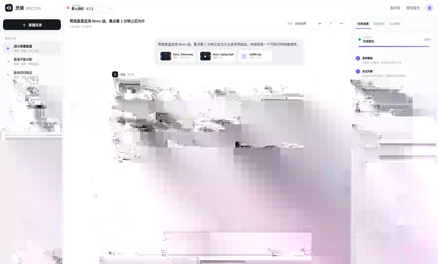

<div align="center">

# 灵境 · Game Studio Cloud

### 对话式游戏研发分析工作台

**把录像、截图、日志、配置和连续追问放进同一个 Workspace。**  
AI 不只回答一次，而是围绕同一任务持续保留素材、证据、上下文与结论。

<p>
  
  
  
  
  
  
</p>

<p>
  <a href="#真实产品界面"><b>真实界面</b></a>
  &nbsp;·&nbsp;
  <a href="#功能全景"><b>功能全景</b></a>
  &nbsp;·&nbsp;
  <a href="#30-秒启动"><b>快速启动</b></a>
  &nbsp;·&nbsp;
  <a href="#生产级-saas-基座"><b>SaaS 基座</b></a>
  &nbsp;·&nbsp;
  <a href="#测试与验收"><b>测试验收</b></a>
</p>

</div>

<br>

> [!NOTE]
> README 中的产品图均来自当前 **中文对话式 v3 产品实际运行截图**，只做尺寸与 WebP 压缩；不再使用英文概念图、示意 UI 或重新绘制的 mockup。

## 真实产品界面



<p align="center"><sub><b>真实对话工作台</b> · 左侧任务，中间持续对话，底部多模态输入，右侧任务进度 / 关键发现 / 本次素材。</sub></p>

这就是灵境的核心交互：**素材先进入任务，对话围绕任务持续发生**。第二轮、第三轮追问不需要重新上传同一批素材，也不用重新解释背景。


<p align="center"><sub><b>真实功能状态</b> · 登录与 Workspace、证据复核、模型服务、对话任务入口均来自当前产品。</sub></p>

---

## 它解决什么

<table>
<tr>
<td width="33%" valign="top">
<h3>🎮 研发问题放进一个任务</h3>
<p>录像、截图、日志、配置、音频和持续追问不再散落在聊天窗口、群聊和本地文件夹。</p>
</td>
<td width="33%" valign="top">
<h3>🔎 结论必须能回到证据</h3>
<p>任务进度、关键发现、日志片段、截图与复核结果集中显示，避免“AI 说了但不知道依据在哪”。</p>
</td>
<td width="33%" valign="top">
<h3>🏢 从 Demo 延伸到团队 SaaS</h3>
<p>登录、Workspace、租户隔离、审计、PostgreSQL、S3、Worker 与健康检查已经进入真实代码结构。</p>
</td>
</tr>
</table>

---

# 功能全景

下面列的是**仓库当前已经实现的能力**，不是路线图。

### 01 · 对话与任务

| 功能 | 当前实现 |
|---|---|
| **持续多轮对话** | 用户消息、Assistant 回复和任务素材保存在同一 Conversation |
| **上下文延续** | 后续追问自动恢复此前消息和当前任务全部素材，不要求重复挂载 |
| **任务场景** | 战斗录像复盘、数值平衡诊断、版本回归、角色 / NPC、多素材对比 |
| **历史任务** | 左侧最近任务列表，可重新进入旧 Conversation |
| **任务深链接** | URL 支持 `?conversation=<id>`，分享后可定位到指定任务 |
| **快捷追问** | 分析完成后根据结果给出下一步建议，可一键回填输入框 |
| **Markdown 风格回答** | 支持标题、强调、编号结论以及复制回复 |

### 02 · 多模态素材

| 素材 | 产品能力 |
|---|---|
| **图片** | PNG / JPG / WEBP；上传、预览、Pillow 解码、尺寸与轻量图像特征 |
| **视频** | MP4 / MOV / WEBM；FFprobe 元数据、FFmpeg 关键帧、任务内预览 |
| **日志 / 文本** | LOG / TXT / JSON / CSV / YAML / XML；文本预览与证据关联 |
| **音频** | 可作为任务素材持续保留；支持具备音频能力的 Provider 路由 |
| **其他文件** | 以二进制对象 + metadata 进入任务上下文 |
| **拖拽上传** | 页面支持拖入文件并加入当前 Conversation |
| **持续追加** | 同一任务分析过程中可以继续增加新素材 |

> 当前没有内置 OCR、ASR、PDF / Office 正文深度解析与完整 RAG Pipeline；README 不把“模型理论上支持”包装成“产品已经实现”。

### 03 · 证据、进度与实时反馈

| 功能 | 当前实现 |
|---|---|
| **任务进度** | 素材整理、定位问题、场景复核、交叉核对、形成结论等阶段实时展示 |
| **WebSocket** | Conversation 级实时进度与结果推送 |
| **Durable Event** | Task Event 写入数据库，可在刷新 / 重连后恢复 |
| **关键发现** | Assistant 结论可以绑定图片、视频关键帧、日志和复核结果 |
| **本次素材** | 右侧面板持续展示当前任务已挂载资产 |
| **Verifier / Replay** | WorldForge Runtime 支持场景复核、状态验证与 Replay 结果进入分析证据 |

### 04 · Model Gateway

当前 Provider Gateway 支持：

| Provider | 当前适配 |
|---|---|
| **Auto Router** | 按任务与可用能力自动选择 |
| **Demo** | 无 Key 时用于本地交互 / API / E2E 的确定性 Demo Provider |
| **OpenAI** | OpenAI-compatible，多模态图像；视频可转关键帧 |
| **Anthropic** | Claude 图像输入；视频走关键帧策略 |
| **Gemini** | 图像 / 视频 / 音频 inline 输入（当前 Adapter 的文件大小边界内） |
| **DeepSeek** | 文本推理为主 |
| **Qwen / DashScope** | 图像、多模态；视频关键帧策略 |
| **Doubao / Ark** | 图像、多模态；视频关键帧策略 |
| **Custom OpenAI-compatible** | 自定义 Base URL / Model |

前端只允许选择服务端判定为 **configured** 的真实 Provider；API Key 不下发到浏览器。

---

## 对话为什么不是“一次性聊天”

Conversation 在服务端保存四类状态：

| 状态 | 用途 |
|---|---|
| **Messages** | 保存用户 / Assistant 历史消息 |
| **Assets** | 保存当前任务累计素材，不只保存本轮附件 |
| **Task Events** | 保存实时分析进度与结果事件 |
| **Scene / Provider** | 保存任务场景和模型选择上下文 |

因此像下面这样的第二轮问题：

```text
那减伤覆盖和技能冷却是不是撞在同一个时间窗？
```

可以直接沿用第一轮 Boss 战录像、截图和日志，不需要重新上传。

---

## 登录、Workspace 与团队边界


<p align="center"><sub><b>Production Auth Gate</b> · 登录 / 创建 Workspace 是真实产品界面，不只是 API 文档中的接口。</sub></p>

---

# 生产级 SaaS 基座

灵境当前不是只把一个 FastAPI 服务套上 Docker。仓库已经落下以下 SaaS 控制面与生产基础设施：

<table>
<tr>
<td width="50%" valign="top">
<h3>身份与租户</h3>
<ul>
<li>Argon2 密码哈希</li>
<li>JWT Bearer Token</li>
<li>HttpOnly Session Cookie</li>
<li>User / Workspace / Membership</li>
<li>服务端 Principal 解析</li>
<li>Workspace 强制数据隔离</li>
<li>关键操作 Audit Trail</li>
</ul>
</td>
<td width="50%" valign="top">
<h3>数据与执行</h3>
<ul>
<li>SQLAlchemy 数据层</li>
<li>SQLite 开发环境</li>
<li>PostgreSQL 生产环境</li>
<li>Alembic Schema Migration</li>
<li>持久化 analysis_jobs</li>
<li>In-process / 独立 Worker</li>
<li>DB Event Store</li>
</ul>
</td>
</tr>
<tr>
<td width="50%" valign="top">
<h3>对象存储</h3>
<ul>
<li>Local Storage</li>
<li>S3 Object Storage</li>
<li>MinIO 兼容部署</li>
<li>Workspace 路径隔离</li>
<li>Presigned 下载 URL</li>
</ul>
</td>
<td width="50%" valign="top">
<h3>安全与运维</h3>
<ul>
<li>Request ID</li>
<li>Security Headers / CSP</li>
<li>CORS Allowlist</li>
<li>Trusted Hosts</li>
<li>基础 Rate Limit</li>
<li>Liveness / Readiness</li>
<li>数据库与对象存储 Readiness 检查</li>
</ul>
</td>
</tr>
</table>

### 多租户边界

客户端不能简单通过一个自由填冝的 Workspace Header 冒充其他租户。Store 层查询挹认证 Principal 的 `workspace_id` 强制过滤；即使知道其他 Workspace 的 Conversation ID，也不会直接读取对应数据。

---

## WorldForge Runtime

产品层下方还保留了 WorldForge Runtime，用于更结构化的游戏任务分析与验证：

- Adaptive Planner
- State Verifier
- Event Store
- Counterfactual Brancher
- Episodic Memory
- Skill Bank
- Replay / Self-play / Evolution 相关能力
- Benchmark 与 Scenario Eval

Runtime 的作用不是替代对话，而是让对话结果可以调用更结构化的复核与模拟能力。

---

# 30 秒启动

### 1 · 创建环境

```bash
python -m venv .venv
source .venv/bin/activate
pip install -r requirements.txt
```

Windows PowerShell：

```powershell
.venv\Scripts\Activate.ps1
```

### 2 · 启动产品

```bash
uvicorn worldforge.api.app:app --host 0.0.0.0 --port 8765 --reload
```

浏览器打开：

```text
http://localhost:8765
```

开发模式默认提供本地 Demo Workspace，不要求 PostgreSQL、S3 或模型 Key，适合先体验完整交互。

---

## 生产部署

仓库提供：

| Service | 职责 |
|---|---|
| **PostgreSQL** | User / Workspace / Conversation / Event / Job / Audit 等持久数据 |
| **MinIO** | S3-compatible 素材与大对象存储 |
| **Migrate** | 启动前执行 `alembic upgrade head` |
| **API** | FastAPI、Auth、Tenant Guard、Upload、WebSocket |
| **Worker** | 独立消费 durable analysis jobs |

准备配置：

```bash
cp .env.production.example .env.production
```

至少修改：

```bash
POSTGRES_PASSWORD=...
MINIO_ROOT_USER=...
MINIO_ROOT_PASSWORD=...
WORLDFORGE_JWT_SECRET=...
```

启动：

```bash
docker compose \
  --env-file .env.production \
  -f docker-compose.prod.yml \
  up --build
```

健康检查：

```text
GET /api/health/live
GET /api/health/ready
```

<details>
<summary><b>展开生产配置矩阵</b></summary>

| 变量 | 开发默认 | 生产建议 |
|---|---|---|
| `WORLDFORGE_ENV` | `development` | `production` |
| `WORLDFORGE_AUTH_MODE` | `dev` | `required` |
| `DATABASE_URL` | SQLite | PostgreSQL |
| `WORLDFORGE_STORAGE_BACKEND` | `local` | `s3` |
| `WORLDFORGE_QUEUE_MODE` | `inprocess` | `external` |
| `WORLDFORGE_AUTO_CREATE_SCHEMA` | `1` | `0` + Alembic |
| `WORLDFORGE_SECURE_COOKIES` | `0` | `1` under HTTPS |
| `WORLDFORGE_CORS_ORIGINS` | localhost | 精确业务域名 |
| `WORLDFORGE_TRUSTED_HOSTS` | localhost | 精确业务域名 |
| `WORLDFORGE_JWT_SECRET` | 开发临时值 | Secret Manager 中固定高熵密钥 |

</details>

---

## 仓库结构

```text
lingjing-game-studio/
├── frontend/                 对话式 Workspace / Auth / Realtime UI
├── worldforge/
│   ├── api/                  FastAPI / Auth / Tenant Guard / WebSocket
│   ├── product/              Conversation 分析 / 媒体 / SaaS Store
│   ├── providers/            Model Gateway
│   ├── runtime/              Planner / Verifier / Replay / World Model
│   ├── security.py           Argon2 / JWT / Principal
│   ├── storage.py            Local / S3
│   ├── observability.py      Request ID / Headers / Rate Limit
│   └── worker.py             Durable Analysis Worker
├── migrations/               Alembic
├── tests/                    Runtime / API / SaaS isolation
├── scripts/                  Backend E2E / UI E2E / Preview / Benchmark
├── docs/                     Architecture / Runbook / Frontend / Benchmark
├── docker-compose.prod.yml
├── Dockerfile
└── .env.production.example
```

---

# 测试与验收

### Unit / API

```bash
pytest -q
```

当前基线：

```text
16 passed
```

### SaaS UI E2E

```bash
python scripts/product_ui_e2e.py
```

覆盖：

```text
auth_gate
register_workspace
upload_interaction
realtime_answer
evidence_panel
suggestions
provider_modal
page_errors = 0
```

### 后端产品 E2E

```bash
python scripts/product_backend_e2e.py
```

覆盖 Backend Health、Provider Gateway、Multimodal Ingest、Conversation Analysis、Task Event、WebSocket History、Follow-up Context。

GitHub Actions 还会执行：

```text
pip install -r requirements.txt
python -m compileall
pytest -q
node --check frontend/app.js
```

---

## 当前边界 · Production Gate

这套仓库已经具备**生产 SaaS 架构基座**，但“生产拓扑可运行”不等于已经完成所有企业治理。

正式公网部署仍建议补充：

- SSO / MFA / SCIM
- 邮箱验证、邀请、找回密码
- Redis / Gateway 级分布式限流
- WAF / DDoS 防护
- PostgreSQL Backup / PITR
- S3 Lifecycle / Encryption Policy
- Metrics / Tracing / 集中日志与告警
- 文件病毒扫描与内容安全
- Secret Manager / KMS
- 数据保留、删除与合规策略
- OCR / ASR / PDF & Office 深度解析 / RAG（按产品需要接入）

---

## 文档

| 文档 | 内容 |
|---|---|
| [`docs/ARCHITECTURE.md`](docs/ARCHITECTURE.md) | SaaS 数据模型、API、Worker、Event 与 Storage 边界 |
| [`docs/RUNBOOK.md`](docs/RUNBOOK.md) | 部署与运行维护 |
| [`docs/FRONTEND.md`](docs/FRONTEND.md) | 对话工作台交互结构 |
| [`docs/BENCHMARKING.md`](docs/BENCHMARKING.md) | Benchmark 方法 |
| [`SECURITY.md`](SECURITY.md) | 安全模型与漏洞反馈 |

<br>

<div align="center">

### Lingjing Game Studio Cloud

**让一次问题排查，沉淀成可以继续追问、复核与协作的研发上下文。**

</div>
