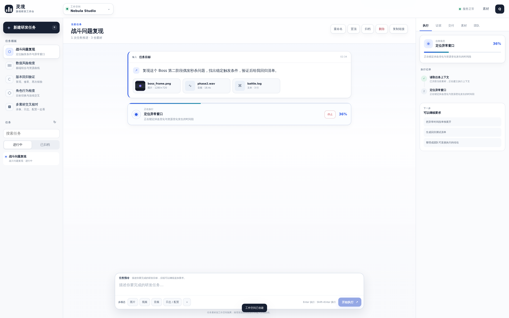
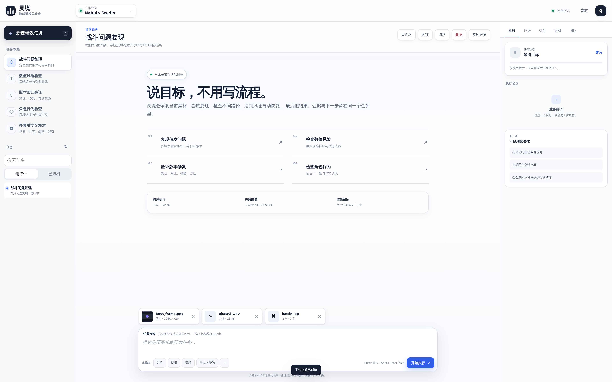
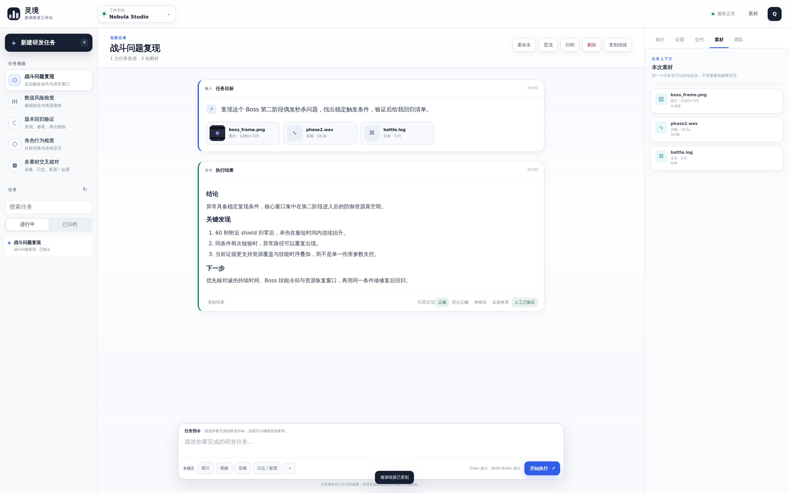
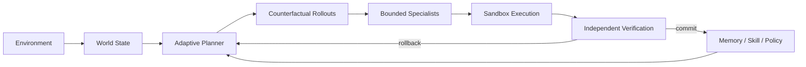

<div align="center">

# 灵境

### 游戏研发执行工作台

**给出目标和素材，系统持续执行、复核、留证；需要时停止、重试、交接、归档，并对不可逆操作显式确认。**

问题复现 · 数值检查 · 版本回归 · 角色行为 · 多素材交叉核对

</div>


---

## 30 秒看懂一次任务

灵境不是给游戏文件加一个聊天框，而是把研发目标变成一条可以持续推进、可以中途控制、最后能检查证据的任务轨迹。

> **目标 → 素材 → 执行 → 复核 → 证据 → 交付**

<table>
<tr>
<td width="50%" valign="top">

<br><sub><b>1 · 交付目标</b>　直接说要解决什么，不要求先拆 Prompt、Agent 或流程图。</sub>
</td>
<td width="50%" valign="top">

<br><sub><b>2 · 看见执行</b>　真实进度持续进入任务轨迹；长任务可以停止，不用被黑盒“思考中”绑住。</sub>
</td>
</tr>
<tr>
<td width="50%" valign="top">

<br><sub><b>3 · 拿到交付</b>　目标、执行过程、结论和后续动作留在同一个研发任务里。</sub>
</td>
<td width="50%" valign="top">

<br><sub><b>4 · 检查证据</b>　截图、录像关键帧、日志摘录和复核结果与结论对应。</sub>
</td>
</tr>
</table>

客户界面只回答真正需要知道的事：**我要完成什么、系统正在做什么、我能不能介入、发现了什么、结论由什么证据支持。**

---

## 为什么敢把任务交给它

| | 产品行为 |
|---|---|
| **可控** | 执行状态持久化；进行中的任务可以真实停止，刷新页面后仍恢复到正确的当前状态 |
| **可核验** | 结论关联证据，并区分观察、推断与待验证项；关键场景可重复复核 |
| **可恢复** | WorldForge 在提交动作前试演候选未来，失败路径可以 rollback / replan，不把一次错误扩散成整条任务失败 |
| **可隔离** | 用户、工作空间、任务、素材、运行记录与审计边界在服务端校验，不依赖前端隐藏 |
| **可治理** | 永久删除先进入持久化审批状态；成员角色、任务负责人、邀请与交接都有服务端权限和审计 |
| **可闭环** | 交付结果可以标记正确性、证据价值与人工验证；质量门作为演进的显式否决条件，而不是把点赞直接变成策略 |

任务完成与最终结果采用确定性的状态提交：**完成状态、assistant 交付和 `answer.ready` 事件作为同一事务提交**。如果停止先发生，就不会再补写一个“迟到的成功结果”。停止后的执行可以用原任务上下文重新执行；产品没有伪造“暂停”，因为当前分析任务无法保证外部推理调用可以从任意指令点无损续跑。

任务本身具备搜索、重命名、置顶、归档/恢复、负责人交接与受审批保护的永久删除。交付会进一步沉淀为复现卡、回归清单、风险清单、调参验证方案或证据包，而不是只停在一段回答。

---

## 多模态不是附件栏



一个任务可以持续追加：

**图片 · 视频 · 音频 · 日志 · JSON / CSV · 配置文件 · 文本 / 文档**

灵境会把素材变成真正进入判断链路的上下文，而不是只把文件名挂在消息旁边：

- **图片**进入视觉证据；
- **视频**按时长自适应抽取关键帧，并把关键帧作为视觉证据参与判断；
- **音频**保留声学输入，自动路由到具备对应能力的推理资源；
- **日志 / 配置**把实际内容摘录写入任务上下文；
- **素材校验**检查声明类型和真实内容，异常媒体不会伪装成有效图像或音视频；
- **证据索引**让最终结论可以指回来源，而不是只给一段无法复查的答案。



---

## 适合做什么

| 研发目标 | 灵境负责交付 |
|---|---|
| **战斗问题复现** | 对齐录像、日志和状态变化，寻找稳定触发条件并重复核验 |
| **数值风险检查** | 探索极端 Build、资源曲线与高波动组合，给出优先调整项 |
| **版本回归验证** | 复现历史异常、核验修复结果并沉淀发布前检查项 |
| **角色行为检查** | 检查连续交互、目标切换与上下文不一致 |
| **多素材交叉核对** | 在同一任务里联合视觉、声音、日志、配置与历史对话 |

### 产品边界

**任务优先。** 页面围绕目标、执行、证据与交付组织，而不是围绕聊天气泡组织。  
**算法隐藏。** 客户不需要理解内部规划器、反事实试演或策略优化术语。  
**推理可替换。** 本地或远端模型只提供感知与推理能力；状态、规划、权限、执行、验证、回滚和完成判定属于 WorldForge。

---

## 快速开始

```bash
python -m venv .venv
source .venv/bin/activate
pip install -r requirements.txt
uvicorn worldforge.api.app:app --reload
```

浏览器打开本地服务即可进入工作台。

独立 Worker：

```bash
WORLDFORGE_QUEUE_MODE=external python -m worldforge.worker
```

接入本地开源全模态推理服务：

```bash
export LOCAL_OMNI_BASE_URL=http://127.0.0.1:8901/v1
export LOCAL_OMNI_MODEL=your-local-multimodal-model
```

本地推理通道只参与感知与内容理解，不接管 WorldForge 的 Agent 决策。

---

<details>
<summary><b>WorldForge Runtime · 工程实现</b></summary>

<br>

WorldForge 是灵境自己的执行内核。外部或本地模型可以提供感知、文本理解和推理资源，但不能直接绕过 WorldForge 提交动作、修改 canonical state、跳过验证或决定一次任务是否完成。



### World State

`worldforge/runtime/engine.py` 维护可恢复的环境状态，而不是只保存对话文本：Goal / Belief / Game State、append-only hash-chained events、Snapshot / Restore / Checkpoint、Replay / Fork、Sandbox 与 rollback / replan。

反事实分支只操作克隆环境；只有经过选择和验证的动作才进入 canonical state。

### Epistemic Disagreement Control

`worldforge/runtime/planner.py` 会把内部专家分歧和世界状态不确定性组合成 epistemic tension：状态越不确定、专家意见越分裂，低风险信息获取行为越有价值；高威胁下则降低不可逆激进行为的优先级。关键状态被观测确认后，探索奖励自然下降，系统回到执行优先。

### Counterfactual + Bounded Specialists

动作提交前并行评估候选未来的 expected utility、downside、survival、success probability 与 verifier violations。状态条件专家只提供有界动作偏置，不能直接执行，也不能绕过 Sandbox / Verifier。

### Verification + Evolution

Verifier 独立检查状态不变量、非法动作、灾难性风险和异常奖励循环。成功与失败轨迹进入 Memory / Skill；策略更新受 group-relative reward、KL trust region、Regression Gate 与 Human Feedback Gate 共同约束。客户对结果的反馈会先进入结构化质量状态，不会直接修改策略；存在错误反馈或缺少人工验证时，Human Feedback Gate 会作为候选演进的否决输入。

> **可验证轨迹 → 候选更新 → 回归评估 + 人工质量门 → 通过才提交。**

### Realtime + Deterministic Job Lifecycle

产品事件通过 durable cursor 读取并 fan-out；WebSocket 使用 subscribe-before-replay、event-id deduplication 与 `after_id` 断点续传，避免重连后重复搬运完整历史。

产品 job 的完成提交与最终 assistant 消息、`answer.ready` 事件在同一事务中落库；cancelled 状态不会被迟到的完成或失败写回覆盖。每轮 progress 带自己的 `job_id`，刷新页面时只恢复当前/最近一次执行，不把多轮任务进度混在一起。

</details>

---

## 质量门禁

```bash
python -m compileall -q worldforge migrations scripts tests
pytest -q
node --check frontend/app.js
python scripts/product_backend_e2e.py
python scripts/product_ui_e2e.py
```

UI E2E 会真实覆盖注册、工作空间、素材上传、执行状态、停止/重试控制、任务生命周期、结构化交付、结果反馈、团队协作、实时结果、证据与多模态素材，并生成 README Gallery。截图以 `1920×1200` viewport、device scale `2` 采集，输出为 **3840×2400 PNG**。

---

## 目录

```text
frontend/                 客户工作台
worldforge/
  api/                    API / Auth / Realtime
  product/                多模态任务、证据与持久化
  runtime/                WorldForge 自主执行内核
  providers/              可替换推理资源
  storage/                本地 / 对象存储
scripts/                  E2E 与训练入口
tests/                    Runtime / API / 多模态 / Realtime 回归测试
```

<div align="center">

**目标不是让模型更会描述它做了什么，而是让系统真的执行、复核、恢复，并留下可以检查的证据。**

</div>
